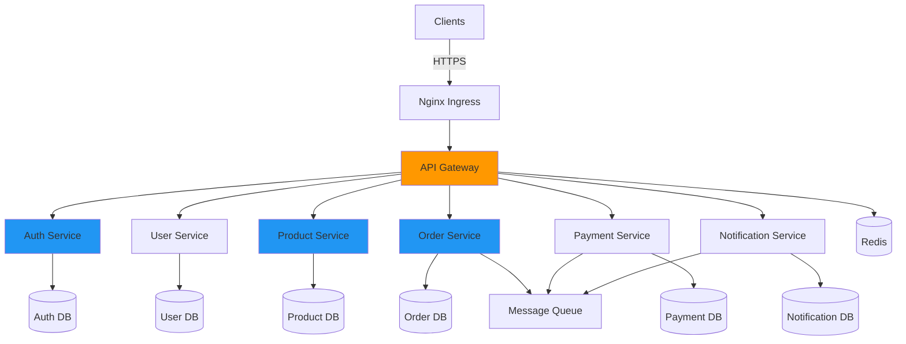

# Cloud-Native Microservices Platform

[](https://github.com/<owner>/<repo>/actions/workflows/ci.yml)
[](https://github.com/<owner>/<repo>/actions/workflows/cd.yml)
[](https://github.com/<owner>/<repo>/actions/workflows/security-scan.yml)
[](https://github.com/<owner>/<repo>/actions/workflows/e2e-tests.yml)
[](LICENSE)
[](https://nodejs.org/)
[](https://kubernetes.io/)
[](http://makeapullrequest.com)

> A production-ready, cloud-native microservices platform demonstrating enterprise-grade architecture, comprehensive observability, security best practices, and scalability.

## Table of Contents

- [Overview](#overview)
- [Features](#features)
- [Architecture](#architecture)
- [Technology Stack](#technology-stack)
- [Quick Start](#quick-start)
- [Documentation](#documentation)
- [API Endpoints](#api-endpoints)
- [Monitoring](#monitoring)
- [Security](#security)
- [Contributing](#contributing)
- [License](#license)

## Overview

This project showcases a complete cloud-native microservices architecture for an e-commerce platform, built with production-ready practices and modern DevOps workflows.

### Key Highlights

- **7 Microservices**: API Gateway, Auth, User, Product, Order, Payment, Notification
- **Database per Service**: Each microservice has its own PostgreSQL database
- **Event-Driven**: Asynchronous communication with message queues
- **Service Mesh**: mTLS encryption and traffic management with Istio/Linkerd
- **Auto-Scaling**: Horizontal Pod Autoscaling based on CPU/memory metrics
- **Observability**: Prometheus metrics, Grafana dashboards, Jaeger tracing
- **Security**: JWT authentication, RBAC, network policies, TLS encryption
- **CI/CD**: Automated testing, building, and deployment pipelines

## Features

### Microservices

| Service | Port | Description | Database |
|---------|------|-------------|----------|
| **API Gateway** | 3000 | Single entry point, rate limiting, authentication, routing | Redis |
| **Auth Service** | 3001 | User authentication, JWT token management, OAuth2 | PostgreSQL |
| **User Service** | 3002 | User profiles, preferences, address management | PostgreSQL |
| **Product Service** | 3003 | Product catalog, inventory, search, reviews | PostgreSQL |
| **Order Service** | 3004 | Order processing, shopping cart, order tracking | PostgreSQL |
| **Payment Service** | 3005 | Payment processing, refunds, payment methods | PostgreSQL |
| **Notification Service** | 3006 | Email, SMS, push notifications | PostgreSQL |

### Technical Features

- RESTful APIs with comprehensive documentation
- JWT-based authentication and RBAC authorization
- Redis caching for performance optimization
- Message queue (RabbitMQ/Kafka) for async communication
- Horizontal Pod Autoscaling (HPA) with custom metrics
- Service mesh for mTLS and traffic management
- Distributed tracing with Jaeger
- Centralized logging with ELK stack
- Automated backups and disaster recovery
- Container security scanning
- Network policies for pod isolation

## Architecture

### High-Level Architecture



For detailed architecture documentation with diagrams, see [docs/ARCHITECTURE.md](./docs/ARCHITECTURE.md).

## Technology Stack

### Backend
- **Runtime**: Node.js 20.x
- **Language**: TypeScript 5.x
- **Framework**: Express.js 4.x
- **Database**: PostgreSQL 15.x
- **Cache**: Redis 7.x
- **Message Queue**: RabbitMQ / Kafka

### Infrastructure
- **Orchestration**: Kubernetes 1.28+
- **Container**: Docker
- **Service Mesh**: Istio / Linkerd
- **Ingress**: Nginx Ingress Controller
- **Cert Manager**: cert-manager

### Observability
- **Metrics**: Prometheus
- **Visualization**: Grafana
- **Tracing**: Jaeger
- **Logging**: Winston, ELK Stack

### CI/CD
- **Pipeline**: GitHub Actions
- **Testing**: Jest
- **Code Quality**: ESLint, Prettier

## Quick Start

### Prerequisites

- Node.js 20.x or later
- Docker and Docker Compose
- kubectl (for Kubernetes)
- PostgreSQL 15.x
- Redis 7.x

### Local Development

```bash
# Clone repository
git clone https://github.com/<owner>/<repo>.git
cd cloud-native-microservices-system

# Install dependencies
npm run install:all

# Setup environment variables
cp .env.example .env

# Start dependencies
docker-compose up -d postgres redis

# Run migrations
npm run migrate:all

# Start all services
npm run dev:all

# Verify
curl http://localhost:3000/health
```

### Docker Compose

```bash
# Start all services
docker-compose up -d

# View logs
docker-compose logs -f api-gateway

# Stop services
docker-compose down
```

### Kubernetes Deployment

```bash
# Deploy to Kubernetes
kubectl apply -k k8s/base/

# Verify deployment
kubectl get pods -n microservices

# Access services
kubectl port-forward svc/api-gateway 3000:3000 -n microservices
```

## Documentation

### Core Documentation

- **[ARCHITECTURE.md](./docs/ARCHITECTURE.md)** - System architecture, design patterns, diagrams
- **[API.md](./docs/API.md)** - Complete API documentation with examples
- **[DEPLOYMENT.md](./docs/DEPLOYMENT.md)** - Deployment guide (local, Docker, Kubernetes)
- **[DEVELOPMENT.md](./docs/DEVELOPMENT.md)** - Development guide, coding standards

### Operations

- **[MONITORING.md](./docs/MONITORING.md)** - Monitoring, metrics, observability
- **[SECURITY.md](./docs/SECURITY.md)** - Security documentation, best practices
- **[DATABASE.md](./docs/DATABASE.md)** - Database schemas, migrations, backups
- **[TROUBLESHOOTING.md](./docs/TROUBLESHOOTING.md)** - Common issues and solutions

### Additional Resources

- **[FAQ.md](./docs/FAQ.md)** - Frequently asked questions
- **[CI/CD Workflows](.github/workflows/README.md)** - CI/CD pipeline documentation
- **[Diagrams](./docs/diagrams/)** - Architecture and flow diagrams

## API Endpoints

### Authentication

```bash
# Register
POST /api/auth/register

# Login
POST /api/auth/login

# Refresh token
POST /api/auth/refresh
```

### Products

```bash
# List products
GET /api/products?page=1&limit=20

# Get product
GET /api/products/:id

# Create product (admin)
POST /api/products
```

### Orders

```bash
# Create order
POST /api/orders

# Get order
GET /api/orders/:id

# List user orders
GET /api/orders
```

See [docs/API.md](./docs/API.md) for complete API documentation.

## Monitoring

### Access Monitoring Tools

- **Prometheus**: http://localhost:9090
- **Grafana**: http://localhost:3001 (admin/admin)
- **Jaeger**: http://localhost:16686

### Key Metrics

- Request rate and response time (p50, p95, p99)
- Error rate and success rate
- CPU and memory usage
- Database query performance
- Cache hit ratio

### Dashboards

Pre-configured Grafana dashboards for:
- Service overview
- Business metrics (orders, revenue)
- Infrastructure metrics
- Database performance

See [docs/MONITORING.md](./docs/MONITORING.md) for detailed monitoring guide.

## Security

### Security Features

- JWT authentication with access and refresh tokens
- HTTPS/TLS encryption everywhere
- Role-based access control (RBAC)
- Input validation and sanitization
- SQL injection prevention
- XSS and CSRF protection
- Rate limiting
- Container security (non-root, read-only filesystem)
- Network policies for pod isolation
- Regular security scanning

### Reporting Security Issues

Report security vulnerabilities to: security@example.com

See [docs/SECURITY.md](./docs/SECURITY.md) for comprehensive security documentation.

## Testing

```bash
# Run all tests
npm test

# Unit tests
npm run test:unit

# Integration tests
npm run test:integration

# Coverage report
npm run test:coverage
```

Target coverage: 80% minimum

## CI/CD Pipeline

Automated workflows for:
- **Continuous Integration**: Testing, linting, building
- **Continuous Deployment**: Staging and production deployments
- **Security Scanning**: Vulnerability scanning and dependency audits
- **E2E Testing**: Integration and performance tests

[View CI/CD Documentation](.github/workflows/README.md)

## Contributing

We welcome contributions! Please:

1. Fork the repository
2. Create a feature branch
3. Make your changes with tests
4. Update documentation
5. Submit a pull request

See [docs/DEVELOPMENT.md](./docs/DEVELOPMENT.md) for contribution guidelines.

## Performance

### Performance Targets

- **Response Time**: p95 < 500ms, p99 < 1s
- **Throughput**: 1000+ requests/second
- **Availability**: 99.9% uptime

### Optimization

- Redis caching for frequent queries
- Database query optimization
- Connection pooling
- Horizontal scaling with HPA
- CDN for static assets

## Deployment Environments

- **Development**: Local development with Docker Compose
- **Staging**: Kubernetes cluster for testing
- **Production**: Multi-zone Kubernetes deployment with HA

## License

This project is licensed under the MIT License - see the [LICENSE](LICENSE) file for details.

## Support

- **Documentation**: [docs/](./docs)
- **Issues**: [GitHub Issues](https://github.com/<owner>/<repo>/issues)
- **Discussions**: [GitHub Discussions](https://github.com/<owner>/<repo>/discussions)

## Roadmap

- [ ] GraphQL API
- [ ] gRPC service communication
- [ ] Event sourcing
- [ ] CQRS pattern
- [ ] Multi-region deployment
- [ ] ML-based recommendations
- [ ] Real-time with WebSockets

## Showcase Value

This project demonstrates:
- **Full-stack expertise** with modern cloud-native technologies
- **Microservices architecture** with production-ready practices
- **DevOps excellence** with automated CI/CD pipelines
- **Cloud-native design** for scalability and resilience
- **Security-first** approach following industry standards
- **Observability** with comprehensive monitoring and tracing
- **Infrastructure as Code** with Kubernetes manifests

---

**Star this repo** if you find it helpful!

Made with ❤️ for the cloud-native community
