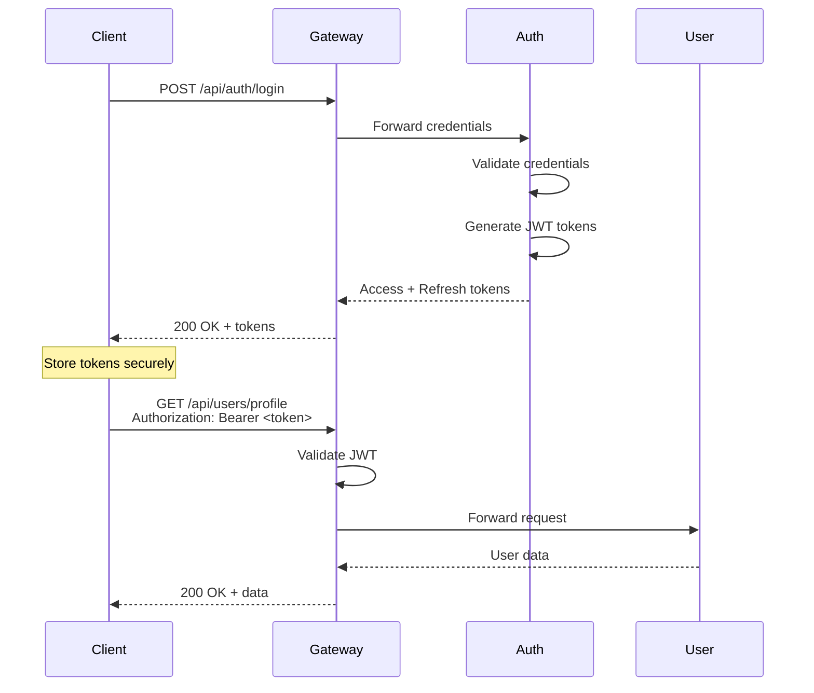

# API Documentation

## Table of Contents
- [Overview](#overview)
- [Authentication](#authentication)
- [API Gateway](#api-gateway)
- [Auth Service APIs](#auth-service-apis)
- [User Service APIs](#user-service-apis)
- [Product Service APIs](#product-service-apis)
- [Order Service APIs](#order-service-apis)
- [Payment Service APIs](#payment-service-apis)
- [Notification Service APIs](#notification-service-apis)
- [Error Handling](#error-handling)
- [Rate Limiting](#rate-limiting)
- [Pagination](#pagination)

## Overview

### Base URLs

| Environment | Base URL |
|-------------|----------|
| Production | `https://api.yourdomain.com` |
| Staging | `https://api-staging.yourdomain.com` |
| Development | `http://localhost:3000` |
| Kubernetes | `http://api-gateway.microservices.svc.cluster.local:3000` |

### API Versioning

All APIs are versioned using URL path:
```
/api/v1/resource
/api/v2/resource
```

Current version: **v1**

### Content Type

All requests and responses use JSON:
```
Content-Type: application/json
Accept: application/json
```

### Common Headers

```http
Authorization: Bearer <jwt-token>
Content-Type: application/json
X-Request-ID: <unique-request-id>
X-Correlation-ID: <correlation-id>
```

## Authentication

### Authentication Flow



### JWT Token Structure

**Access Token** (expires in 15 minutes):
```json
{
  "userId": "uuid",
  "email": "user@example.com",
  "role": "user|admin",
  "iat": 1234567890,
  "exp": 1234568790
}
```

**Refresh Token** (expires in 7 days):
- Stored in database
- Used to obtain new access token
- Can be revoked

## API Gateway

### Health Endpoints

#### Check Gateway Health

```http
GET /health
```

**Response** (200 OK):
```json
{
  "status": "ok",
  "timestamp": "2024-01-15T10:30:00Z",
  "uptime": 86400,
  "version": "1.0.0"
}
```

#### Check Readiness

```http
GET /ready
```

**Response** (200 OK):
```json
{
  "status": "ready",
  "services": {
    "auth": "up",
    "user": "up",
    "product": "up",
    "order": "up",
    "payment": "up",
    "notification": "up"
  }
}
```

#### Metrics (Prometheus)

```http
GET /metrics
```

**Response** (200 OK):
```
# HELP http_request_duration_seconds HTTP request duration
# TYPE http_request_duration_seconds histogram
http_request_duration_seconds_bucket{le="0.1",method="GET",route="/api/products",status="200"} 1234
...
```

## Auth Service APIs

### Register User

```http
POST /api/auth/register
```

**Request Body**:
```json
{
  "email": "user@example.com",
  "password": "SecurePass123!",
  "firstName": "John",
  "lastName": "Doe",
  "phoneNumber": "+1234567890"
}
```

**Validation Rules**:
- Email: Valid email format, unique
- Password: Min 8 chars, uppercase, lowercase, number, special char
- Phone: Valid phone number format

**Response** (201 Created):
```json
{
  "success": true,
  "message": "User registered successfully",
  "data": {
    "userId": "550e8400-e29b-41d4-a716-446655440000",
    "email": "user@example.com",
    "accessToken": "eyJhbGciOiJIUzI1NiIsInR5cCI6IkpXVCJ9...",
    "refreshToken": "eyJhbGciOiJIUzI1NiIsInR5cCI6IkpXVCJ9...",
    "expiresIn": 900
  }
}
```

**Error Response** (400 Bad Request):
```json
{
  "success": false,
  "error": {
    "code": "VALIDATION_ERROR",
    "message": "Email already exists",
    "details": [
      {
        "field": "email",
        "message": "Email is already registered"
      }
    ]
  }
}
```

### Login

```http
POST /api/auth/login
```

**Request Body**:
```json
{
  "email": "user@example.com",
  "password": "SecurePass123!"
}
```

**Response** (200 OK):
```json
{
  "success": true,
  "data": {
    "userId": "550e8400-e29b-41d4-a716-446655440000",
    "email": "user@example.com",
    "accessToken": "eyJhbGciOiJIUzI1NiIsInR5cCI6IkpXVCJ9...",
    "refreshToken": "eyJhbGciOiJIUzI1NiIsInR5cCI6IkpXVCJ9...",
    "expiresIn": 900
  }
}
```

**Error Response** (401 Unauthorized):
```json
{
  "success": false,
  "error": {
    "code": "INVALID_CREDENTIALS",
    "message": "Invalid email or password"
  }
}
```

### Refresh Token

```http
POST /api/auth/refresh
```

**Request Body**:
```json
{
  "refreshToken": "eyJhbGciOiJIUzI1NiIsInR5cCI6IkpXVCJ9..."
}
```

**Response** (200 OK):
```json
{
  "success": true,
  "data": {
    "accessToken": "eyJhbGciOiJIUzI1NiIsInR5cCI6IkpXVCJ9...",
    "expiresIn": 900
  }
}
```

### Logout

```http
POST /api/auth/logout
Authorization: Bearer <access-token>
```

**Request Body**:
```json
{
  "refreshToken": "eyJhbGciOiJIUzI1NiIsInR5cCI6IkpXVCJ9..."
}
```

**Response** (200 OK):
```json
{
  "success": true,
  "message": "Logged out successfully"
}
```

### Request Password Reset

```http
POST /api/auth/forgot-password
```

**Request Body**:
```json
{
  "email": "user@example.com"
}
```

**Response** (200 OK):
```json
{
  "success": true,
  "message": "Password reset email sent"
}
```

### Reset Password

```http
POST /api/auth/reset-password
```

**Request Body**:
```json
{
  "token": "reset-token-from-email",
  "newPassword": "NewSecurePass123!"
}
```

**Response** (200 OK):
```json
{
  "success": true,
  "message": "Password reset successfully"
}
```

### Verify Email

```http
POST /api/auth/verify-email
```

**Request Body**:
```json
{
  "token": "verification-token-from-email"
}
```

**Response** (200 OK):
```json
{
  "success": true,
  "message": "Email verified successfully"
}
```

## User Service APIs

### Get User Profile

```http
GET /api/users/profile
Authorization: Bearer <access-token>
```

**Response** (200 OK):
```json
{
  "success": true,
  "data": {
    "userId": "550e8400-e29b-41d4-a716-446655440000",
    "email": "user@example.com",
    "firstName": "John",
    "lastName": "Doe",
    "phoneNumber": "+1234567890",
    "avatar": "https://cdn.example.com/avatars/user123.jpg",
    "addresses": [
      {
        "addressId": "addr-123",
        "type": "shipping",
        "street": "123 Main St",
        "city": "New York",
        "state": "NY",
        "zipCode": "10001",
        "country": "US",
        "isDefault": true
      }
    ],
    "preferences": {
      "emailNotifications": true,
      "smsNotifications": false,
      "currency": "USD",
      "language": "en"
    },
    "createdAt": "2024-01-01T10:00:00Z",
    "updatedAt": "2024-01-15T12:30:00Z"
  }
}
```

### Update User Profile

```http
PUT /api/users/profile
Authorization: Bearer <access-token>
```

**Request Body**:
```json
{
  "firstName": "John",
  "lastName": "Smith",
  "phoneNumber": "+1234567890",
  "avatar": "https://cdn.example.com/avatars/new-avatar.jpg"
}
```

**Response** (200 OK):
```json
{
  "success": true,
  "message": "Profile updated successfully",
  "data": {
    "userId": "550e8400-e29b-41d4-a716-446655440000",
    "firstName": "John",
    "lastName": "Smith",
    "phoneNumber": "+1234567890",
    "updatedAt": "2024-01-15T14:30:00Z"
  }
}
```

### Add Address

```http
POST /api/users/addresses
Authorization: Bearer <access-token>
```

**Request Body**:
```json
{
  "type": "shipping",
  "street": "456 Oak Ave",
  "city": "Los Angeles",
  "state": "CA",
  "zipCode": "90001",
  "country": "US",
  "isDefault": false
}
```

**Response** (201 Created):
```json
{
  "success": true,
  "message": "Address added successfully",
  "data": {
    "addressId": "addr-456",
    "type": "shipping",
    "street": "456 Oak Ave",
    "city": "Los Angeles",
    "state": "CA",
    "zipCode": "90001",
    "country": "US",
    "isDefault": false,
    "createdAt": "2024-01-15T14:35:00Z"
  }
}
```

### Update Address

```http
PUT /api/users/addresses/:addressId
Authorization: Bearer <access-token>
```

**Request Body**:
```json
{
  "street": "789 Elm St",
  "isDefault": true
}
```

**Response** (200 OK):
```json
{
  "success": true,
  "message": "Address updated successfully",
  "data": {
    "addressId": "addr-456",
    "street": "789 Elm St",
    "isDefault": true,
    "updatedAt": "2024-01-15T14:40:00Z"
  }
}
```

### Delete Address

```http
DELETE /api/users/addresses/:addressId
Authorization: Bearer <access-token>
```

**Response** (200 OK):
```json
{
  "success": true,
  "message": "Address deleted successfully"
}
```

### Update Preferences

```http
PATCH /api/users/preferences
Authorization: Bearer <access-token>
```

**Request Body**:
```json
{
  "emailNotifications": false,
  "smsNotifications": true,
  "currency": "EUR",
  "language": "fr"
}
```

**Response** (200 OK):
```json
{
  "success": true,
  "message": "Preferences updated successfully",
  "data": {
    "emailNotifications": false,
    "smsNotifications": true,
    "currency": "EUR",
    "language": "fr",
    "updatedAt": "2024-01-15T14:45:00Z"
  }
}
```

## Product Service APIs

### List Products

```http
GET /api/products?page=1&limit=20&category=electronics&sort=price&order=asc&search=laptop
```

**Query Parameters**:
- `page` (optional): Page number (default: 1)
- `limit` (optional): Items per page (default: 20, max: 100)
- `category` (optional): Filter by category
- `sort` (optional): Sort field (price, name, createdAt, rating)
- `order` (optional): Sort order (asc, desc)
- `search` (optional): Search term
- `minPrice` (optional): Minimum price filter
- `maxPrice` (optional): Maximum price filter
- `inStock` (optional): Filter in-stock items (true/false)

**Response** (200 OK):
```json
{
  "success": true,
  "data": {
    "products": [
      {
        "productId": "prod-123",
        "name": "Professional Laptop",
        "description": "High-performance laptop for professionals",
        "price": 1299.99,
        "currency": "USD",
        "category": "electronics",
        "subcategory": "computers",
        "sku": "LAPTOP-001",
        "images": [
          "https://cdn.example.com/products/laptop-1.jpg",
          "https://cdn.example.com/products/laptop-2.jpg"
        ],
        "stock": 45,
        "rating": 4.5,
        "reviewCount": 128,
        "specifications": {
          "processor": "Intel i7",
          "ram": "16GB",
          "storage": "512GB SSD"
        },
        "createdAt": "2024-01-01T00:00:00Z",
        "updatedAt": "2024-01-15T10:00:00Z"
      }
    ],
    "pagination": {
      "page": 1,
      "limit": 20,
      "total": 150,
      "totalPages": 8,
      "hasNextPage": true,
      "hasPreviousPage": false
    }
  }
}
```

### Get Product Details

```http
GET /api/products/:productId
```

**Response** (200 OK):
```json
{
  "success": true,
  "data": {
    "productId": "prod-123",
    "name": "Professional Laptop",
    "description": "High-performance laptop for professionals",
    "longDescription": "Detailed description with markdown support...",
    "price": 1299.99,
    "currency": "USD",
    "category": "electronics",
    "subcategory": "computers",
    "sku": "LAPTOP-001",
    "images": [
      "https://cdn.example.com/products/laptop-1.jpg",
      "https://cdn.example.com/products/laptop-2.jpg"
    ],
    "stock": 45,
    "rating": 4.5,
    "reviewCount": 128,
    "specifications": {
      "processor": "Intel i7",
      "ram": "16GB",
      "storage": "512GB SSD",
      "display": "15.6 inch FHD",
      "weight": "1.8kg"
    },
    "tags": ["laptop", "professional", "high-performance"],
    "relatedProducts": ["prod-124", "prod-125"],
    "createdAt": "2024-01-01T00:00:00Z",
    "updatedAt": "2024-01-15T10:00:00Z"
  }
}
```

### Create Product (Admin)

```http
POST /api/products
Authorization: Bearer <admin-token>
```

**Request Body**:
```json
{
  "name": "New Product",
  "description": "Product description",
  "longDescription": "Detailed description...",
  "price": 99.99,
  "currency": "USD",
  "category": "electronics",
  "subcategory": "accessories",
  "sku": "PROD-001",
  "images": [
    "https://cdn.example.com/products/new-1.jpg"
  ],
  "stock": 100,
  "specifications": {
    "color": "black",
    "weight": "200g"
  },
  "tags": ["new", "electronics"]
}
```

**Response** (201 Created):
```json
{
  "success": true,
  "message": "Product created successfully",
  "data": {
    "productId": "prod-789",
    "name": "New Product",
    "price": 99.99,
    "createdAt": "2024-01-15T15:00:00Z"
  }
}
```

### Update Product (Admin)

```http
PUT /api/products/:productId
Authorization: Bearer <admin-token>
```

**Request Body**:
```json
{
  "price": 89.99,
  "stock": 150,
  "description": "Updated description"
}
```

**Response** (200 OK):
```json
{
  "success": true,
  "message": "Product updated successfully",
  "data": {
    "productId": "prod-789",
    "price": 89.99,
    "stock": 150,
    "updatedAt": "2024-01-15T15:05:00Z"
  }
}
```

### Delete Product (Admin)

```http
DELETE /api/products/:productId
Authorization: Bearer <admin-token>
```

**Response** (200 OK):
```json
{
  "success": true,
  "message": "Product deleted successfully"
}
```

### Get Product Reviews

```http
GET /api/products/:productId/reviews?page=1&limit=10&sort=createdAt&order=desc
```

**Response** (200 OK):
```json
{
  "success": true,
  "data": {
    "reviews": [
      {
        "reviewId": "rev-123",
        "productId": "prod-123",
        "userId": "user-456",
        "userName": "John D.",
        "rating": 5,
        "title": "Excellent product!",
        "comment": "Very satisfied with this purchase...",
        "verified": true,
        "helpful": 15,
        "createdAt": "2024-01-10T12:00:00Z"
      }
    ],
    "pagination": {
      "page": 1,
      "limit": 10,
      "total": 128,
      "totalPages": 13
    },
    "summary": {
      "averageRating": 4.5,
      "totalReviews": 128,
      "ratingDistribution": {
        "5": 80,
        "4": 30,
        "3": 10,
        "2": 5,
        "1": 3
      }
    }
  }
}
```

### Add Product Review

```http
POST /api/products/:productId/reviews
Authorization: Bearer <access-token>
```

**Request Body**:
```json
{
  "rating": 5,
  "title": "Great product!",
  "comment": "Highly recommended..."
}
```

**Response** (201 Created):
```json
{
  "success": true,
  "message": "Review added successfully",
  "data": {
    "reviewId": "rev-789",
    "productId": "prod-123",
    "rating": 5,
    "createdAt": "2024-01-15T15:10:00Z"
  }
}
```

## Order Service APIs

### Create Order

```http
POST /api/orders
Authorization: Bearer <access-token>
```

**Request Body**:
```json
{
  "items": [
    {
      "productId": "prod-123",
      "quantity": 2,
      "price": 1299.99
    },
    {
      "productId": "prod-456",
      "quantity": 1,
      "price": 299.99
    }
  ],
  "shippingAddressId": "addr-123",
  "billingAddressId": "addr-123",
  "shippingMethod": "standard",
  "paymentMethod": "credit_card"
}
```

**Response** (201 Created):
```json
{
  "success": true,
  "message": "Order created successfully",
  "data": {
    "orderId": "order-789",
    "orderNumber": "ORD-2024-001234",
    "status": "pending",
    "items": [
      {
        "productId": "prod-123",
        "productName": "Professional Laptop",
        "quantity": 2,
        "price": 1299.99,
        "subtotal": 2599.98
      },
      {
        "productId": "prod-456",
        "productName": "Wireless Mouse",
        "quantity": 1,
        "price": 299.99,
        "subtotal": 299.99
      }
    ],
    "subtotal": 2899.97,
    "shippingCost": 15.00,
    "tax": 261.00,
    "total": 3175.97,
    "currency": "USD",
    "shippingAddress": {
      "street": "123 Main St",
      "city": "New York",
      "state": "NY",
      "zipCode": "10001",
      "country": "US"
    },
    "createdAt": "2024-01-15T15:15:00Z",
    "estimatedDelivery": "2024-01-22T00:00:00Z"
  }
}
```

### Get Order

```http
GET /api/orders/:orderId
Authorization: Bearer <access-token>
```

**Response** (200 OK):
```json
{
  "success": true,
  "data": {
    "orderId": "order-789",
    "orderNumber": "ORD-2024-001234",
    "status": "shipped",
    "items": [...],
    "subtotal": 2899.97,
    "shippingCost": 15.00,
    "tax": 261.00,
    "total": 3175.97,
    "currency": "USD",
    "shippingAddress": {...},
    "trackingNumber": "TRACK123456",
    "statusHistory": [
      {
        "status": "pending",
        "timestamp": "2024-01-15T15:15:00Z"
      },
      {
        "status": "confirmed",
        "timestamp": "2024-01-15T15:20:00Z"
      },
      {
        "status": "processing",
        "timestamp": "2024-01-15T16:00:00Z"
      },
      {
        "status": "shipped",
        "timestamp": "2024-01-16T10:00:00Z"
      }
    ],
    "createdAt": "2024-01-15T15:15:00Z",
    "updatedAt": "2024-01-16T10:00:00Z"
  }
}
```

### List User Orders

```http
GET /api/orders?page=1&limit=10&status=all
Authorization: Bearer <access-token>
```

**Query Parameters**:
- `page` (optional): Page number
- `limit` (optional): Items per page
- `status` (optional): Filter by status (all, pending, confirmed, shipped, delivered, cancelled)

**Response** (200 OK):
```json
{
  "success": true,
  "data": {
    "orders": [
      {
        "orderId": "order-789",
        "orderNumber": "ORD-2024-001234",
        "status": "shipped",
        "itemCount": 2,
        "total": 3175.97,
        "currency": "USD",
        "createdAt": "2024-01-15T15:15:00Z"
      }
    ],
    "pagination": {
      "page": 1,
      "limit": 10,
      "total": 25,
      "totalPages": 3
    }
  }
}
```

### Cancel Order

```http
POST /api/orders/:orderId/cancel
Authorization: Bearer <access-token>
```

**Request Body**:
```json
{
  "reason": "Changed my mind"
}
```

**Response** (200 OK):
```json
{
  "success": true,
  "message": "Order cancelled successfully",
  "data": {
    "orderId": "order-789",
    "status": "cancelled",
    "cancelledAt": "2024-01-15T16:00:00Z",
    "refundStatus": "pending"
  }
}
```

### Track Order

```http
GET /api/orders/:orderId/tracking
Authorization: Bearer <access-token>
```

**Response** (200 OK):
```json
{
  "success": true,
  "data": {
    "orderId": "order-789",
    "orderNumber": "ORD-2024-001234",
    "status": "in_transit",
    "trackingNumber": "TRACK123456",
    "carrier": "FedEx",
    "trackingUrl": "https://fedex.com/track/TRACK123456",
    "estimatedDelivery": "2024-01-22T00:00:00Z",
    "trackingEvents": [
      {
        "status": "picked_up",
        "location": "New York, NY",
        "timestamp": "2024-01-16T10:00:00Z",
        "description": "Package picked up"
      },
      {
        "status": "in_transit",
        "location": "Philadelphia, PA",
        "timestamp": "2024-01-17T08:00:00Z",
        "description": "In transit"
      }
    ]
  }
}
```

## Payment Service APIs

### Process Payment

```http
POST /api/payments
Authorization: Bearer <access-token>
```

**Request Body**:
```json
{
  "orderId": "order-789",
  "amount": 3175.97,
  "currency": "USD",
  "paymentMethod": "credit_card",
  "paymentDetails": {
    "cardNumber": "4111111111111111",
    "expiryMonth": "12",
    "expiryYear": "2025",
    "cvv": "123",
    "cardholderName": "John Doe"
  },
  "billingAddress": {
    "street": "123 Main St",
    "city": "New York",
    "state": "NY",
    "zipCode": "10001",
    "country": "US"
  }
}
```

**Response** (200 OK):
```json
{
  "success": true,
  "message": "Payment processed successfully",
  "data": {
    "paymentId": "pay-123",
    "orderId": "order-789",
    "amount": 3175.97,
    "currency": "USD",
    "status": "completed",
    "transactionId": "txn-456789",
    "paymentMethod": "credit_card",
    "lastFourDigits": "1111",
    "processedAt": "2024-01-15T15:20:00Z"
  }
}
```

**Error Response** (402 Payment Required):
```json
{
  "success": false,
  "error": {
    "code": "PAYMENT_FAILED",
    "message": "Payment declined by issuer",
    "details": {
      "reason": "insufficient_funds",
      "declineCode": "insufficient_funds"
    }
  }
}
```

### Get Payment Status

```http
GET /api/payments/:paymentId
Authorization: Bearer <access-token>
```

**Response** (200 OK):
```json
{
  "success": true,
  "data": {
    "paymentId": "pay-123",
    "orderId": "order-789",
    "amount": 3175.97,
    "currency": "USD",
    "status": "completed",
    "transactionId": "txn-456789",
    "paymentMethod": "credit_card",
    "lastFourDigits": "1111",
    "processedAt": "2024-01-15T15:20:00Z"
  }
}
```

### Request Refund

```http
POST /api/payments/:paymentId/refund
Authorization: Bearer <access-token>
```

**Request Body**:
```json
{
  "amount": 3175.97,
  "reason": "Order cancelled"
}
```

**Response** (200 OK):
```json
{
  "success": true,
  "message": "Refund initiated successfully",
  "data": {
    "refundId": "ref-123",
    "paymentId": "pay-123",
    "amount": 3175.97,
    "currency": "USD",
    "status": "pending",
    "reason": "Order cancelled",
    "initiatedAt": "2024-01-15T16:00:00Z",
    "estimatedCompletionDate": "2024-01-22T00:00:00Z"
  }
}
```

### Get Refund Status

```http
GET /api/payments/refunds/:refundId
Authorization: Bearer <access-token>
```

**Response** (200 OK):
```json
{
  "success": true,
  "data": {
    "refundId": "ref-123",
    "paymentId": "pay-123",
    "amount": 3175.97,
    "currency": "USD",
    "status": "completed",
    "reason": "Order cancelled",
    "initiatedAt": "2024-01-15T16:00:00Z",
    "completedAt": "2024-01-20T10:00:00Z"
  }
}
```

### List Payment Methods

```http
GET /api/payments/methods
Authorization: Bearer <access-token>
```

**Response** (200 OK):
```json
{
  "success": true,
  "data": {
    "paymentMethods": [
      {
        "methodId": "pm-123",
        "type": "credit_card",
        "brand": "visa",
        "lastFourDigits": "1111",
        "expiryMonth": "12",
        "expiryYear": "2025",
        "isDefault": true,
        "createdAt": "2024-01-01T00:00:00Z"
      },
      {
        "methodId": "pm-456",
        "type": "credit_card",
        "brand": "mastercard",
        "lastFourDigits": "5555",
        "expiryMonth": "06",
        "expiryYear": "2026",
        "isDefault": false,
        "createdAt": "2024-01-05T00:00:00Z"
      }
    ]
  }
}
```

## Notification Service APIs

### Get Notifications

```http
GET /api/notifications?page=1&limit=20&status=unread
Authorization: Bearer <access-token>
```

**Query Parameters**:
- `page` (optional): Page number
- `limit` (optional): Items per page
- `status` (optional): Filter by status (all, read, unread)

**Response** (200 OK):
```json
{
  "success": true,
  "data": {
    "notifications": [
      {
        "notificationId": "notif-123",
        "type": "order_confirmation",
        "title": "Order Confirmed",
        "message": "Your order #ORD-2024-001234 has been confirmed",
        "status": "unread",
        "priority": "high",
        "data": {
          "orderId": "order-789",
          "orderNumber": "ORD-2024-001234"
        },
        "createdAt": "2024-01-15T15:20:00Z"
      }
    ],
    "pagination": {
      "page": 1,
      "limit": 20,
      "total": 45,
      "totalPages": 3
    },
    "unreadCount": 12
  }
}
```

### Mark Notification as Read

```http
PATCH /api/notifications/:notificationId/read
Authorization: Bearer <access-token>
```

**Response** (200 OK):
```json
{
  "success": true,
  "message": "Notification marked as read",
  "data": {
    "notificationId": "notif-123",
    "status": "read",
    "readAt": "2024-01-15T16:00:00Z"
  }
}
```

### Mark All as Read

```http
PATCH /api/notifications/read-all
Authorization: Bearer <access-token>
```

**Response** (200 OK):
```json
{
  "success": true,
  "message": "All notifications marked as read",
  "data": {
    "updatedCount": 12
  }
}
```

### Delete Notification

```http
DELETE /api/notifications/:notificationId
Authorization: Bearer <access-token>
```

**Response** (200 OK):
```json
{
  "success": true,
  "message": "Notification deleted successfully"
}
```

### Update Notification Preferences

```http
PUT /api/notifications/preferences
Authorization: Bearer <access-token>
```

**Request Body**:
```json
{
  "channels": {
    "email": true,
    "sms": false,
    "push": true
  },
  "types": {
    "order_updates": true,
    "promotions": false,
    "newsletters": true,
    "security_alerts": true
  }
}
```

**Response** (200 OK):
```json
{
  "success": true,
  "message": "Notification preferences updated",
  "data": {
    "channels": {
      "email": true,
      "sms": false,
      "push": true
    },
    "types": {
      "order_updates": true,
      "promotions": false,
      "newsletters": true,
      "security_alerts": true
    },
    "updatedAt": "2024-01-15T16:10:00Z"
  }
}
```

## Error Handling

### Standard Error Response

All errors follow this format:

```json
{
  "success": false,
  "error": {
    "code": "ERROR_CODE",
    "message": "Human-readable error message",
    "details": {},
    "timestamp": "2024-01-15T16:00:00Z",
    "requestId": "req-123456"
  }
}
```

### HTTP Status Codes

| Code | Description | Example Use Case |
|------|-------------|------------------|
| 200 | OK | Successful GET, PUT, PATCH |
| 201 | Created | Successful POST (resource created) |
| 204 | No Content | Successful DELETE |
| 400 | Bad Request | Invalid request body/parameters |
| 401 | Unauthorized | Missing or invalid authentication |
| 403 | Forbidden | Insufficient permissions |
| 404 | Not Found | Resource doesn't exist |
| 409 | Conflict | Duplicate resource |
| 422 | Unprocessable Entity | Validation failed |
| 429 | Too Many Requests | Rate limit exceeded |
| 500 | Internal Server Error | Server error |
| 503 | Service Unavailable | Service temporarily unavailable |

### Error Codes

| Code | HTTP Status | Description |
|------|-------------|-------------|
| `VALIDATION_ERROR` | 400 | Request validation failed |
| `INVALID_CREDENTIALS` | 401 | Invalid email/password |
| `TOKEN_EXPIRED` | 401 | JWT token expired |
| `TOKEN_INVALID` | 401 | Invalid JWT token |
| `UNAUTHORIZED` | 401 | Authentication required |
| `FORBIDDEN` | 403 | Insufficient permissions |
| `NOT_FOUND` | 404 | Resource not found |
| `DUPLICATE_RESOURCE` | 409 | Resource already exists |
| `PAYMENT_FAILED` | 402 | Payment processing failed |
| `INSUFFICIENT_STOCK` | 422 | Product out of stock |
| `RATE_LIMIT_EXCEEDED` | 429 | Too many requests |
| `INTERNAL_ERROR` | 500 | Internal server error |
| `SERVICE_UNAVAILABLE` | 503 | Service temporarily down |

### Validation Error Example

```json
{
  "success": false,
  "error": {
    "code": "VALIDATION_ERROR",
    "message": "Request validation failed",
    "details": [
      {
        "field": "email",
        "message": "Email is required",
        "value": ""
      },
      {
        "field": "password",
        "message": "Password must be at least 8 characters",
        "value": "short"
      }
    ],
    "timestamp": "2024-01-15T16:00:00Z",
    "requestId": "req-123456"
  }
}
```

## Rate Limiting

### Rate Limit Headers

All responses include rate limit headers:

```http
X-RateLimit-Limit: 100
X-RateLimit-Remaining: 95
X-RateLimit-Reset: 1705334400
```

### Rate Limit Tiers

| Tier | Requests per Minute | Requests per Hour |
|------|---------------------|-------------------|
| Anonymous | 20 | 100 |
| Authenticated | 100 | 5000 |
| Premium | 500 | 25000 |
| Admin | 1000 | 50000 |

### Rate Limit Exceeded Response

```json
{
  "success": false,
  "error": {
    "code": "RATE_LIMIT_EXCEEDED",
    "message": "Too many requests, please try again later",
    "details": {
      "limit": 100,
      "remaining": 0,
      "resetAt": "2024-01-15T16:05:00Z"
    }
  }
}
```

## Pagination

### Query Parameters

All list endpoints support pagination:
- `page`: Page number (default: 1)
- `limit`: Items per page (default: 20, max: 100)

### Pagination Response

```json
{
  "data": [...],
  "pagination": {
    "page": 1,
    "limit": 20,
    "total": 150,
    "totalPages": 8,
    "hasNextPage": true,
    "hasPreviousPage": false
  }
}
```

### Link Headers

Responses include Link headers for pagination:

```http
Link: <https://api.example.com/api/products?page=1&limit=20>; rel="first",
      <https://api.example.com/api/products?page=2&limit=20>; rel="next",
      <https://api.example.com/api/products?page=8&limit=20>; rel="last"
```

## Versioning and Deprecation

### API Versioning

- Current version: v1
- Version specified in URL: `/api/v1/resource`
- Backward compatible changes don't require version bump
- Breaking changes require new version

### Deprecation Policy

- Minimum 6 months notice for deprecated endpoints
- Deprecation warnings in response headers:

```http
Warning: 299 - "This endpoint is deprecated and will be removed on 2024-12-31. Use /api/v2/resource instead"
X-API-Deprecation-Date: 2024-12-31
X-API-Deprecation-Link: https://docs.example.com/migration-guide
```

## Testing

### Postman Collection

Import our Postman collection for testing:
- [Download Postman Collection](./postman/microservices-api.postman_collection.json)
- [Download Environment](./postman/environment.postman_environment.json)

### Example cURL Requests

**Register:**
```bash
curl -X POST https://api.example.com/api/auth/register \
  -H "Content-Type: application/json" \
  -d '{
    "email": "user@example.com",
    "password": "SecurePass123!",
    "firstName": "John",
    "lastName": "Doe"
  }'
```

**Get Products:**
```bash
curl -X GET "https://api.example.com/api/products?page=1&limit=10" \
  -H "Authorization: Bearer YOUR_TOKEN"
```

## Support

For API support:
- Documentation: https://docs.example.com
- Support Email: api-support@example.com
- Developer Portal: https://developer.example.com
- Status Page: https://status.example.com
