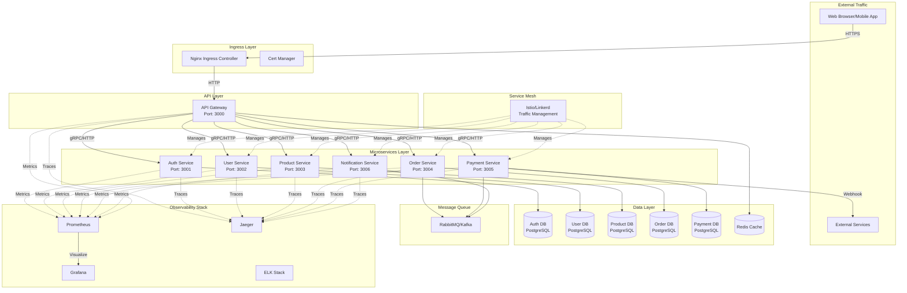
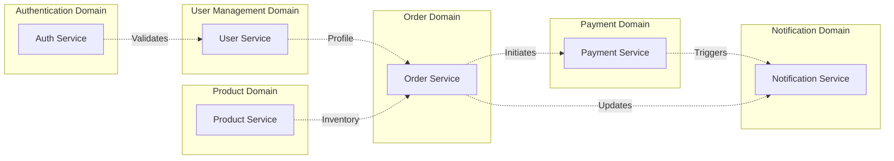
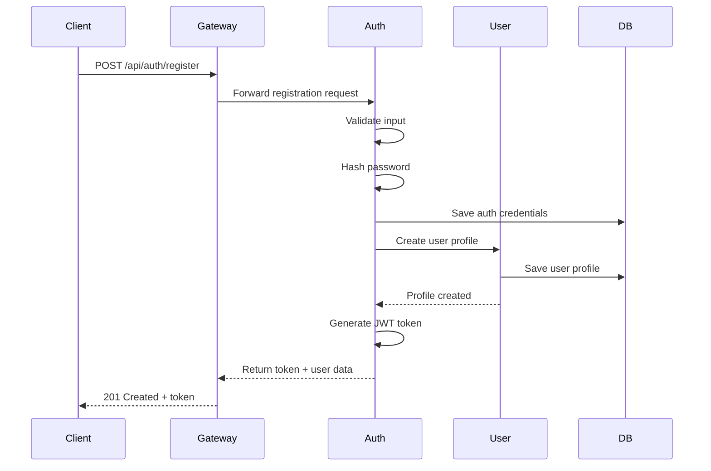
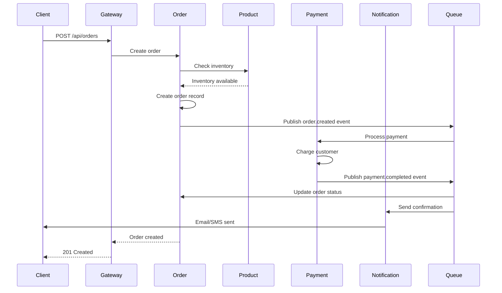
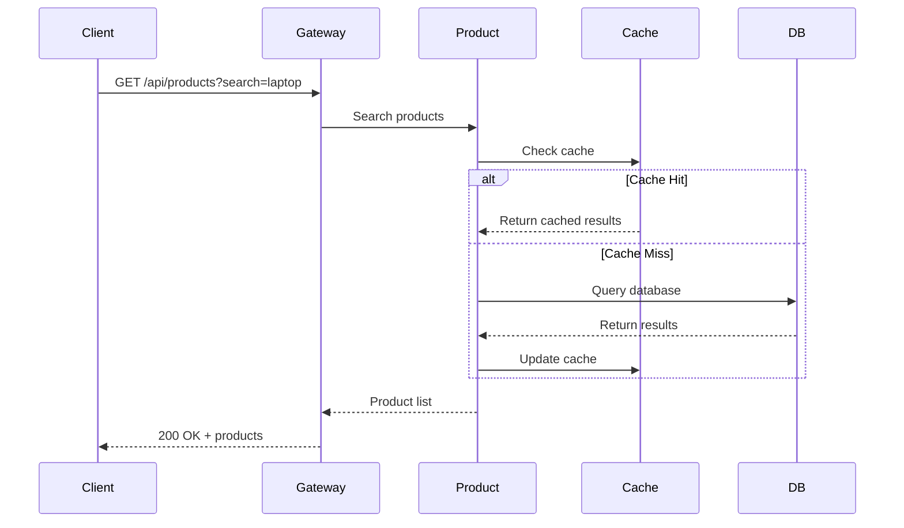

# System Architecture Documentation

## Table of Contents
- [System Overview](#system-overview)
- [Architecture Diagram](#architecture-diagram)
- [Microservices Architecture](#microservices-architecture)
- [Service Descriptions](#service-descriptions)
- [Communication Patterns](#communication-patterns)
- [Data Flow](#data-flow)
- [Technology Stack](#technology-stack)
- [Infrastructure Components](#infrastructure-components)

## System Overview

This cloud-native microservices platform is a production-ready e-commerce system designed with modern architectural principles. The system demonstrates enterprise-grade practices including:

- **Microservices Architecture**: 7 independent, scalable services
- **Container Orchestration**: Kubernetes-native deployment
- **Service Mesh**: Traffic management and security
- **Observability**: Comprehensive monitoring, logging, and tracing
- **Resilience**: Circuit breakers, rate limiting, and auto-scaling
- **Security**: JWT authentication, TLS encryption, network policies

### Key Features
- User authentication and authorization
- Product catalog management
- Order processing and management
- Payment processing
- Real-time notifications
- API Gateway with rate limiting
- Horizontal pod autoscaling
- Distributed tracing
- Metrics collection and visualization

## Architecture Diagram



## Microservices Architecture

### Design Principles

1. **Single Responsibility**: Each service handles a specific business domain
2. **Loose Coupling**: Services communicate through well-defined APIs
3. **High Cohesion**: Related functionality grouped together
4. **Independent Deployment**: Services can be deployed independently
5. **Database per Service**: Each service owns its data
6. **API-First Design**: RESTful APIs with OpenAPI specifications

### Service Boundaries



## Service Descriptions

### 1. API Gateway
**Port**: 3000
**Technology**: Node.js, Express, TypeScript

**Responsibilities**:
- Single entry point for all client requests
- Request routing to appropriate microservices
- Load balancing
- Rate limiting and throttling
- Authentication token validation
- Request/response transformation
- CORS handling
- Circuit breaker pattern
- Request logging and monitoring

**Key Features**:
- Prometheus metrics export
- Jaeger distributed tracing
- Redis-based rate limiting
- Health check endpoints
- Horizontal pod autoscaling

### 2. Auth Service
**Port**: 3001
**Technology**: Node.js, Express, TypeScript, PostgreSQL

**Responsibilities**:
- User authentication
- JWT token generation and validation
- Password hashing and verification
- Session management
- Token refresh mechanism
- Password reset workflow

**Database Schema**:
- Users authentication table
- Sessions table
- Refresh tokens table
- Password reset tokens table

### 3. User Service
**Port**: 3002
**Technology**: Node.js, Express, TypeScript, PostgreSQL

**Responsibilities**:
- User profile management
- User registration
- Profile updates
- User preferences
- Address management
- User search and listing

**Database Schema**:
- User profiles table
- Addresses table
- User preferences table

### 4. Product Service
**Port**: 3003
**Technology**: Node.js, Express, TypeScript, PostgreSQL

**Responsibilities**:
- Product catalog management
- Product CRUD operations
- Inventory tracking
- Product search and filtering
- Category management
- Product reviews and ratings

**Database Schema**:
- Products table
- Categories table
- Inventory table
- Product reviews table
- Product images table

### 5. Order Service
**Port**: 3004
**Technology**: Node.js, Express, TypeScript, PostgreSQL

**Responsibilities**:
- Order creation and management
- Order status tracking
- Shopping cart management
- Order history
- Order cancellation
- Integration with product and payment services

**Database Schema**:
- Orders table
- Order items table
- Shopping carts table
- Order status history table

### 6. Payment Service
**Port**: 3005
**Technology**: Node.js, Express, TypeScript, PostgreSQL

**Responsibilities**:
- Payment processing
- Payment gateway integration
- Transaction management
- Refund processing
- Payment status tracking
- PCI compliance

**Database Schema**:
- Payments table
- Transactions table
- Payment methods table
- Refunds table

### 7. Notification Service
**Port**: 3006
**Technology**: Node.js, Express, TypeScript, PostgreSQL

**Responsibilities**:
- Email notifications
- SMS notifications
- Push notifications
- Notification templates
- Notification queue management
- Event-driven notifications

**Database Schema**:
- Notifications table
- Notification templates table
- Notification logs table
- User notification preferences table

## Communication Patterns

### Synchronous Communication

**REST API over HTTP/HTTPS**:
- API Gateway to all microservices
- Used for real-time request-response operations
- Includes retry logic and circuit breakers

```
Client -> API Gateway -> Microservice -> Database
                      <- Response <-
```

### Asynchronous Communication

**Message Queue (RabbitMQ/Kafka)**:
- Order creation triggers payment processing
- Payment confirmation triggers notification
- Event-driven architecture for eventual consistency

```
Order Service -> Message Queue -> Payment Service
                                -> Notification Service
```

### Service Discovery

**Kubernetes DNS**:
- Services discover each other via Kubernetes DNS
- Service names resolve to ClusterIP
- Example: `http://product-service:3003`

### Circuit Breaker Pattern

Implemented using Opossum library:
- Prevents cascading failures
- Automatic fallback mechanisms
- Configurable timeout and error thresholds

## Data Flow

### User Registration Flow



### Order Creation Flow



### Product Search Flow



## Technology Stack

### Backend Services
| Component | Technology | Version |
|-----------|-----------|---------|
| Runtime | Node.js | 20.x |
| Language | TypeScript | 5.3.x |
| Framework | Express | 4.18.x |
| Database | PostgreSQL | 15.x |
| Cache | Redis | 7.x |
| Message Queue | RabbitMQ/Kafka | Latest |

### Infrastructure
| Component | Technology | Purpose |
|-----------|-----------|---------|
| Orchestration | Kubernetes | 1.28+ |
| Service Mesh | Istio/Linkerd | Traffic management |
| Ingress | Nginx Ingress | External traffic routing |
| Cert Manager | cert-manager | TLS certificate management |

### Observability
| Component | Technology | Purpose |
|-----------|-----------|---------|
| Metrics | Prometheus | Metrics collection |
| Visualization | Grafana | Dashboard and alerting |
| Tracing | Jaeger | Distributed tracing |
| Logging | Winston | Application logging |
| APM | prom-client | Application metrics |

### Development Tools
| Component | Technology | Purpose |
|-----------|-----------|---------|
| Package Manager | npm | Dependency management |
| Linter | ESLint | Code quality |
| Formatter | Prettier | Code formatting |
| Testing | Jest | Unit and integration tests |
| CI/CD | GitHub Actions | Automation pipeline |

## Infrastructure Components

### Kubernetes Resources

**Deployments**:
- 3 replicas per service for high availability
- Rolling update strategy (maxSurge: 1, maxUnavailable: 0)
- Resource requests and limits defined
- Security contexts enforced

**Services**:
- ClusterIP for internal communication
- LoadBalancer for external access (API Gateway)
- Service discovery via Kubernetes DNS

**ConfigMaps**:
- Service-specific configuration
- Environment variables
- Feature flags

**Secrets**:
- Database credentials
- JWT secrets
- API keys
- TLS certificates

**Horizontal Pod Autoscaling**:
- CPU-based scaling (target: 70%)
- Memory-based scaling (target: 80%)
- Min replicas: 2, Max replicas: 10

**Network Policies**:
- Ingress rules per service
- Egress restrictions
- Default deny policies

### Persistence

**StatefulSets** (for databases):
- Stable network identities
- Ordered deployment and scaling
- Persistent volume claims
- Automated backup strategies

**Storage Classes**:
- SSD for databases (high IOPS)
- Standard for logs and temporary data

### Security

**Pod Security Policies**:
- Run as non-root user
- Read-only root filesystem
- Drop all capabilities
- No privilege escalation

**RBAC**:
- Service accounts per service
- Role-based access control
- Least privilege principle

**Network Security**:
- mTLS between services (via service mesh)
- Network policies for traffic isolation
- Ingress TLS termination

## Scalability Considerations

### Horizontal Scaling
- Stateless services scale horizontally
- Database read replicas for scaling reads
- Cache layer (Redis) for reduced database load

### Vertical Scaling
- Resource limits allow for vertical scaling
- Pod resource requests tuned based on metrics

### Database Scaling
- Database per service pattern prevents bottlenecks
- Connection pooling
- Read replicas for heavy read operations
- Sharding strategy for large datasets

### Caching Strategy
- Redis distributed cache
- Cache-aside pattern
- TTL-based expiration
- Cache warming strategies

## High Availability

### Service Level
- Multiple replicas per service
- Health checks (liveness and readiness probes)
- Pod disruption budgets
- Anti-affinity rules for pod distribution

### Data Level
- Database replication (master-slave)
- Automated backups
- Point-in-time recovery
- Regular disaster recovery drills

### Infrastructure Level
- Multi-zone deployment
- Load balancing across zones
- Failover mechanisms
- Automated recovery procedures

## Performance Optimization

### Application Level
- Connection pooling
- Database query optimization
- Response compression
- Asynchronous processing for long operations

### Infrastructure Level
- CDN for static assets
- Redis caching layer
- Database indexing
- Resource limits and requests tuning

### Monitoring and Profiling
- APM (Application Performance Monitoring)
- Database query profiling
- Distributed tracing for bottleneck identification
- Regular performance testing

## Future Enhancements

1. **GraphQL Gateway**: Alternative to REST API
2. **gRPC Communication**: For service-to-service communication
3. **Event Sourcing**: For order and payment services
4. **CQRS Pattern**: Separate read and write models
5. **Multi-region Deployment**: For global distribution
6. **Service Mesh Advanced Features**: Traffic splitting, canary deployments
7. **Machine Learning Integration**: Product recommendations, fraud detection
8. **Real-time Features**: WebSocket support for live updates
