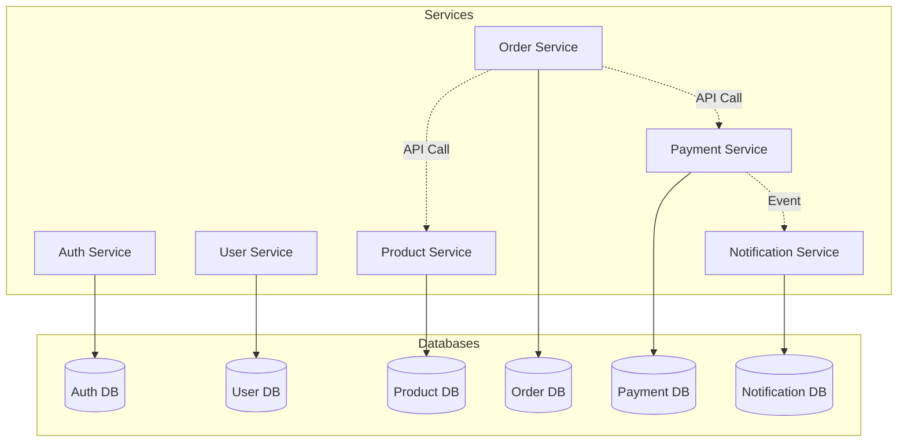

# Database Documentation

## Table of Contents
- [Overview](#overview)
- [Database Architecture](#database-architecture)
- [Schema Design](#schema-design)
- [Migration Strategy](#migration-strategy)
- [Backup and Restore](#backup-and-restore)
- [Performance Tuning](#performance-tuning)
- [Monitoring](#monitoring)
- [Best Practices](#best-practices)

## Overview

### Database Strategy

The microservices architecture follows the **Database per Service** pattern, where each service has its own dedicated database. This approach provides:

- **Data isolation**: Services can't directly access other services' data
- **Technology independence**: Each service can use the most appropriate database
- **Independent scaling**: Databases can be scaled independently
- **Fault isolation**: Database issues in one service don't affect others
- **Team autonomy**: Teams can manage their own databases

### Database Technologies

| Service | Database | Purpose |
|---------|----------|---------|
| Auth Service | PostgreSQL | User authentication data |
| User Service | PostgreSQL | User profiles and preferences |
| Product Service | PostgreSQL | Product catalog and inventory |
| Order Service | PostgreSQL | Orders and transactions |
| Payment Service | PostgreSQL | Payment records |
| Notification Service | PostgreSQL | Notification history |
| API Gateway | Redis | Session management, rate limiting |

## Database Architecture

### Database per Service Pattern



### Database Infrastructure

```yaml
# PostgreSQL StatefulSet
apiVersion: apps/v1
kind: StatefulSet
metadata:
  name: postgres
  namespace: microservices
spec:
  serviceName: postgres
  replicas: 1
  selector:
    matchLabels:
      app: postgres
  template:
    metadata:
      labels:
        app: postgres
    spec:
      containers:
        - name: postgres
          image: postgres:15
          ports:
            - containerPort: 5432
              name: postgres
          env:
            - name: POSTGRES_PASSWORD
              valueFrom:
                secretKeyRef:
                  name: postgres-secret
                  key: password
            - name: PGDATA
              value: /var/lib/postgresql/data/pgdata
          volumeMounts:
            - name: postgres-storage
              mountPath: /var/lib/postgresql/data
          resources:
            requests:
              cpu: 500m
              memory: 1Gi
            limits:
              cpu: 2
              memory: 4Gi
  volumeClaimTemplates:
    - metadata:
        name: postgres-storage
      spec:
        accessModes: ["ReadWriteOnce"]
        storageClassName: fast-ssd
        resources:
          requests:
            storage: 50Gi
```

## Schema Design

### Auth Service Schema

```sql
-- Users authentication table
CREATE TABLE users (
    id UUID PRIMARY KEY DEFAULT gen_random_uuid(),
    email VARCHAR(255) UNIQUE NOT NULL,
    password_hash TEXT NOT NULL,
    is_verified BOOLEAN DEFAULT FALSE,
    is_active BOOLEAN DEFAULT TRUE,
    role VARCHAR(50) DEFAULT 'user',
    last_login_at TIMESTAMP,
    created_at TIMESTAMP DEFAULT CURRENT_TIMESTAMP,
    updated_at TIMESTAMP DEFAULT CURRENT_TIMESTAMP
);

-- Refresh tokens
CREATE TABLE refresh_tokens (
    id UUID PRIMARY KEY DEFAULT gen_random_uuid(),
    user_id UUID NOT NULL REFERENCES users(id) ON DELETE CASCADE,
    token_hash TEXT NOT NULL,
    expires_at TIMESTAMP NOT NULL,
    revoked BOOLEAN DEFAULT FALSE,
    created_at TIMESTAMP DEFAULT CURRENT_TIMESTAMP,
    UNIQUE(token_hash)
);

-- Password reset tokens
CREATE TABLE password_reset_tokens (
    id UUID PRIMARY KEY DEFAULT gen_random_uuid(),
    user_id UUID NOT NULL REFERENCES users(id) ON DELETE CASCADE,
    token_hash TEXT NOT NULL,
    expires_at TIMESTAMP NOT NULL,
    used BOOLEAN DEFAULT FALSE,
    created_at TIMESTAMP DEFAULT CURRENT_TIMESTAMP,
    UNIQUE(token_hash)
);

-- Email verification tokens
CREATE TABLE email_verification_tokens (
    id UUID PRIMARY KEY DEFAULT gen_random_uuid(),
    user_id UUID NOT NULL REFERENCES users(id) ON DELETE CASCADE,
    token_hash TEXT NOT NULL,
    expires_at TIMESTAMP NOT NULL,
    used BOOLEAN DEFAULT FALSE,
    created_at TIMESTAMP DEFAULT CURRENT_TIMESTAMP,
    UNIQUE(token_hash)
);

-- Indexes
CREATE INDEX idx_users_email ON users(email);
CREATE INDEX idx_refresh_tokens_user_id ON refresh_tokens(user_id);
CREATE INDEX idx_refresh_tokens_expires_at ON refresh_tokens(expires_at);
CREATE INDEX idx_password_reset_tokens_user_id ON password_reset_tokens(user_id);
```

### User Service Schema

```sql
-- User profiles
CREATE TABLE user_profiles (
    id UUID PRIMARY KEY DEFAULT gen_random_uuid(),
    user_id UUID UNIQUE NOT NULL,
    first_name VARCHAR(100) NOT NULL,
    last_name VARCHAR(100) NOT NULL,
    phone_number VARCHAR(20),
    avatar_url TEXT,
    date_of_birth DATE,
    created_at TIMESTAMP DEFAULT CURRENT_TIMESTAMP,
    updated_at TIMESTAMP DEFAULT CURRENT_TIMESTAMP
);

-- User addresses
CREATE TABLE user_addresses (
    id UUID PRIMARY KEY DEFAULT gen_random_uuid(),
    user_id UUID NOT NULL,
    address_type VARCHAR(20) NOT NULL, -- 'shipping', 'billing'
    street VARCHAR(255) NOT NULL,
    city VARCHAR(100) NOT NULL,
    state VARCHAR(100) NOT NULL,
    zip_code VARCHAR(20) NOT NULL,
    country VARCHAR(100) NOT NULL,
    is_default BOOLEAN DEFAULT FALSE,
    created_at TIMESTAMP DEFAULT CURRENT_TIMESTAMP,
    updated_at TIMESTAMP DEFAULT CURRENT_TIMESTAMP
);

-- User preferences
CREATE TABLE user_preferences (
    id UUID PRIMARY KEY DEFAULT gen_random_uuid(),
    user_id UUID UNIQUE NOT NULL,
    email_notifications BOOLEAN DEFAULT TRUE,
    sms_notifications BOOLEAN DEFAULT FALSE,
    push_notifications BOOLEAN DEFAULT TRUE,
    currency VARCHAR(3) DEFAULT 'USD',
    language VARCHAR(2) DEFAULT 'en',
    theme VARCHAR(20) DEFAULT 'light',
    created_at TIMESTAMP DEFAULT CURRENT_TIMESTAMP,
    updated_at TIMESTAMP DEFAULT CURRENT_TIMESTAMP
);

-- Indexes
CREATE INDEX idx_user_profiles_user_id ON user_profiles(user_id);
CREATE INDEX idx_user_addresses_user_id ON user_addresses(user_id);
CREATE INDEX idx_user_preferences_user_id ON user_preferences(user_id);
```

### Product Service Schema

```sql
-- Categories
CREATE TABLE categories (
    id UUID PRIMARY KEY DEFAULT gen_random_uuid(),
    name VARCHAR(100) UNIQUE NOT NULL,
    description TEXT,
    parent_id UUID REFERENCES categories(id),
    slug VARCHAR(100) UNIQUE NOT NULL,
    created_at TIMESTAMP DEFAULT CURRENT_TIMESTAMP,
    updated_at TIMESTAMP DEFAULT CURRENT_TIMESTAMP
);

-- Products
CREATE TABLE products (
    id UUID PRIMARY KEY DEFAULT gen_random_uuid(),
    name VARCHAR(255) NOT NULL,
    description TEXT,
    long_description TEXT,
    category_id UUID REFERENCES categories(id),
    sku VARCHAR(100) UNIQUE NOT NULL,
    price DECIMAL(10, 2) NOT NULL,
    currency VARCHAR(3) DEFAULT 'USD',
    stock INTEGER DEFAULT 0,
    is_active BOOLEAN DEFAULT TRUE,
    created_at TIMESTAMP DEFAULT CURRENT_TIMESTAMP,
    updated_at TIMESTAMP DEFAULT CURRENT_TIMESTAMP
);

-- Product images
CREATE TABLE product_images (
    id UUID PRIMARY KEY DEFAULT gen_random_uuid(),
    product_id UUID NOT NULL REFERENCES products(id) ON DELETE CASCADE,
    image_url TEXT NOT NULL,
    alt_text VARCHAR(255),
    is_primary BOOLEAN DEFAULT FALSE,
    sort_order INTEGER DEFAULT 0,
    created_at TIMESTAMP DEFAULT CURRENT_TIMESTAMP
);

-- Product specifications
CREATE TABLE product_specifications (
    id UUID PRIMARY KEY DEFAULT gen_random_uuid(),
    product_id UUID NOT NULL REFERENCES products(id) ON DELETE CASCADE,
    key VARCHAR(100) NOT NULL,
    value TEXT NOT NULL,
    created_at TIMESTAMP DEFAULT CURRENT_TIMESTAMP
);

-- Product reviews
CREATE TABLE product_reviews (
    id UUID PRIMARY KEY DEFAULT gen_random_uuid(),
    product_id UUID NOT NULL REFERENCES products(id) ON DELETE CASCADE,
    user_id UUID NOT NULL,
    rating INTEGER NOT NULL CHECK (rating >= 1 AND rating <= 5),
    title VARCHAR(255),
    comment TEXT,
    verified_purchase BOOLEAN DEFAULT FALSE,
    helpful_count INTEGER DEFAULT 0,
    created_at TIMESTAMP DEFAULT CURRENT_TIMESTAMP,
    updated_at TIMESTAMP DEFAULT CURRENT_TIMESTAMP,
    UNIQUE(product_id, user_id)
);

-- Indexes
CREATE INDEX idx_products_category_id ON products(category_id);
CREATE INDEX idx_products_sku ON products(sku);
CREATE INDEX idx_products_price ON products(price);
CREATE INDEX idx_products_is_active ON products(is_active);
CREATE INDEX idx_product_images_product_id ON product_images(product_id);
CREATE INDEX idx_product_reviews_product_id ON product_reviews(product_id);
CREATE INDEX idx_product_reviews_user_id ON product_reviews(user_id);

-- Full-text search
CREATE INDEX idx_products_name_search ON products USING gin(to_tsvector('english', name));
CREATE INDEX idx_products_description_search ON products USING gin(to_tsvector('english', description));
```

### Order Service Schema

```sql
-- Orders
CREATE TABLE orders (
    id UUID PRIMARY KEY DEFAULT gen_random_uuid(),
    order_number VARCHAR(50) UNIQUE NOT NULL,
    user_id UUID NOT NULL,
    status VARCHAR(50) DEFAULT 'pending', -- pending, confirmed, processing, shipped, delivered, cancelled
    subtotal DECIMAL(10, 2) NOT NULL,
    shipping_cost DECIMAL(10, 2) DEFAULT 0,
    tax DECIMAL(10, 2) DEFAULT 0,
    total DECIMAL(10, 2) NOT NULL,
    currency VARCHAR(3) DEFAULT 'USD',
    shipping_address JSONB NOT NULL,
    billing_address JSONB NOT NULL,
    payment_method VARCHAR(50),
    tracking_number VARCHAR(100),
    notes TEXT,
    created_at TIMESTAMP DEFAULT CURRENT_TIMESTAMP,
    updated_at TIMESTAMP DEFAULT CURRENT_TIMESTAMP
);

-- Order items
CREATE TABLE order_items (
    id UUID PRIMARY KEY DEFAULT gen_random_uuid(),
    order_id UUID NOT NULL REFERENCES orders(id) ON DELETE CASCADE,
    product_id UUID NOT NULL,
    product_name VARCHAR(255) NOT NULL,
    product_sku VARCHAR(100) NOT NULL,
    quantity INTEGER NOT NULL CHECK (quantity > 0),
    unit_price DECIMAL(10, 2) NOT NULL,
    subtotal DECIMAL(10, 2) NOT NULL,
    created_at TIMESTAMP DEFAULT CURRENT_TIMESTAMP
);

-- Order status history
CREATE TABLE order_status_history (
    id UUID PRIMARY KEY DEFAULT gen_random_uuid(),
    order_id UUID NOT NULL REFERENCES orders(id) ON DELETE CASCADE,
    status VARCHAR(50) NOT NULL,
    notes TEXT,
    created_at TIMESTAMP DEFAULT CURRENT_TIMESTAMP
);

-- Shopping carts
CREATE TABLE shopping_carts (
    id UUID PRIMARY KEY DEFAULT gen_random_uuid(),
    user_id UUID UNIQUE NOT NULL,
    items JSONB DEFAULT '[]',
    created_at TIMESTAMP DEFAULT CURRENT_TIMESTAMP,
    updated_at TIMESTAMP DEFAULT CURRENT_TIMESTAMP
);

-- Indexes
CREATE INDEX idx_orders_user_id ON orders(user_id);
CREATE INDEX idx_orders_status ON orders(status);
CREATE INDEX idx_orders_created_at ON orders(created_at);
CREATE INDEX idx_order_items_order_id ON order_items(order_id);
CREATE INDEX idx_order_items_product_id ON order_items(product_id);
CREATE INDEX idx_order_status_history_order_id ON order_status_history(order_id);
CREATE INDEX idx_shopping_carts_user_id ON shopping_carts(user_id);
```

### Payment Service Schema

```sql
-- Payments
CREATE TABLE payments (
    id UUID PRIMARY KEY DEFAULT gen_random_uuid(),
    order_id UUID UNIQUE NOT NULL,
    user_id UUID NOT NULL,
    amount DECIMAL(10, 2) NOT NULL,
    currency VARCHAR(3) DEFAULT 'USD',
    status VARCHAR(50) DEFAULT 'pending', -- pending, processing, completed, failed, refunded
    payment_method VARCHAR(50) NOT NULL,
    transaction_id VARCHAR(255),
    gateway_response JSONB,
    processed_at TIMESTAMP,
    created_at TIMESTAMP DEFAULT CURRENT_TIMESTAMP,
    updated_at TIMESTAMP DEFAULT CURRENT_TIMESTAMP
);

-- Payment methods
CREATE TABLE payment_methods (
    id UUID PRIMARY KEY DEFAULT gen_random_uuid(),
    user_id UUID NOT NULL,
    type VARCHAR(50) NOT NULL, -- credit_card, debit_card, paypal
    provider VARCHAR(50),
    last_four_digits VARCHAR(4),
    expiry_month INTEGER,
    expiry_year INTEGER,
    brand VARCHAR(50),
    is_default BOOLEAN DEFAULT FALSE,
    created_at TIMESTAMP DEFAULT CURRENT_TIMESTAMP,
    updated_at TIMESTAMP DEFAULT CURRENT_TIMESTAMP
);

-- Refunds
CREATE TABLE refunds (
    id UUID PRIMARY KEY DEFAULT gen_random_uuid(),
    payment_id UUID NOT NULL REFERENCES payments(id),
    amount DECIMAL(10, 2) NOT NULL,
    reason TEXT,
    status VARCHAR(50) DEFAULT 'pending', -- pending, processing, completed, failed
    transaction_id VARCHAR(255),
    processed_at TIMESTAMP,
    created_at TIMESTAMP DEFAULT CURRENT_TIMESTAMP,
    updated_at TIMESTAMP DEFAULT CURRENT_TIMESTAMP
);

-- Indexes
CREATE INDEX idx_payments_order_id ON payments(order_id);
CREATE INDEX idx_payments_user_id ON payments(user_id);
CREATE INDEX idx_payments_status ON payments(status);
CREATE INDEX idx_payment_methods_user_id ON payment_methods(user_id);
CREATE INDEX idx_refunds_payment_id ON refunds(payment_id);
```

### Notification Service Schema

```sql
-- Notifications
CREATE TABLE notifications (
    id UUID PRIMARY KEY DEFAULT gen_random_uuid(),
    user_id UUID NOT NULL,
    type VARCHAR(50) NOT NULL, -- email, sms, push
    category VARCHAR(50) NOT NULL, -- order_update, payment_confirmation, etc.
    title VARCHAR(255) NOT NULL,
    message TEXT NOT NULL,
    status VARCHAR(50) DEFAULT 'unread', -- unread, read
    priority VARCHAR(20) DEFAULT 'normal', -- low, normal, high, urgent
    data JSONB,
    read_at TIMESTAMP,
    created_at TIMESTAMP DEFAULT CURRENT_TIMESTAMP
);

-- Notification templates
CREATE TABLE notification_templates (
    id UUID PRIMARY KEY DEFAULT gen_random_uuid(),
    name VARCHAR(100) UNIQUE NOT NULL,
    type VARCHAR(50) NOT NULL,
    subject VARCHAR(255),
    body TEXT NOT NULL,
    variables JSONB,
    is_active BOOLEAN DEFAULT TRUE,
    created_at TIMESTAMP DEFAULT CURRENT_TIMESTAMP,
    updated_at TIMESTAMP DEFAULT CURRENT_TIMESTAMP
);

-- Notification logs
CREATE TABLE notification_logs (
    id UUID PRIMARY KEY DEFAULT gen_random_uuid(),
    notification_id UUID REFERENCES notifications(id) ON DELETE CASCADE,
    status VARCHAR(50) NOT NULL, -- sent, failed, pending
    error_message TEXT,
    sent_at TIMESTAMP,
    created_at TIMESTAMP DEFAULT CURRENT_TIMESTAMP
);

-- Indexes
CREATE INDEX idx_notifications_user_id ON notifications(user_id);
CREATE INDEX idx_notifications_status ON notifications(status);
CREATE INDEX idx_notifications_created_at ON notifications(created_at);
CREATE INDEX idx_notification_logs_notification_id ON notification_logs(notification_id);
```

## Migration Strategy

### Migration Tools

We use **node-pg-migrate** for database migrations:

```bash
npm install node-pg-migrate
```

### Migration Structure

```
migrations/
├── 001_create_users_table.sql
├── 002_create_refresh_tokens_table.sql
├── 003_add_user_roles.sql
└── 004_add_indexes.sql
```

### Creating Migrations

```bash
# Create new migration
npx node-pg-migrate create migration_name

# Run migrations
npx node-pg-migrate up

# Rollback migration
npx node-pg-migrate down

# Show migration status
npx node-pg-migrate status
```

### Migration Example

```sql
-- migrations/001_create_users_table.sql

-- Up migration
CREATE TABLE users (
    id UUID PRIMARY KEY DEFAULT gen_random_uuid(),
    email VARCHAR(255) UNIQUE NOT NULL,
    password_hash TEXT NOT NULL,
    created_at TIMESTAMP DEFAULT CURRENT_TIMESTAMP,
    updated_at TIMESTAMP DEFAULT CURRENT_TIMESTAMP
);

CREATE INDEX idx_users_email ON users(email);

-- Down migration
DROP TABLE IF EXISTS users;
```

### Migration Best Practices

1. **Never modify existing migrations**: Create new ones instead
2. **Always provide rollback**: Include down migrations
3. **Test migrations**: Test both up and down
4. **Incremental changes**: Small, focused migrations
5. **Version control**: Commit migrations with code
6. **Document changes**: Add comments explaining complex migrations

## Backup and Restore

### Automated Backup Strategy

```bash
#!/bin/bash
# backup.sh - Automated database backup script

DATE=$(date +%Y%m%d_%H%M%S)
BACKUP_DIR="/backups"
RETENTION_DAYS=30

# Backup each database
for DB in auth_db user_db product_db order_db payment_db notification_db; do
    echo "Backing up $DB..."
    pg_dump -h $DB_HOST -U $DB_USER -d $DB \
        -F custom -f "$BACKUP_DIR/${DB}_${DATE}.dump"

    # Compress backup
    gzip "$BACKUP_DIR/${DB}_${DATE}.dump"

    echo "Backup completed: ${DB}_${DATE}.dump.gz"
done

# Remove old backups
find $BACKUP_DIR -name "*.dump.gz" -mtime +$RETENTION_DAYS -delete

echo "Backup process completed"
```

### Kubernetes CronJob for Backups

```yaml
apiVersion: batch/v1
kind: CronJob
metadata:
  name: postgres-backup
  namespace: microservices
spec:
  schedule: "0 2 * * *" # Daily at 2 AM
  jobTemplate:
    spec:
      template:
        spec:
          containers:
            - name: backup
              image: postgres:15
              env:
                - name: PGHOST
                  value: postgres-service
                - name: PGUSER
                  valueFrom:
                    secretKeyRef:
                      name: postgres-secret
                      key: username
                - name: PGPASSWORD
                  valueFrom:
                    secretKeyRef:
                      name: postgres-secret
                      key: password
              command:
                - /bin/bash
                - -c
                - |
                  DATE=$(date +%Y%m%d_%H%M%S)
                  pg_dump -F custom -f /backup/backup_${DATE}.dump
                  aws s3 cp /backup/backup_${DATE}.dump s3://backups/postgres/
              volumeMounts:
                - name: backup-storage
                  mountPath: /backup
          volumes:
            - name: backup-storage
              emptyDir: {}
          restartPolicy: OnFailure
```

### Restore Procedure

```bash
# Restore from backup
pg_restore -h $DB_HOST -U $DB_USER -d $DB_NAME \
    -c --if-exists /path/to/backup.dump

# Or restore from compressed backup
gunzip -c /path/to/backup.dump.gz | \
    pg_restore -h $DB_HOST -U $DB_USER -d $DB_NAME -c --if-exists

# Restore specific table
pg_restore -h $DB_HOST -U $DB_USER -d $DB_NAME \
    -t users /path/to/backup.dump
```

### Point-in-Time Recovery (PITR)

```bash
# Enable WAL archiving in postgresql.conf
wal_level = replica
archive_mode = on
archive_command = 'test ! -f /archive/%f && cp %p /archive/%f'

# Take base backup
pg_basebackup -h $DB_HOST -U $DB_USER -D /backup/base -Fp -Xs -P

# Restore to specific point in time
# 1. Stop PostgreSQL
# 2. Restore base backup
# 3. Create recovery.conf
restore_command = 'cp /archive/%f %p'
recovery_target_time = '2024-01-15 14:30:00'
# 4. Start PostgreSQL
```

## Performance Tuning

### PostgreSQL Configuration

```conf
# postgresql.conf

# Memory settings
shared_buffers = 4GB              # 25% of total RAM
effective_cache_size = 12GB       # 75% of total RAM
maintenance_work_mem = 1GB
work_mem = 64MB

# Checkpoint settings
checkpoint_completion_target = 0.9
wal_buffers = 16MB
default_statistics_target = 100
random_page_cost = 1.1            # For SSD

# Connection settings
max_connections = 200
shared_preload_libraries = 'pg_stat_statements'

# Logging
log_statement = 'ddl'
log_min_duration_statement = 1000  # Log queries > 1s
log_line_prefix = '%t [%p]: [%l-1] user=%u,db=%d,app=%a,client=%h '
```

### Connection Pooling

```typescript
import { Pool } from 'pg';

const pool = new Pool({
  host: process.env.DATABASE_HOST,
  port: parseInt(process.env.DATABASE_PORT || '5432'),
  database: process.env.DATABASE_NAME,
  user: process.env.DATABASE_USER,
  password: process.env.DATABASE_PASSWORD,

  // Connection pool settings
  min: 2,                    // Minimum connections
  max: 10,                   // Maximum connections
  idleTimeoutMillis: 30000,  // Close idle connections after 30s
  connectionTimeoutMillis: 2000,  // Fail fast if no connection available
  maxUses: 7500,            // Close connection after 7500 uses

  // Statement timeout
  statement_timeout: 30000,  // 30 seconds
});

// Graceful shutdown
process.on('SIGTERM', async () => {
  await pool.end();
});
```

### Query Optimization

```sql
-- Use EXPLAIN ANALYZE to understand query performance
EXPLAIN ANALYZE
SELECT p.*, c.name as category_name
FROM products p
JOIN categories c ON p.category_id = c.id
WHERE p.is_active = TRUE
ORDER BY p.created_at DESC
LIMIT 20;

-- Create indexes for frequently queried columns
CREATE INDEX CONCURRENTLY idx_products_is_active_created_at
ON products(is_active, created_at DESC);

-- Partial index for active products
CREATE INDEX idx_products_active
ON products(created_at DESC)
WHERE is_active = TRUE;

-- Composite index for search
CREATE INDEX idx_products_search
ON products USING gin((
    setweight(to_tsvector('english', name), 'A') ||
    setweight(to_tsvector('english', COALESCE(description, '')), 'B')
));
```

### Database Maintenance

```sql
-- Analyze tables
ANALYZE products;
ANALYZE VERBOSE products;

-- Vacuum tables
VACUUM ANALYZE products;
VACUUM FULL products;  -- Requires table lock

-- Reindex
REINDEX TABLE products;
REINDEX INDEX CONCURRENTLY idx_products_name;

-- Check table bloat
SELECT
    schemaname,
    tablename,
    pg_size_pretty(pg_total_relation_size(schemaname||'.'||tablename)) AS size,
    pg_size_pretty(pg_total_relation_size(schemaname||'.'||tablename) - pg_relation_size(schemaname||'.'||tablename)) AS external_size
FROM pg_tables
WHERE schemaname = 'public'
ORDER BY pg_total_relation_size(schemaname||'.'||tablename) DESC;
```

## Monitoring

### Key Metrics to Monitor

1. **Connection metrics**:
   - Active connections
   - Idle connections
   - Connection wait time

2. **Query performance**:
   - Slow queries (> 1s)
   - Query execution time
   - Queries per second

3. **Database size**:
   - Database size
   - Table sizes
   - Index sizes

4. **Replication lag** (if using replicas)
5. **Cache hit ratio**
6. **Disk I/O**
7. **CPU and memory usage**

### Monitoring Queries

```sql
-- Active queries
SELECT
    pid,
    usename,
    application_name,
    client_addr,
    state,
    query,
    NOW() - query_start AS duration
FROM pg_stat_activity
WHERE state != 'idle'
ORDER BY duration DESC;

-- Slow queries
SELECT
    query,
    calls,
    total_time,
    mean_time,
    max_time
FROM pg_stat_statements
ORDER BY mean_time DESC
LIMIT 20;

-- Database size
SELECT
    datname,
    pg_size_pretty(pg_database_size(datname)) AS size
FROM pg_database
ORDER BY pg_database_size(datname) DESC;

-- Table sizes
SELECT
    schemaname,
    tablename,
    pg_size_pretty(pg_total_relation_size(schemaname||'.'||tablename)) AS total_size,
    pg_size_pretty(pg_relation_size(schemaname||'.'||tablename)) AS table_size,
    pg_size_pretty(pg_total_relation_size(schemaname||'.'||tablename) - pg_relation_size(schemaname||'.'||tablename)) AS index_size
FROM pg_tables
WHERE schemaname = 'public'
ORDER BY pg_total_relation_size(schemaname||'.'||tablename) DESC;

-- Cache hit ratio (should be > 99%)
SELECT
    sum(heap_blks_read) as heap_read,
    sum(heap_blks_hit)  as heap_hit,
    sum(heap_blks_hit) / (sum(heap_blks_hit) + sum(heap_blks_read)) * 100 as ratio
FROM pg_statio_user_tables;

-- Index usage
SELECT
    schemaname,
    tablename,
    indexname,
    idx_scan,
    idx_tup_read,
    idx_tup_fetch
FROM pg_stat_user_indexes
ORDER BY idx_scan ASC;
```

### PostgreSQL Exporter for Prometheus

```yaml
apiVersion: v1
kind: ConfigMap
metadata:
  name: postgres-exporter-config
  namespace: microservices
data:
  queries.yaml: |
    pg_database:
      query: "SELECT pg_database.datname, pg_database_size(pg_database.datname) as size FROM pg_database"
      metrics:
        - datname:
            usage: "LABEL"
            description: "Name of the database"
        - size:
            usage: "GAUGE"
            description: "Database size in bytes"

    pg_stat_activity:
      query: "SELECT state, COUNT(*) as count FROM pg_stat_activity GROUP BY state"
      metrics:
        - state:
            usage: "LABEL"
            description: "Connection state"
        - count:
            usage: "GAUGE"
            description: "Number of connections in this state"
---
apiVersion: apps/v1
kind: Deployment
metadata:
  name: postgres-exporter
  namespace: microservices
spec:
  replicas: 1
  selector:
    matchLabels:
      app: postgres-exporter
  template:
    metadata:
      labels:
        app: postgres-exporter
    spec:
      containers:
        - name: postgres-exporter
          image: prometheuscommunity/postgres-exporter:latest
          ports:
            - containerPort: 9187
          env:
            - name: DATA_SOURCE_NAME
              valueFrom:
                secretKeyRef:
                  name: postgres-secret
                  key: connection-string
          volumeMounts:
            - name: config
              mountPath: /etc/postgres-exporter
      volumes:
        - name: config
          configMap:
            name: postgres-exporter-config
```

## Best Practices

### Database Best Practices

1. **Use UUIDs for primary keys**: Avoids sequential ID guessing
2. **Always include timestamps**: created_at, updated_at
3. **Use constraints**: NOT NULL, CHECK, FOREIGN KEY
4. **Index strategically**: Not too many, not too few
5. **Use transactions**: For multi-step operations
6. **Implement soft deletes**: For audit trails
7. **Partition large tables**: For better performance
8. **Regular maintenance**: VACUUM, ANALYZE, REINDEX
9. **Monitor performance**: Slow queries, connection pool
10. **Backup regularly**: Automated daily backups

### Query Best Practices

1. **Use parameterized queries**: Prevent SQL injection
2. **Limit result sets**: Use LIMIT and OFFSET
3. **Avoid SELECT ***: Select only needed columns
4. **Use EXPLAIN ANALYZE**: Understand query plans
5. **Index foreign keys**: Improve join performance
6. **Batch operations**: Use bulk inserts/updates
7. **Avoid N+1 queries**: Use JOINs or batch loading
8. **Use connection pooling**: Reuse connections
9. **Set timeouts**: Prevent long-running queries
10. **Cache frequently accessed data**: Use Redis

### Schema Design Best Practices

1. **Normalize appropriately**: Balance between normalization and performance
2. **Use appropriate data types**: Don't use TEXT for everything
3. **Document your schema**: Add comments to tables and columns
4. **Version your schema**: Use migrations
5. **Plan for growth**: Consider partitioning and sharding
6. **Avoid premature optimization**: Start simple, optimize as needed
7. **Use enums wisely**: For fixed sets of values
8. **Handle NULL carefully**: Understand NULL semantics
9. **Use cascading deletes**: WHERE appropriate
10. **Implement audit trails**: Track who changed what and when

## Resources

- [PostgreSQL Documentation](https://www.postgresql.org/docs/)
- [PostgreSQL Performance Tuning](https://wiki.postgresql.org/wiki/Performance_Optimization)
- [pg_stat_statements Documentation](https://www.postgresql.org/docs/current/pgstatstatements.html)
- [Database Reliability Engineering](https://www.oreilly.com/library/view/database-reliability-engineering/9781491925935/)
