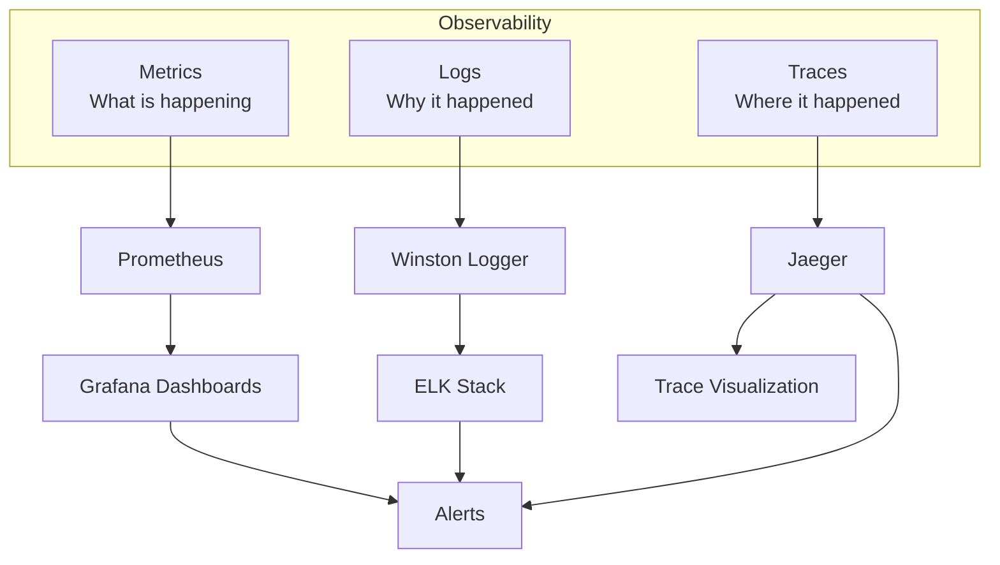

# Monitoring and Observability Guide

## Table of Contents
- [Overview](#overview)
- [Metrics with Prometheus](#metrics-with-prometheus)
- [Visualization with Grafana](#visualization-with-grafana)
- [Distributed Tracing with Jaeger](#distributed-tracing-with-jaeger)
- [Logging Strategy](#logging-strategy)
- [Alerting](#alerting)
- [Performance Monitoring](#performance-monitoring)
- [Best Practices](#best-practices)

## Overview

### The Three Pillars of Observability



### Monitoring Stack

| Component | Purpose | Access URL |
|-----------|---------|------------|
| Prometheus | Metrics collection | http://localhost:9090 |
| Grafana | Metrics visualization | http://localhost:3001 |
| Jaeger | Distributed tracing | http://localhost:16686 |
| AlertManager | Alert management | http://localhost:9093 |

## Metrics with Prometheus

### Application Metrics

Each service exposes metrics on `/metrics` endpoint using `prom-client`:

```typescript
import { Registry, Counter, Histogram, Gauge } from 'prom-client';

// Create registry
export const register = new Registry();

// HTTP request counter
export const httpRequestCounter = new Counter({
  name: 'http_requests_total',
  help: 'Total number of HTTP requests',
  labelNames: ['method', 'route', 'status'],
  registers: [register],
});

// HTTP request duration
export const httpRequestDuration = new Histogram({
  name: 'http_request_duration_seconds',
  help: 'Duration of HTTP requests in seconds',
  labelNames: ['method', 'route', 'status'],
  buckets: [0.1, 0.5, 1, 2, 5],
  registers: [register],
});

// Active connections
export const activeConnections = new Gauge({
  name: 'active_connections',
  help: 'Number of active connections',
  registers: [register],
});

// Database query duration
export const dbQueryDuration = new Histogram({
  name: 'db_query_duration_seconds',
  help: 'Duration of database queries in seconds',
  labelNames: ['query_type', 'table'],
  buckets: [0.01, 0.05, 0.1, 0.5, 1],
  registers: [register],
});

// Error counter
export const errorCounter = new Counter({
  name: 'errors_total',
  help: 'Total number of errors',
  labelNames: ['service', 'type'],
  registers: [register],
});
```

### Instrumenting Your Code

```typescript
// Middleware for HTTP metrics
export const metricsMiddleware = (req: Request, res: Response, next: NextFunction) => {
  const start = Date.now();

  // Count active connections
  activeConnections.inc();

  res.on('finish', () => {
    const duration = (Date.now() - start) / 1000;

    // Record request
    httpRequestCounter.inc({
      method: req.method,
      route: req.route?.path || req.path,
      status: res.statusCode,
    });

    // Record duration
    httpRequestDuration.observe(
      {
        method: req.method,
        route: req.route?.path || req.path,
        status: res.statusCode,
      },
      duration
    );

    // Decrement active connections
    activeConnections.dec();
  });

  next();
};

// Database query instrumentation
export async function executeQuery<T>(
  query: string,
  params: any[],
  queryType: string,
  table: string
): Promise<T> {
  const start = Date.now();

  try {
    const result = await pool.query(query, params);
    const duration = (Date.now() - start) / 1000;

    dbQueryDuration.observe({ query_type: queryType, table }, duration);

    return result.rows as T;
  } catch (error) {
    errorCounter.inc({ service: 'database', type: 'query_error' });
    throw error;
  }
}

// Business metrics
export const orderCounter = new Counter({
  name: 'orders_total',
  help: 'Total number of orders',
  labelNames: ['status'],
  registers: [register],
});

export const orderValue = new Histogram({
  name: 'order_value_dollars',
  help: 'Order value in dollars',
  buckets: [10, 50, 100, 500, 1000, 5000],
  registers: [register],
});

// Usage in business logic
async function createOrder(orderData: CreateOrderDto): Promise<Order> {
  const order = await orderRepository.create(orderData);

  // Record metrics
  orderCounter.inc({ status: 'created' });
  orderValue.observe(order.total);

  return order;
}
```

### Prometheus Configuration

**prometheus.yml**:
```yaml
global:
  scrape_interval: 15s
  evaluation_interval: 15s
  external_labels:
    cluster: 'microservices-cluster'
    environment: 'production'

# Alertmanager configuration
alerting:
  alertmanagers:
    - static_configs:
        - targets:
            - alertmanager:9093

# Load rules
rule_files:
  - '/etc/prometheus/rules/*.yml'

# Scrape configurations
scrape_configs:
  # API Gateway
  - job_name: 'api-gateway'
    kubernetes_sd_configs:
      - role: pod
        namespaces:
          names:
            - microservices
    relabel_configs:
      - source_labels: [__meta_kubernetes_pod_label_app]
        action: keep
        regex: api-gateway
      - source_labels: [__meta_kubernetes_pod_annotation_prometheus_io_scrape]
        action: keep
        regex: true
      - source_labels: [__meta_kubernetes_pod_annotation_prometheus_io_path]
        action: replace
        target_label: __metrics_path__
        regex: (.+)
      - source_labels: [__address__, __meta_kubernetes_pod_annotation_prometheus_io_port]
        action: replace
        regex: ([^:]+)(?::\d+)?;(\d+)
        replacement: $1:$2
        target_label: __address__

  # Auth Service
  - job_name: 'auth-service'
    kubernetes_sd_configs:
      - role: pod
        namespaces:
          names:
            - microservices
    relabel_configs:
      - source_labels: [__meta_kubernetes_pod_label_app]
        action: keep
        regex: auth-service
      - source_labels: [__meta_kubernetes_pod_annotation_prometheus_io_scrape]
        action: keep
        regex: true

  # User Service
  - job_name: 'user-service'
    kubernetes_sd_configs:
      - role: pod
        namespaces:
          names:
            - microservices
    relabel_configs:
      - source_labels: [__meta_kubernetes_pod_label_app]
        action: keep
        regex: user-service

  # Product Service
  - job_name: 'product-service'
    kubernetes_sd_configs:
      - role: pod
        namespaces:
          names:
            - microservices
    relabel_configs:
      - source_labels: [__meta_kubernetes_pod_label_app]
        action: keep
        regex: product-service

  # Order Service
  - job_name: 'order-service'
    kubernetes_sd_configs:
      - role: pod
        namespaces:
          names:
            - microservices
    relabel_configs:
      - source_labels: [__meta_kubernetes_pod_label_app]
        action: keep
        regex: order-service

  # Payment Service
  - job_name: 'payment-service'
    kubernetes_sd_configs:
      - role: pod
        namespaces:
          names:
            - microservices
    relabel_configs:
      - source_labels: [__meta_kubernetes_pod_label_app]
        action: keep
        regex: payment-service

  # Notification Service
  - job_name: 'notification-service'
    kubernetes_sd_configs:
      - role: pod
        namespaces:
          names:
            - microservices
    relabel_configs:
      - source_labels: [__meta_kubernetes_pod_label_app]
        action: keep
        regex: notification-service

  # PostgreSQL
  - job_name: 'postgresql'
    static_configs:
      - targets:
          - postgres-exporter:9187

  # Redis
  - job_name: 'redis'
    static_configs:
      - targets:
          - redis-exporter:9121

  # Kubernetes nodes
  - job_name: 'kubernetes-nodes'
    kubernetes_sd_configs:
      - role: node
    relabel_configs:
      - action: labelmap
        regex: __meta_kubernetes_node_label_(.+)

  # Kubernetes pods
  - job_name: 'kubernetes-pods'
    kubernetes_sd_configs:
      - role: pod
    relabel_configs:
      - source_labels: [__meta_kubernetes_pod_annotation_prometheus_io_scrape]
        action: keep
        regex: true
```

### Key Metrics to Monitor

#### Application Metrics
- Request rate (requests/second)
- Request duration (latency)
- Error rate (errors/second)
- Success rate (%)
- Active connections

#### Business Metrics
- Orders created/completed/failed
- Revenue (order value)
- User registrations
- Product views
- Cart abandonment rate

#### Infrastructure Metrics
- CPU usage (%)
- Memory usage (%)
- Disk usage (%)
- Network I/O
- Pod restart count

#### Database Metrics
- Query duration
- Connection pool size
- Active connections
- Slow queries
- Deadlocks

## Visualization with Grafana

### Setting Up Grafana

```bash
# Deploy Grafana
kubectl apply -f k8s/monitoring/grafana/

# Get admin password
kubectl get secret grafana-admin -n microservices -o jsonpath='{.data.password}' | base64 -d

# Access Grafana
kubectl port-forward svc/grafana 3001:3000 -n microservices
# Open http://localhost:3001
```

### Adding Prometheus Data Source

1. Login to Grafana
2. Go to Configuration > Data Sources
3. Click "Add data source"
4. Select "Prometheus"
5. Set URL: `http://prometheus:9090`
6. Click "Save & Test"

### Dashboard Examples

#### Service Overview Dashboard

**Panels**:
1. **Request Rate**: `rate(http_requests_total[5m])`
2. **Error Rate**: `rate(http_requests_total{status=~"5.."}[5m])`
3. **Request Duration (p50, p95, p99)**:
   ```promql
   histogram_quantile(0.50, rate(http_request_duration_seconds_bucket[5m]))
   histogram_quantile(0.95, rate(http_request_duration_seconds_bucket[5m]))
   histogram_quantile(0.99, rate(http_request_duration_seconds_bucket[5m]))
   ```
4. **Active Connections**: `active_connections`
5. **CPU Usage**: `rate(container_cpu_usage_seconds_total[5m])`
6. **Memory Usage**: `container_memory_usage_bytes`

#### Business Metrics Dashboard

**Panels**:
1. **Orders per Hour**: `increase(orders_total[1h])`
2. **Revenue per Hour**: `sum(increase(order_value_dollars_sum[1h]))`
3. **Average Order Value**: `order_value_dollars_sum / order_value_dollars_count`
4. **Order Status Distribution**: `orders_total by (status)`
5. **User Registrations**: `increase(user_registrations_total[1h])`

#### Database Performance Dashboard

**Panels**:
1. **Query Duration (p95)**:
   ```promql
   histogram_quantile(0.95, rate(db_query_duration_seconds_bucket[5m]))
   ```
2. **Queries per Second**: `rate(db_queries_total[5m])`
3. **Connection Pool Usage**: `db_connections_active / db_connections_max`
4. **Slow Queries**: `db_slow_queries_total`

#### Infrastructure Dashboard

**Panels**:
1. **CPU Usage by Pod**: `rate(container_cpu_usage_seconds_total[5m]) by (pod)`
2. **Memory Usage by Pod**: `container_memory_usage_bytes by (pod)`
3. **Network I/O**:
   ```promql
   rate(container_network_receive_bytes_total[5m])
   rate(container_network_transmit_bytes_total[5m])
   ```
4. **Pod Restarts**: `kube_pod_container_status_restarts_total`

### Pre-built Dashboards

Import these dashboard IDs from Grafana.com:

- **Node Exporter Full**: 1860
- **Kubernetes Cluster Monitoring**: 7249
- **PostgreSQL Database**: 9628
- **Redis Dashboard**: 11835
- **NGINX Ingress Controller**: 9614

### Creating Custom Dashboard

**Dashboard JSON** (example):
```json
{
  "dashboard": {
    "title": "Microservices Overview",
    "panels": [
      {
        "title": "Request Rate",
        "type": "graph",
        "targets": [
          {
            "expr": "sum(rate(http_requests_total[5m])) by (service)",
            "legendFormat": "{{service}}"
          }
        ]
      },
      {
        "title": "Error Rate",
        "type": "graph",
        "targets": [
          {
            "expr": "sum(rate(http_requests_total{status=~\"5..\"}[5m])) by (service)",
            "legendFormat": "{{service}}"
          }
        ]
      }
    ]
  }
}
```

## Distributed Tracing with Jaeger

### Jaeger Setup

```bash
# Deploy Jaeger
kubectl apply -f k8s/tracing/jaeger-production/

# Access Jaeger UI
kubectl port-forward svc/jaeger-query 16686:16686 -n microservices
# Open http://localhost:16686
```

### Instrumenting Services

```typescript
import { initTracer } from 'jaeger-client';
import { FORMAT_HTTP_HEADERS } from 'opentracing';

// Initialize tracer
export function createTracer(serviceName: string) {
  const config = {
    serviceName,
    sampler: {
      type: 'const',
      param: 1, // Sample all requests
    },
    reporter: {
      logSpans: true,
      agentHost: process.env.JAEGER_AGENT_HOST || 'localhost',
      agentPort: parseInt(process.env.JAEGER_AGENT_PORT || '6831'),
    },
  };

  const options = {
    logger: {
      info: (msg: string) => console.log(msg),
      error: (msg: string) => console.error(msg),
    },
  };

  return initTracer(config, options);
}

// Tracer middleware
export function tracingMiddleware(tracer: any) {
  return (req: Request, res: Response, next: NextFunction) => {
    // Extract parent span context
    const parentSpanContext = tracer.extract(FORMAT_HTTP_HEADERS, req.headers);

    // Create span
    const span = tracer.startSpan(req.path, {
      childOf: parentSpanContext,
      tags: {
        'http.method': req.method,
        'http.url': req.url,
        'span.kind': 'server',
      },
    });

    // Add span to request
    req.span = span;

    // Finish span on response
    res.on('finish', () => {
      span.setTag('http.status_code', res.statusCode);
      if (res.statusCode >= 400) {
        span.setTag('error', true);
      }
      span.finish();
    });

    next();
  };
}

// Tracing service calls
async function callUserService(userId: string, parentSpan: any): Promise<User> {
  const span = tracer.startSpan('call-user-service', {
    childOf: parentSpan,
    tags: {
      'service': 'user-service',
      'user.id': userId,
    },
  });

  try {
    const headers = {};
    tracer.inject(span, FORMAT_HTTP_HEADERS, headers);

    const response = await axios.get(
      `${USER_SERVICE_URL}/api/users/${userId}`,
      { headers }
    );

    span.setTag('http.status_code', response.status);
    return response.data;
  } catch (error) {
    span.setTag('error', true);
    span.log({ event: 'error', message: error.message });
    throw error;
  } finally {
    span.finish();
  }
}

// Database query tracing
async function tracedQuery<T>(
  query: string,
  params: any[],
  parentSpan: any
): Promise<T> {
  const span = tracer.startSpan('database-query', {
    childOf: parentSpan,
    tags: {
      'db.type': 'postgresql',
      'db.statement': query,
    },
  });

  try {
    const result = await pool.query(query, params);
    span.setTag('db.rows_affected', result.rowCount);
    return result.rows as T;
  } catch (error) {
    span.setTag('error', true);
    span.log({ event: 'error', message: error.message });
    throw error;
  } finally {
    span.finish();
  }
}
```

### Trace Example

```
Trace ID: abc123def456
Duration: 245ms

Span 1: API Gateway (245ms)
  |
  +-- Span 2: Auth Service - Validate Token (15ms)
  |
  +-- Span 3: Order Service - Create Order (220ms)
      |
      +-- Span 4: Product Service - Check Inventory (45ms)
      |   |
      |   +-- Span 5: Database Query - SELECT products (10ms)
      |
      +-- Span 6: Database Query - INSERT order (25ms)
      |
      +-- Span 7: Payment Service - Process Payment (150ms)
          |
          +-- Span 8: External API - Stripe (140ms)
```

### Analyzing Traces

1. **Find slow requests**: Sort by duration
2. **Identify bottlenecks**: Look for long spans
3. **Debug errors**: Filter by error tag
4. **Service dependencies**: View service graph
5. **Compare traces**: Compare similar requests

## Logging Strategy

### Winston Logger Configuration

```typescript
import winston from 'winston';

const logFormat = winston.format.combine(
  winston.format.timestamp({ format: 'YYYY-MM-DD HH:mm:ss' }),
  winston.format.errors({ stack: true }),
  winston.format.splat(),
  winston.format.json()
);

export const logger = winston.createLogger({
  level: process.env.LOG_LEVEL || 'info',
  format: logFormat,
  defaultMeta: {
    service: process.env.SERVICE_NAME,
    environment: process.env.NODE_ENV,
  },
  transports: [
    // Console output
    new winston.transports.Console({
      format: winston.format.combine(
        winston.format.colorize(),
        winston.format.printf(
          ({ timestamp, level, message, service, ...meta }) => {
            return `${timestamp} [${service}] ${level}: ${message} ${
              Object.keys(meta).length ? JSON.stringify(meta, null, 2) : ''
            }`;
          }
        )
      ),
    }),

    // File output
    new winston.transports.File({
      filename: 'logs/error.log',
      level: 'error',
    }),
    new winston.transports.File({
      filename: 'logs/combined.log',
    }),
  ],
});

// Request logging middleware
export const requestLogger = (req: Request, res: Response, next: NextFunction) => {
  const startTime = Date.now();

  res.on('finish', () => {
    const duration = Date.now() - startTime;

    logger.info('HTTP Request', {
      method: req.method,
      url: req.url,
      status: res.statusCode,
      duration,
      userAgent: req.get('user-agent'),
      ip: req.ip,
      userId: req.user?.id,
    });
  });

  next();
};
```

### Structured Logging

```typescript
// Good - Structured logs
logger.info('User created', {
  userId: user.id,
  email: user.email,
  timestamp: new Date().toISOString(),
});

logger.error('Payment failed', {
  orderId: order.id,
  amount: order.total,
  error: error.message,
  stack: error.stack,
});

// Bad - Unstructured logs
logger.info(`User ${user.id} created`);
logger.error('Payment failed: ' + error.message);
```

### Log Levels

| Level | Usage | Example |
|-------|-------|---------|
| `error` | Errors that need attention | Payment processing failed |
| `warn` | Warning conditions | Rate limit approaching |
| `info` | General information | User logged in |
| `http` | HTTP requests | GET /api/users |
| `debug` | Debug information | Query executed in 15ms |

### Log Aggregation

**ELK Stack** (Elasticsearch, Logstash, Kibana):

```yaml
# Filebeat configuration
filebeat.inputs:
  - type: container
    paths:
      - '/var/log/containers/*.log'
    processors:
      - add_kubernetes_metadata:
          host: ${NODE_NAME}
          matchers:
            - logs_path:
                logs_path: "/var/log/containers/"

output.elasticsearch:
  hosts: ['${ELASTICSEARCH_HOST:elasticsearch}:${ELASTICSEARCH_PORT:9200}']
  index: "microservices-%{+yyyy.MM.dd}"
```

## Alerting

### Alert Rules

**prometheus-rules.yml**:
```yaml
groups:
  - name: microservices_alerts
    interval: 30s
    rules:
      # High error rate
      - alert: HighErrorRate
        expr: |
          (
            sum(rate(http_requests_total{status=~"5.."}[5m])) by (service)
            /
            sum(rate(http_requests_total[5m])) by (service)
          ) > 0.05
        for: 5m
        labels:
          severity: critical
        annotations:
          summary: "High error rate on {{ $labels.service }}"
          description: "{{ $labels.service }} has error rate of {{ $value | humanizePercentage }}"

      # High response time
      - alert: HighResponseTime
        expr: |
          histogram_quantile(0.95,
            sum(rate(http_request_duration_seconds_bucket[5m])) by (service, le)
          ) > 2
        for: 5m
        labels:
          severity: warning
        annotations:
          summary: "High response time on {{ $labels.service }}"
          description: "{{ $labels.service }} 95th percentile response time is {{ $value }}s"

      # Service down
      - alert: ServiceDown
        expr: up{job=~".*-service"} == 0
        for: 1m
        labels:
          severity: critical
        annotations:
          summary: "Service {{ $labels.job }} is down"
          description: "{{ $labels.job }} has been down for more than 1 minute"

      # High CPU usage
      - alert: HighCPUUsage
        expr: |
          rate(container_cpu_usage_seconds_total[5m]) * 100 > 80
        for: 10m
        labels:
          severity: warning
        annotations:
          summary: "High CPU usage on {{ $labels.pod }}"
          description: "{{ $labels.pod }} CPU usage is {{ $value }}%"

      # High memory usage
      - alert: HighMemoryUsage
        expr: |
          (container_memory_usage_bytes / container_spec_memory_limit_bytes) * 100 > 90
        for: 5m
        labels:
          severity: warning
        annotations:
          summary: "High memory usage on {{ $labels.pod }}"
          description: "{{ $labels.pod }} memory usage is {{ $value }}%"

      # Database connection pool exhausted
      - alert: DatabaseConnectionPoolExhausted
        expr: |
          db_connections_active / db_connections_max > 0.9
        for: 5m
        labels:
          severity: critical
        annotations:
          summary: "Database connection pool nearly exhausted"
          description: "Connection pool usage is {{ $value | humanizePercentage }}"

      # High order failure rate
      - alert: HighOrderFailureRate
        expr: |
          (
            rate(orders_total{status="failed"}[5m])
            /
            rate(orders_total[5m])
          ) > 0.1
        for: 5m
        labels:
          severity: critical
        annotations:
          summary: "High order failure rate"
          description: "Order failure rate is {{ $value | humanizePercentage }}"
```

### AlertManager Configuration

**alertmanager.yml**:
```yaml
global:
  resolve_timeout: 5m
  slack_api_url: 'https://hooks.slack.com/services/YOUR/WEBHOOK/URL'

route:
  receiver: 'default'
  group_by: ['alertname', 'cluster', 'service']
  group_wait: 10s
  group_interval: 10s
  repeat_interval: 12h
  routes:
    - match:
        severity: critical
      receiver: 'pagerduty'
      continue: true

    - match:
        severity: warning
      receiver: 'slack'

receivers:
  - name: 'default'
    email_configs:
      - to: 'team@example.com'
        from: 'alertmanager@example.com'
        smarthost: 'smtp.example.com:587'
        auth_username: 'alertmanager@example.com'
        auth_password: 'password'

  - name: 'slack'
    slack_configs:
      - channel: '#alerts'
        title: '{{ .GroupLabels.alertname }}'
        text: '{{ range .Alerts }}{{ .Annotations.description }}{{ end }}'

  - name: 'pagerduty'
    pagerduty_configs:
      - service_key: 'YOUR_PAGERDUTY_SERVICE_KEY'
```

## Performance Monitoring

### Key Performance Indicators (KPIs)

1. **Latency**: Response time (p50, p95, p99)
2. **Throughput**: Requests per second
3. **Error Rate**: Errors per second
4. **Saturation**: Resource utilization (CPU, memory, disk)

### SLIs and SLOs

**Service Level Indicators (SLIs)**:
- API availability: 99.9%
- Response time p95: < 500ms
- Error rate: < 0.1%

**Service Level Objectives (SLOs)**:
```promql
# Availability SLO: 99.9% uptime
(
  sum(rate(http_requests_total{status!~"5.."}[30d]))
  /
  sum(rate(http_requests_total[30d]))
) > 0.999

# Latency SLO: 95% of requests under 500ms
histogram_quantile(0.95,
  sum(rate(http_request_duration_seconds_bucket[30d])) by (le)
) < 0.5

# Error Rate SLO: Less than 0.1%
(
  sum(rate(http_requests_total{status=~"5.."}[30d]))
  /
  sum(rate(http_requests_total[30d]))
) < 0.001
```

### Performance Testing

```bash
# Load testing with k6
k6 run --vus 100 --duration 30s load-test.js

# Apache Bench
ab -n 10000 -c 100 http://api-gateway/health

# Artillery
artillery quick --count 100 --num 1000 http://api-gateway/api/products
```

## Best Practices

### Monitoring Best Practices

1. **Monitor the Four Golden Signals**:
   - Latency
   - Traffic
   - Errors
   - Saturation

2. **Use Descriptive Metric Names**:
   - `http_requests_total` ✓
   - `requests` ✗

3. **Add Relevant Labels**:
   ```promql
   http_requests_total{method="GET", route="/api/users", status="200"}
   ```

4. **Use Histograms for Timing**:
   - Calculate percentiles (p50, p95, p99)
   - Don't use gauges for timing

5. **Monitor Business Metrics**:
   - Revenue, orders, user signups
   - Not just technical metrics

### Logging Best Practices

1. **Use Structured Logging**: JSON format
2. **Include Context**: Request ID, user ID, trace ID
3. **Log Levels**: Use appropriate levels
4. **Don't Log Sensitive Data**: Passwords, tokens, PII
5. **Correlation IDs**: Track requests across services

### Tracing Best Practices

1. **Sample Appropriately**:
   - Development: 100%
   - Production: 1-10%

2. **Add Tags**: Service name, operation, status
3. **Log Errors**: Capture exception details
4. **Measure Critical Paths**: Database queries, external APIs
5. **Name Spans Clearly**: Use action verbs

### Dashboard Design

1. **Start with Overview**: High-level metrics
2. **Drill Down**: Detailed service metrics
3. **Use Templating**: Switch between services
4. **Set Thresholds**: Visual indicators for problems
5. **Document**: Add descriptions to panels

## Troubleshooting Monitoring

### Prometheus Issues

```bash
# Check Prometheus targets
curl http://prometheus:9090/api/v1/targets

# Check configuration
curl http://prometheus:9090/api/v1/status/config

# Check rules
curl http://prometheus:9090/api/v1/rules

# Reload configuration
curl -X POST http://prometheus:9090/-/reload
```

### Grafana Issues

```bash
# Check Grafana logs
kubectl logs deployment/grafana -n microservices

# Test data source
curl -H "Authorization: Bearer $API_KEY" \
  http://grafana:3000/api/datasources/proxy/1/api/v1/query?query=up
```

### Jaeger Issues

```bash
# Check Jaeger logs
kubectl logs deployment/jaeger-collector -n microservices

# Verify agent connectivity
telnet jaeger-agent 6831
```

## Resources

- [Prometheus Documentation](https://prometheus.io/docs/)
- [Grafana Documentation](https://grafana.com/docs/)
- [Jaeger Documentation](https://www.jaegertracing.io/docs/)
- [Google SRE Books](https://sre.google/books/)
- [The Four Golden Signals](https://sre.google/sre-book/monitoring-distributed-systems/)
