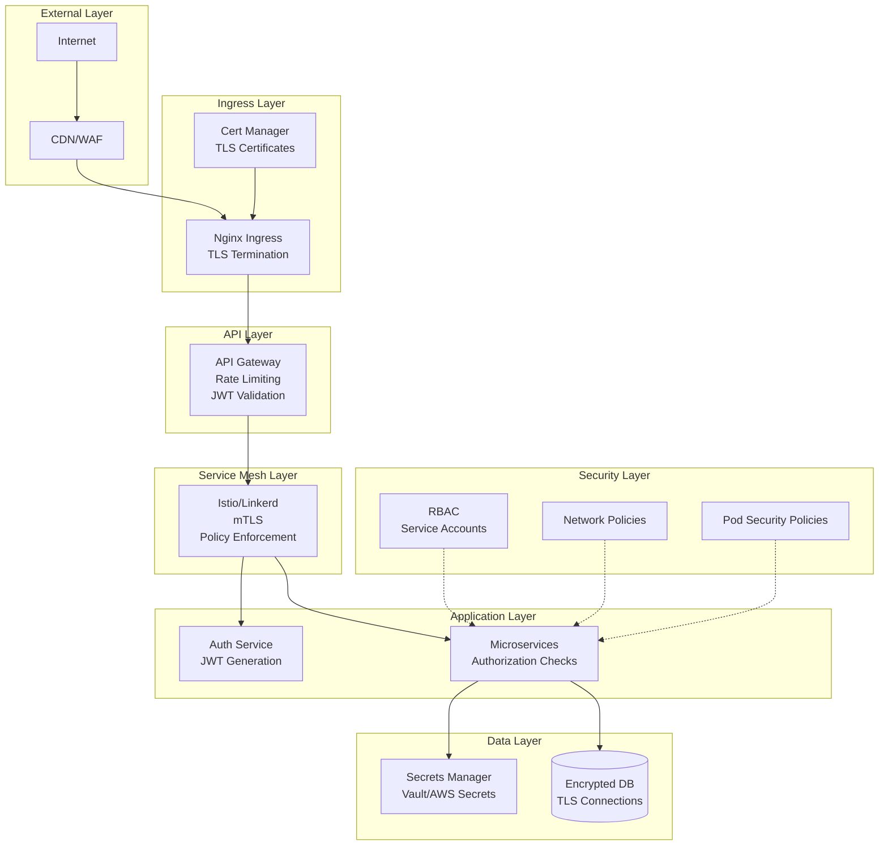

# Security Documentation

## Table of Contents
- [Security Overview](#security-overview)
- [Authentication & Authorization](#authentication--authorization)
- [Secrets Management](#secrets-management)
- [Network Security](#network-security)
- [TLS/SSL Configuration](#tlsssl-configuration)
- [Container Security](#container-security)
- [Database Security](#database-security)
- [API Security](#api-security)
- [Security Best Practices](#security-best-practices)
- [Incident Response](#incident-response)
- [Compliance](#compliance)

## Security Overview

### Security Architecture



### Security Layers

1. **Network Security**: WAF, DDoS protection, TLS
2. **Authentication**: JWT tokens, OAuth2
3. **Authorization**: RBAC, permissions
4. **Application Security**: Input validation, sanitization
5. **Data Security**: Encryption at rest and in transit
6. **Infrastructure Security**: Pod security, network policies
7. **Monitoring**: Security events, audit logs

## Authentication & Authorization

### JWT Authentication

#### Token Structure

```typescript
// Access Token (15 minutes expiration)
{
  "userId": "550e8400-e29b-41d4-a716-446655440000",
  "email": "user@example.com",
  "role": "user",
  "permissions": ["read:profile", "write:profile"],
  "iat": 1705334400,
  "exp": 1705335300,
  "iss": "auth-service",
  "aud": "microservices-api"
}

// Refresh Token (7 days expiration)
{
  "userId": "550e8400-e29b-41d4-a716-446655440000",
  "tokenId": "refresh-token-uuid",
  "type": "refresh",
  "iat": 1705334400,
  "exp": 1705939200
}
```

#### Token Generation

```typescript
import jwt from 'jsonwebtoken';
import crypto from 'crypto';

// Generate access token
export function generateAccessToken(user: IUser): string {
  const payload = {
    userId: user.id,
    email: user.email,
    role: user.role,
    permissions: user.permissions,
  };

  return jwt.sign(payload, process.env.JWT_SECRET!, {
    expiresIn: '15m',
    issuer: 'auth-service',
    audience: 'microservices-api',
  });
}

// Generate refresh token
export function generateRefreshToken(user: IUser): string {
  const payload = {
    userId: user.id,
    tokenId: crypto.randomUUID(),
    type: 'refresh',
  };

  return jwt.sign(payload, process.env.JWT_REFRESH_SECRET!, {
    expiresIn: '7d',
  });
}

// Verify token
export function verifyAccessToken(token: string): TokenPayload {
  try {
    return jwt.verify(token, process.env.JWT_SECRET!, {
      issuer: 'auth-service',
      audience: 'microservices-api',
    }) as TokenPayload;
  } catch (error) {
    if (error instanceof jwt.TokenExpiredError) {
      throw new TokenExpiredError('Access token expired');
    }
    throw new InvalidTokenError('Invalid access token');
  }
}
```

#### Authentication Middleware

```typescript
export const authenticate = async (
  req: Request,
  res: Response,
  next: NextFunction
) => {
  try {
    // Extract token from header
    const authHeader = req.headers.authorization;
    if (!authHeader || !authHeader.startsWith('Bearer ')) {
      return res.status(401).json({
        success: false,
        error: {
          code: 'UNAUTHORIZED',
          message: 'No token provided',
        },
      });
    }

    const token = authHeader.substring(7);

    // Verify token
    const payload = verifyAccessToken(token);

    // Check if token is revoked
    const isRevoked = await isTokenRevoked(payload.userId, token);
    if (isRevoked) {
      return res.status(401).json({
        success: false,
        error: {
          code: 'TOKEN_REVOKED',
          message: 'Token has been revoked',
        },
      });
    }

    // Attach user to request
    req.user = {
      id: payload.userId,
      email: payload.email,
      role: payload.role,
      permissions: payload.permissions,
    };

    next();
  } catch (error) {
    if (error instanceof TokenExpiredError) {
      return res.status(401).json({
        success: false,
        error: {
          code: 'TOKEN_EXPIRED',
          message: 'Token has expired',
        },
      });
    }

    return res.status(401).json({
      success: false,
      error: {
        code: 'INVALID_TOKEN',
        message: 'Invalid token',
      },
    });
  }
};
```

### Authorization

#### Role-Based Access Control (RBAC)

```typescript
// Define roles and permissions
export enum Role {
  USER = 'user',
  ADMIN = 'admin',
  MODERATOR = 'moderator',
}

export const PERMISSIONS = {
  // User permissions
  'read:profile': [Role.USER, Role.ADMIN],
  'write:profile': [Role.USER, Role.ADMIN],

  // Product permissions
  'read:products': [Role.USER, Role.ADMIN, Role.MODERATOR],
  'write:products': [Role.ADMIN],
  'delete:products': [Role.ADMIN],

  // Order permissions
  'read:orders': [Role.USER, Role.ADMIN],
  'write:orders': [Role.USER, Role.ADMIN],
  'cancel:orders': [Role.USER, Role.ADMIN],

  // Admin permissions
  'read:users': [Role.ADMIN],
  'write:users': [Role.ADMIN],
  'delete:users': [Role.ADMIN],
};

// Authorization middleware
export const authorize = (...requiredPermissions: string[]) => {
  return (req: Request, res: Response, next: NextFunction) => {
    if (!req.user) {
      return res.status(401).json({
        success: false,
        error: {
          code: 'UNAUTHORIZED',
          message: 'Authentication required',
        },
      });
    }

    const userPermissions = req.user.permissions || [];
    const hasPermission = requiredPermissions.every((permission) =>
      userPermissions.includes(permission)
    );

    if (!hasPermission) {
      return res.status(403).json({
        success: false,
        error: {
          code: 'FORBIDDEN',
          message: 'Insufficient permissions',
          required: requiredPermissions,
        },
      });
    }

    next();
  };
};

// Usage
router.delete(
  '/api/products/:id',
  authenticate,
  authorize('delete:products'),
  deleteProduct
);
```

### OAuth2 Integration

```typescript
import passport from 'passport';
import { Strategy as GoogleStrategy } from 'passport-google-oauth20';

// Configure Google OAuth
passport.use(
  new GoogleStrategy(
    {
      clientID: process.env.GOOGLE_CLIENT_ID!,
      clientSecret: process.env.GOOGLE_CLIENT_SECRET!,
      callbackURL: '/auth/google/callback',
    },
    async (accessToken, refreshToken, profile, done) => {
      try {
        // Find or create user
        let user = await userRepository.findByEmail(profile.emails[0].value);

        if (!user) {
          user = await userRepository.create({
            email: profile.emails[0].value,
            firstName: profile.name.givenName,
            lastName: profile.name.familyName,
            provider: 'google',
            providerId: profile.id,
          });
        }

        return done(null, user);
      } catch (error) {
        return done(error);
      }
    }
  )
);

// OAuth routes
router.get('/auth/google', passport.authenticate('google', {
  scope: ['profile', 'email'],
}));

router.get(
  '/auth/google/callback',
  passport.authenticate('google', { session: false }),
  (req, res) => {
    const accessToken = generateAccessToken(req.user);
    const refreshToken = generateRefreshToken(req.user);

    res.json({
      success: true,
      data: {
        accessToken,
        refreshToken,
      },
    });
  }
);
```

## Secrets Management

### Using Kubernetes Secrets

```bash
# Create secret from literal
kubectl create secret generic jwt-secret \
  --from-literal=JWT_SECRET=your-secret-key \
  -n microservices

# Create secret from file
kubectl create secret generic db-credentials \
  --from-file=username.txt \
  --from-file=password.txt \
  -n microservices

# Create secret from env file
kubectl create secret generic app-secrets \
  --from-env-file=.env \
  -n microservices
```

### Using HashiCorp Vault

```typescript
import Vault from 'node-vault';

// Initialize Vault client
const vault = Vault({
  apiVersion: 'v1',
  endpoint: process.env.VAULT_ADDR,
  token: process.env.VAULT_TOKEN,
});

// Read secret
export async function getSecret(path: string): Promise<any> {
  try {
    const result = await vault.read(path);
    return result.data;
  } catch (error) {
    logger.error('Failed to read secret from Vault', { path, error });
    throw error;
  }
}

// Write secret
export async function setSecret(path: string, data: any): Promise<void> {
  try {
    await vault.write(path, { data });
    logger.info('Secret written to Vault', { path });
  } catch (error) {
    logger.error('Failed to write secret to Vault', { path, error });
    throw error;
  }
}

// Usage
const dbCredentials = await getSecret('secret/data/database');
const dbPassword = dbCredentials.password;
```

### AWS Secrets Manager

```typescript
import { SecretsManager } from '@aws-sdk/client-secrets-manager';

const client = new SecretsManager({
  region: process.env.AWS_REGION,
});

export async function getAWSSecret(secretName: string): Promise<any> {
  try {
    const response = await client.getSecretValue({
      SecretId: secretName,
    });

    if (response.SecretString) {
      return JSON.parse(response.SecretString);
    }

    throw new Error('Secret not found');
  } catch (error) {
    logger.error('Failed to retrieve secret from AWS', { secretName, error });
    throw error;
  }
}
```

### External Secrets Operator

```yaml
apiVersion: external-secrets.io/v1beta1
kind: ExternalSecret
metadata:
  name: auth-service-secret
  namespace: microservices
spec:
  refreshInterval: 1h
  secretStoreRef:
    name: aws-secrets-manager
    kind: SecretStore
  target:
    name: auth-service-secret
    creationPolicy: Owner
  data:
    - secretKey: JWT_SECRET
      remoteRef:
        key: prod/auth-service/jwt-secret
    - secretKey: DATABASE_PASSWORD
      remoteRef:
        key: prod/auth-service/db-password
```

## Network Security

### Network Policies

```yaml
# Deny all ingress traffic by default
apiVersion: networking.k8s.io/v1
kind: NetworkPolicy
metadata:
  name: default-deny-ingress
  namespace: microservices
spec:
  podSelector: {}
  policyTypes:
    - Ingress

---
# Allow ingress to API Gateway from ingress controller
apiVersion: networking.k8s.io/v1
kind: NetworkPolicy
metadata:
  name: allow-ingress-to-gateway
  namespace: microservices
spec:
  podSelector:
    matchLabels:
      app: api-gateway
  policyTypes:
    - Ingress
  ingress:
    - from:
        - namespaceSelector:
            matchLabels:
              name: ingress-nginx
      ports:
        - protocol: TCP
          port: 3000

---
# Allow traffic from API Gateway to services
apiVersion: networking.k8s.io/v1
kind: NetworkPolicy
metadata:
  name: allow-gateway-to-services
  namespace: microservices
spec:
  podSelector:
    matchLabels:
      component: service
  policyTypes:
    - Ingress
  ingress:
    - from:
        - podSelector:
            matchLabels:
              app: api-gateway
      ports:
        - protocol: TCP
          port: 3001
        - protocol: TCP
          port: 3002
        - protocol: TCP
          port: 3003
        - protocol: TCP
          port: 3004
        - protocol: TCP
          port: 3005
        - protocol: TCP
          port: 3006

---
# Allow services to access database
apiVersion: networking.k8s.io/v1
kind: NetworkPolicy
metadata:
  name: allow-services-to-database
  namespace: microservices
spec:
  podSelector:
    matchLabels:
      app: postgres
  policyTypes:
    - Ingress
  ingress:
    - from:
        - podSelector:
            matchLabels:
              component: service
      ports:
        - protocol: TCP
          port: 5432
```

### Service Mesh Security (Istio)

```yaml
# Mutual TLS between services
apiVersion: security.istio.io/v1beta1
kind: PeerAuthentication
metadata:
  name: default
  namespace: microservices
spec:
  mtls:
    mode: STRICT

---
# Authorization policy
apiVersion: security.istio.io/v1beta1
kind: AuthorizationPolicy
metadata:
  name: allow-gateway-to-services
  namespace: microservices
spec:
  selector:
    matchLabels:
      component: service
  action: ALLOW
  rules:
    - from:
        - source:
            principals: ["cluster.local/ns/microservices/sa/api-gateway"]
      to:
        - operation:
            methods: ["GET", "POST", "PUT", "DELETE"]
```

## TLS/SSL Configuration

### cert-manager Setup

```yaml
# ClusterIssuer for Let's Encrypt
apiVersion: cert-manager.io/v1
kind: ClusterIssuer
metadata:
  name: letsencrypt-prod
spec:
  acme:
    server: https://acme-v02.api.letsencrypt.org/directory
    email: admin@yourdomain.com
    privateKeySecretRef:
      name: letsencrypt-prod
    solvers:
      - http01:
          ingress:
            class: nginx

---
# Certificate
apiVersion: cert-manager.io/v1
kind: Certificate
metadata:
  name: api-tls
  namespace: microservices
spec:
  secretName: api-tls-secret
  issuerRef:
    name: letsencrypt-prod
    kind: ClusterIssuer
  commonName: api.yourdomain.com
  dnsNames:
    - api.yourdomain.com
    - www.api.yourdomain.com
```

### Ingress with TLS

```yaml
apiVersion: networking.k8s.io/v1
kind: Ingress
metadata:
  name: api-ingress
  namespace: microservices
  annotations:
    cert-manager.io/cluster-issuer: letsencrypt-prod
    nginx.ingress.kubernetes.io/ssl-redirect: "true"
    nginx.ingress.kubernetes.io/force-ssl-redirect: "true"
spec:
  ingressClassName: nginx
  tls:
    - hosts:
        - api.yourdomain.com
      secretName: api-tls-secret
  rules:
    - host: api.yourdomain.com
      http:
        paths:
          - path: /
            pathType: Prefix
            backend:
              service:
                name: api-gateway
                port:
                  number: 3000
```

## Container Security

### Pod Security Standards

```yaml
# Pod Security Policy
apiVersion: policy/v1beta1
kind: PodSecurityPolicy
metadata:
  name: restricted
spec:
  privileged: false
  allowPrivilegeEscalation: false
  requiredDropCapabilities:
    - ALL
  volumes:
    - 'configMap'
    - 'emptyDir'
    - 'projected'
    - 'secret'
    - 'downwardAPI'
    - 'persistentVolumeClaim'
  hostNetwork: false
  hostIPC: false
  hostPID: false
  runAsUser:
    rule: 'MustRunAsNonRoot'
  seLinux:
    rule: 'RunAsAny'
  fsGroup:
    rule: 'RunAsAny'
  readOnlyRootFilesystem: true
```

### Secure Deployment Configuration

```yaml
apiVersion: apps/v1
kind: Deployment
metadata:
  name: auth-service
spec:
  template:
    spec:
      # Security context for pod
      securityContext:
        runAsNonRoot: true
        runAsUser: 1000
        fsGroup: 1000
        seccompProfile:
          type: RuntimeDefault

      containers:
        - name: auth-service
          image: auth-service:1.0.0

          # Security context for container
          securityContext:
            allowPrivilegeEscalation: false
            readOnlyRootFilesystem: true
            runAsNonRoot: true
            runAsUser: 1000
            capabilities:
              drop:
                - ALL

          # Resource limits
          resources:
            requests:
              cpu: 200m
              memory: 256Mi
            limits:
              cpu: 500m
              memory: 512Mi

          # Volume mounts for writable directories
          volumeMounts:
            - name: tmp
              mountPath: /tmp
            - name: cache
              mountPath: /app/.cache

      volumes:
        - name: tmp
          emptyDir: {}
        - name: cache
          emptyDir: {}
```

### Image Security

```dockerfile
# Use specific version, not latest
FROM node:20.10.0-alpine

# Run as non-root user
RUN addgroup -g 1000 appuser && \
    adduser -D -u 1000 -G appuser appuser

# Set working directory
WORKDIR /app

# Copy package files
COPY package*.json ./

# Install dependencies
RUN npm ci --only=production && \
    npm cache clean --force

# Copy application code
COPY --chown=appuser:appuser . .

# Switch to non-root user
USER appuser

# Expose port
EXPOSE 3000

# Health check
HEALTHCHECK --interval=30s --timeout=3s --start-period=5s \
  CMD node healthcheck.js || exit 1

# Start application
CMD ["node", "dist/index.js"]
```

## Database Security

### PostgreSQL Security

```sql
-- Create database user with limited privileges
CREATE USER auth_service WITH PASSWORD 'secure_password';
CREATE DATABASE auth_db OWNER auth_service;

-- Grant minimal required privileges
GRANT CONNECT ON DATABASE auth_db TO auth_service;
GRANT USAGE ON SCHEMA public TO auth_service;
GRANT SELECT, INSERT, UPDATE, DELETE ON ALL TABLES IN SCHEMA public TO auth_service;
GRANT USAGE, SELECT ON ALL SEQUENCES IN SCHEMA public TO auth_service;

-- Enable SSL
ALTER SYSTEM SET ssl = on;

-- Configure pg_hba.conf for SSL connections
hostssl all all 0.0.0.0/0 md5

-- Audit logging
ALTER SYSTEM SET log_connections = on;
ALTER SYSTEM SET log_disconnections = on;
ALTER SYSTEM SET log_statement = 'ddl';
```

### Connection Security

```typescript
import { Pool } from 'pg';
import fs from 'fs';

const pool = new Pool({
  host: process.env.DATABASE_HOST,
  port: parseInt(process.env.DATABASE_PORT || '5432'),
  database: process.env.DATABASE_NAME,
  user: process.env.DATABASE_USER,
  password: process.env.DATABASE_PASSWORD,

  // SSL configuration
  ssl: {
    rejectUnauthorized: true,
    ca: fs.readFileSync('/path/to/ca-cert.pem').toString(),
    cert: fs.readFileSync('/path/to/client-cert.pem').toString(),
    key: fs.readFileSync('/path/to/client-key.pem').toString(),
  },

  // Connection pool settings
  min: 2,
  max: 10,
  idleTimeoutMillis: 30000,
  connectionTimeoutMillis: 2000,
});

// Always use parameterized queries
const result = await pool.query(
  'SELECT * FROM users WHERE email = $1',
  [email]
);
```

### Data Encryption

```sql
-- Enable transparent data encryption
-- Using PostgreSQL pgcrypto extension

CREATE EXTENSION IF NOT EXISTS pgcrypto;

-- Encrypt sensitive data
CREATE TABLE users (
  id UUID PRIMARY KEY DEFAULT gen_random_uuid(),
  email VARCHAR(255) UNIQUE NOT NULL,
  password_hash BYTEA NOT NULL,
  ssn BYTEA, -- Encrypted
  created_at TIMESTAMP DEFAULT CURRENT_TIMESTAMP
);

-- Insert with encryption
INSERT INTO users (email, password_hash, ssn)
VALUES (
  'user@example.com',
  crypt('password', gen_salt('bf')),
  pgp_sym_encrypt('123-45-6789', 'encryption_key')
);

-- Query with decryption
SELECT
  email,
  pgp_sym_decrypt(ssn, 'encryption_key') as ssn
FROM users
WHERE email = 'user@example.com';
```

## API Security

### Input Validation

```typescript
import Joi from 'joi';

// Define validation schema
const registerSchema = Joi.object({
  email: Joi.string().email().required(),
  password: Joi.string()
    .min(8)
    .pattern(/^(?=.*[a-z])(?=.*[A-Z])(?=.*\d)(?=.*[@$!%*?&])[A-Za-z\d@$!%*?&]/)
    .required()
    .messages({
      'string.pattern.base': 'Password must contain uppercase, lowercase, number, and special character',
    }),
  firstName: Joi.string().min(2).max(50).required(),
  lastName: Joi.string().min(2).max(50).required(),
});

// Validation middleware
export const validate = (schema: Joi.ObjectSchema) => {
  return (req: Request, res: Response, next: NextFunction) => {
    const { error, value } = schema.validate(req.body, {
      abortEarly: false,
      stripUnknown: true,
    });

    if (error) {
      return res.status(400).json({
        success: false,
        error: {
          code: 'VALIDATION_ERROR',
          message: 'Validation failed',
          details: error.details.map((detail) => ({
            field: detail.path.join('.'),
            message: detail.message,
          })),
        },
      });
    }

    req.body = value;
    next();
  };
};

// Usage
router.post('/register', validate(registerSchema), registerController);
```

### Rate Limiting

```typescript
import rateLimit from 'express-rate-limit';
import RedisStore from 'rate-limit-redis';
import Redis from 'ioredis';

const redis = new Redis({
  host: process.env.REDIS_HOST,
  port: parseInt(process.env.REDIS_PORT || '6379'),
  password: process.env.REDIS_PASSWORD,
});

// General rate limiter
export const apiLimiter = rateLimit({
  store: new RedisStore({
    client: redis,
    prefix: 'rl:',
  }),
  windowMs: 15 * 60 * 1000, // 15 minutes
  max: 100, // Limit each IP to 100 requests per window
  message: {
    success: false,
    error: {
      code: 'RATE_LIMIT_EXCEEDED',
      message: 'Too many requests, please try again later',
    },
  },
  standardHeaders: true,
  legacyHeaders: false,
});

// Strict rate limiter for auth endpoints
export const authLimiter = rateLimit({
  store: new RedisStore({
    client: redis,
    prefix: 'rl:auth:',
  }),
  windowMs: 15 * 60 * 1000,
  max: 5, // Limit auth attempts
  skipSuccessfulRequests: true,
  message: {
    success: false,
    error: {
      code: 'TOO_MANY_AUTH_ATTEMPTS',
      message: 'Too many authentication attempts, please try again later',
    },
  },
});

// Apply rate limiters
app.use('/api/', apiLimiter);
app.use('/api/auth/login', authLimiter);
app.use('/api/auth/register', authLimiter);
```

### CORS Configuration

```typescript
import cors from 'cors';

const corsOptions = {
  origin: (origin: string | undefined, callback: Function) => {
    const allowedOrigins = process.env.CORS_ORIGIN?.split(',') || [];

    // Allow requests with no origin (mobile apps, Postman)
    if (!origin) {
      return callback(null, true);
    }

    if (allowedOrigins.includes(origin)) {
      callback(null, true);
    } else {
      callback(new Error('Not allowed by CORS'));
    }
  },
  credentials: true,
  methods: ['GET', 'POST', 'PUT', 'PATCH', 'DELETE', 'OPTIONS'],
  allowedHeaders: ['Content-Type', 'Authorization', 'X-Request-ID'],
  exposedHeaders: ['X-Total-Count', 'X-Page-Count'],
  maxAge: 86400, // 24 hours
};

app.use(cors(corsOptions));
```

### Security Headers

```typescript
import helmet from 'helmet';

app.use(helmet({
  contentSecurityPolicy: {
    directives: {
      defaultSrc: ["'self'"],
      styleSrc: ["'self'", "'unsafe-inline'"],
      scriptSrc: ["'self'"],
      imgSrc: ["'self'", 'data:', 'https:'],
    },
  },
  hsts: {
    maxAge: 31536000,
    includeSubDomains: true,
    preload: true,
  },
  frameguard: {
    action: 'deny',
  },
  xssFilter: true,
  noSniff: true,
  referrerPolicy: {
    policy: 'strict-origin-when-cross-origin',
  },
}));

// Additional security headers
app.use((req, res, next) => {
  res.setHeader('X-Content-Type-Options', 'nosniff');
  res.setHeader('X-Frame-Options', 'DENY');
  res.setHeader('X-XSS-Protection', '1; mode=block');
  res.setHeader('Strict-Transport-Security', 'max-age=31536000; includeSubDomains');
  next();
});
```

## Security Best Practices

### Secure Coding Practices

1. **Never hardcode secrets**: Use environment variables or secret managers
2. **Validate all inputs**: Use validation libraries (Joi, Yup)
3. **Sanitize outputs**: Prevent XSS attacks
4. **Use parameterized queries**: Prevent SQL injection
5. **Hash passwords**: Use bcrypt with salt
6. **Implement rate limiting**: Prevent brute force attacks
7. **Use HTTPS everywhere**: Encrypt data in transit
8. **Keep dependencies updated**: Regularly update packages
9. **Implement proper error handling**: Don't leak sensitive information
10. **Log security events**: Monitor for suspicious activity

### Password Security

```typescript
import bcrypt from 'bcrypt';

const SALT_ROUNDS = 12;

// Hash password
export async function hashPassword(password: string): Promise<string> {
  return bcrypt.hash(password, SALT_ROUNDS);
}

// Verify password
export async function verifyPassword(
  password: string,
  hash: string
): Promise<boolean> {
  return bcrypt.compare(password, hash);
}

// Password strength validation
export function validatePasswordStrength(password: string): boolean {
  const minLength = 8;
  const hasUpperCase = /[A-Z]/.test(password);
  const hasLowerCase = /[a-z]/.test(password);
  const hasNumbers = /\d/.test(password);
  const hasSpecialChar = /[@$!%*?&]/.test(password);

  return (
    password.length >= minLength &&
    hasUpperCase &&
    hasLowerCase &&
    hasNumbers &&
    hasSpecialChar
  );
}
```

### Secure Session Management

```typescript
// Implement session invalidation
export async function invalidateSession(userId: string, token: string): Promise<void> {
  const key = `revoked:${userId}:${token}`;
  await redis.set(key, '1', 'EX', 900); // 15 minutes TTL
}

// Check if token is revoked
export async function isTokenRevoked(userId: string, token: string): Promise<boolean> {
  const key = `revoked:${userId}:${token}`;
  const result = await redis.get(key);
  return result !== null;
}

// Logout from all devices
export async function logoutAllDevices(userId: string): Promise<void> {
  // Increment user's token version
  await redis.incr(`token:version:${userId}`);

  // Delete all refresh tokens
  await db.query('DELETE FROM refresh_tokens WHERE user_id = $1', [userId]);
}
```

## Incident Response

### Security Incident Response Plan

1. **Detection**: Monitor logs and alerts
2. **Containment**: Isolate affected systems
3. **Eradication**: Remove the threat
4. **Recovery**: Restore normal operations
5. **Post-Incident**: Document and improve

### Incident Response Checklist

- [ ] Identify the incident
- [ ] Assess the severity
- [ ] Notify the security team
- [ ] Contain the threat
- [ ] Preserve evidence
- [ ] Investigate the root cause
- [ ] Remove the threat
- [ ] Restore services
- [ ] Monitor for recurrence
- [ ] Document the incident
- [ ] Update security measures
- [ ] Conduct post-mortem

### Security Monitoring

```typescript
// Log security events
export function logSecurityEvent(event: SecurityEvent): void {
  logger.warn('Security Event', {
    type: event.type,
    severity: event.severity,
    userId: event.userId,
    ip: event.ip,
    timestamp: new Date().toISOString(),
    details: event.details,
  });

  // Send alert for critical events
  if (event.severity === 'critical') {
    sendSecurityAlert(event);
  }
}

// Example security events
logSecurityEvent({
  type: 'FAILED_LOGIN_ATTEMPT',
  severity: 'warning',
  userId: 'user-123',
  ip: '192.168.1.1',
  details: { attempts: 3 },
});

logSecurityEvent({
  type: 'UNAUTHORIZED_ACCESS',
  severity: 'critical',
  userId: 'user-456',
  ip: '192.168.1.2',
  details: { endpoint: '/api/admin/users' },
});
```

## Compliance

### GDPR Compliance

1. **Data Protection**:
   - Encrypt personal data
   - Implement data minimization
   - Pseudonymization where possible

2. **User Rights**:
   - Right to access data
   - Right to rectification
   - Right to erasure (right to be forgotten)
   - Data portability

3. **Consent Management**:
   - Explicit consent for data processing
   - Easy withdrawal of consent

```typescript
// Implement data export
export async function exportUserData(userId: string): Promise<UserData> {
  const user = await userRepository.findById(userId);
  const orders = await orderRepository.findByUserId(userId);
  const profile = await profileRepository.findByUserId(userId);

  return {
    user,
    orders,
    profile,
    exportedAt: new Date().toISOString(),
  };
}

// Implement data deletion
export async function deleteUserData(userId: string): Promise<void> {
  await db.transaction(async (trx) => {
    // Anonymize orders instead of deleting
    await trx('orders')
      .where({ user_id: userId })
      .update({ user_id: null, anonymized: true });

    // Delete personal data
    await trx('user_profiles').where({ user_id: userId }).del();
    await trx('users').where({ id: userId }).del();
  });
}
```

### PCI DSS Compliance

For payment data:
1. **Never store CVV/CVC**
2. **Encrypt cardholder data**
3. **Use tokenization**
4. **Implement access controls**
5. **Regular security audits**
6. **Maintain audit logs**

## Security Checklist

### Pre-Deployment Security Checklist

- [ ] All secrets stored securely
- [ ] HTTPS/TLS configured
- [ ] Authentication implemented
- [ ] Authorization checks in place
- [ ] Input validation on all endpoints
- [ ] Rate limiting configured
- [ ] CORS properly configured
- [ ] Security headers set
- [ ] Database credentials secured
- [ ] Container images scanned
- [ ] Network policies applied
- [ ] Pod security policies enforced
- [ ] Logging and monitoring configured
- [ ] Incident response plan documented
- [ ] Dependencies updated
- [ ] Security testing completed

## Resources

- [OWASP Top 10](https://owasp.org/www-project-top-ten/)
- [CIS Kubernetes Benchmark](https://www.cisecurity.org/benchmark/kubernetes)
- [NIST Cybersecurity Framework](https://www.nist.gov/cyberframework)
- [Kubernetes Security Best Practices](https://kubernetes.io/docs/concepts/security/)
- [Node.js Security Best Practices](https://nodejs.org/en/docs/guides/security/)
