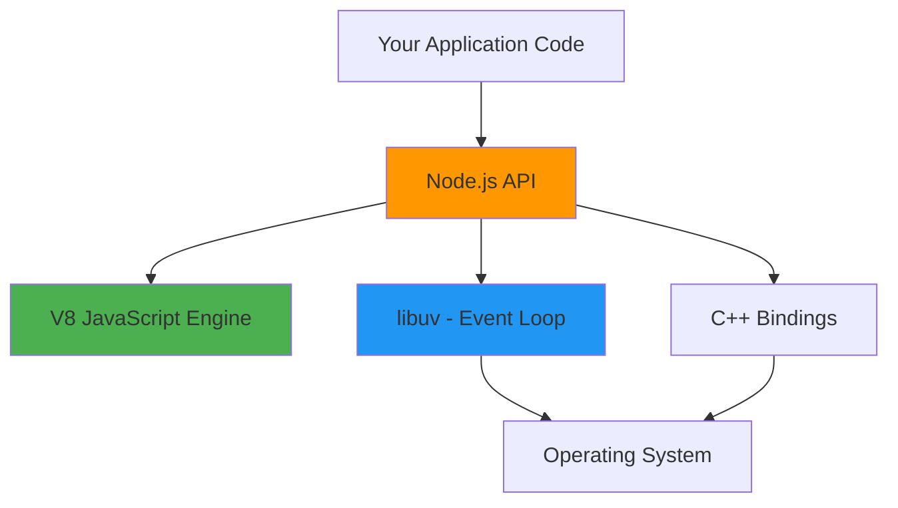
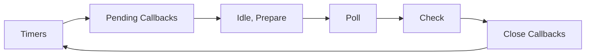

# Module 3: Node.js & TypeScript Deep Dive

## Overview

Now that you understand HTTP fundamentals, it's time to master the tools we'll use to build production-ready microservices: Node.js and TypeScript. This module goes deep into the Node.js runtime, TypeScript's type system, and asynchronous programming patterns that power our entire platform.

Every service in our microservices platform is built with Node.js and TypeScript. Understanding these technologies deeply will enable you to write efficient, type-safe, and maintainable code.

## Learning Objectives

By the end of this module, you will be able to:

- ✅ Understand Node.js architecture and event loop
- ✅ Master asynchronous programming with callbacks, promises, and async/await
- ✅ Configure TypeScript for production projects
- ✅ Use TypeScript's type system effectively (interfaces, types, generics)
- ✅ Manage dependencies with npm and package.json
- ✅ Handle errors in asynchronous code
- ✅ Use CommonJS and ES Modules appropriately
- ✅ Configure development workflows with TypeScript

## Node.js Architecture

### What is Node.js?

Node.js is a JavaScript runtime built on Chrome's V8 JavaScript engine. It allows you to run JavaScript outside the browser, making it perfect for building server-side applications.

**Key Features**:
- **Event-driven**: Built around an event loop
- **Non-blocking I/O**: Asynchronous operations
- **Single-threaded**: One thread handles many connections
- **V8 Engine**: Fast JavaScript execution
- **Large Ecosystem**: npm with millions of packages

### Node.js Architecture Diagram



### The Event Loop

The event loop is the heart of Node.js. It enables non-blocking I/O operations despite JavaScript being single-threaded.

**Event Loop Phases**:


1. **Timers**: Executes callbacks scheduled by `setTimeout()` and `setInterval()`
2. **Pending Callbacks**: Executes I/O callbacks deferred from previous iteration
3. **Idle, Prepare**: Internal use only
4. **Poll**: Retrieves new I/O events, executes I/O callbacks
5. **Check**: Executes `setImmediate()` callbacks
6. **Close Callbacks**: Executes close event callbacks (e.g., `socket.on('close')`)

**Example**:
```javascript
console.log('Start');

setTimeout(() => {
  console.log('Timeout');
}, 0);

setImmediate(() => {
  console.log('Immediate');
});

Promise.resolve().then(() => {
  console.log('Promise');
});

console.log('End');

// Output:
// Start
// End
// Promise
// Immediate
// Timeout
```

### Non-Blocking I/O

Traditional blocking I/O:
```javascript
// Blocking (traditional languages)
const data = readFileSync('file.txt'); // Waits here
console.log(data);
processData(data); // Executes after read completes
```

Node.js non-blocking I/O:
```javascript
// Non-blocking (Node.js)
readFile('file.txt', (err, data) => { // Doesn't wait
  console.log(data);
  processData(data);
});
console.log('Reading file...'); // Executes immediately
```

**Benefits**:
- Handle thousands of concurrent connections
- Efficient resource usage
- Better scalability
- Ideal for I/O-heavy operations

## Asynchronous Programming

### Callbacks (Legacy Pattern)

The original pattern for asynchronous operations:

```javascript
const fs = require('fs');

fs.readFile('file.txt', 'utf8', (err, data) => {
  if (err) {
    console.error('Error reading file:', err);
    return;
  }
  console.log('File contents:', data);

  // Nested callback (callback hell)
  fs.writeFile('output.txt', data.toUpperCase(), (err) => {
    if (err) {
      console.error('Error writing file:', err);
      return;
    }
    console.log('File written successfully');
  });
});
```

**Callback Hell Example**:
```javascript
getData((err, data) => {
  if (err) return handleError(err);

  processData(data, (err, result) => {
    if (err) return handleError(err);

    saveResult(result, (err) => {
      if (err) return handleError(err);

      sendNotification((err) => {
        if (err) return handleError(err);
        console.log('All done!');
      });
    });
  });
});
```

### Promises

Promises provide a cleaner way to handle asynchronous operations:

```javascript
const fs = require('fs').promises;

fs.readFile('file.txt', 'utf8')
  .then(data => {
    console.log('File contents:', data);
    return fs.writeFile('output.txt', data.toUpperCase());
  })
  .then(() => {
    console.log('File written successfully');
  })
  .catch(err => {
    console.error('Error:', err);
  });
```

**Promise States**:
- **Pending**: Initial state
- **Fulfilled**: Operation completed successfully
- **Rejected**: Operation failed

**Creating Promises**:
```javascript
function delay(ms) {
  return new Promise((resolve, reject) => {
    setTimeout(() => {
      resolve(`Waited ${ms}ms`);
    }, ms);
  });
}

delay(1000)
  .then(message => console.log(message))
  .catch(error => console.error(error));
```

### Async/Await (Modern Pattern)

The most readable pattern for asynchronous code:

```javascript
const fs = require('fs').promises;

async function processFile() {
  try {
    const data = await fs.readFile('file.txt', 'utf8');
    console.log('File contents:', data);

    await fs.writeFile('output.txt', data.toUpperCase());
    console.log('File written successfully');

    return 'Success';
  } catch (error) {
    console.error('Error:', error);
    throw error;
  }
}

// Using the async function
processFile()
  .then(result => console.log(result))
  .catch(error => console.error('Failed:', error));
```

**Parallel Operations**:
```javascript
async function fetchMultiple() {
  try {
    // Sequential (slow)
    const user = await fetchUser(1);
    const posts = await fetchPosts(1);
    const comments = await fetchComments(1);

    // Parallel (fast)
    const [user, posts, comments] = await Promise.all([
      fetchUser(1),
      fetchPosts(1),
      fetchComments(1)
    ]);

    return { user, posts, comments };
  } catch (error) {
    console.error('Error:', error);
  }
}
```

## TypeScript Fundamentals

### Why TypeScript?

TypeScript adds static typing to JavaScript, catching errors at compile time rather than runtime.

**Benefits**:
- **Type Safety**: Catch errors early
- **Better IDE Support**: Autocomplete and refactoring
- **Self-Documenting**: Types serve as documentation
- **Improved Refactoring**: Confident code changes
- **Modern Features**: Use latest JavaScript features

### Basic Types

```typescript
// Primitive types
let name: string = 'John';
let age: number = 30;
let isActive: boolean = true;
let nothing: null = null;
let notDefined: undefined = undefined;

// Arrays
let numbers: number[] = [1, 2, 3];
let strings: Array<string> = ['a', 'b', 'c'];

// Tuples
let tuple: [string, number] = ['John', 30];

// Enums
enum Role {
  Admin = 'ADMIN',
  User = 'USER',
  Guest = 'GUEST'
}
let userRole: Role = Role.Admin;

// Any (avoid when possible)
let anything: any = 'hello';
anything = 42; // No error

// Unknown (safer than any)
let something: unknown = 'hello';
if (typeof something === 'string') {
  console.log(something.toUpperCase()); // Type guard required
}

// Void (no return value)
function logMessage(message: string): void {
  console.log(message);
}

// Never (function never returns)
function throwError(message: string): never {
  throw new Error(message);
}
```

### Interfaces

Interfaces define the shape of objects:

```typescript
interface User {
  id: number;
  name: string;
  email: string;
  age?: number; // Optional property
  readonly createdAt: Date; // Read-only
}

const user: User = {
  id: 1,
  name: 'John Doe',
  email: 'john@example.com',
  createdAt: new Date()
};

// user.createdAt = new Date(); // Error: readonly property

// Extending interfaces
interface Admin extends User {
  permissions: string[];
}

const admin: Admin = {
  id: 2,
  name: 'Admin User',
  email: 'admin@example.com',
  createdAt: new Date(),
  permissions: ['read', 'write', 'delete']
};
```

### Type Aliases

Type aliases create custom types:

```typescript
// Simple alias
type ID = string | number;

// Object type
type Product = {
  id: ID;
  name: string;
  price: number;
};

// Union types
type Status = 'pending' | 'processing' | 'completed' | 'failed';

// Intersection types
type Timestamped = {
  createdAt: Date;
  updatedAt: Date;
};

type ProductWithTimestamps = Product & Timestamped;

// Function types
type Handler = (req: Request, res: Response) => void;
type AsyncHandler = (req: Request, res: Response) => Promise<void>;
```

### Generics

Generics enable reusable, type-safe code:

```typescript
// Generic function
function identity<T>(value: T): T {
  return value;
}

const num = identity<number>(42); // num is number
const str = identity<string>('hello'); // str is string

// Generic interface
interface ApiResponse<T> {
  data: T;
  error: string | null;
  status: number;
}

const userResponse: ApiResponse<User> = {
  data: { id: 1, name: 'John', email: 'john@example.com', createdAt: new Date() },
  error: null,
  status: 200
};

// Generic class
class Repository<T> {
  private items: T[] = [];

  add(item: T): void {
    this.items.push(item);
  }

  findById(id: number): T | undefined {
    return this.items.find((item: any) => item.id === id);
  }

  getAll(): T[] {
    return this.items;
  }
}

const userRepo = new Repository<User>();
userRepo.add({ id: 1, name: 'John', email: 'john@example.com', createdAt: new Date() });
```

### Type Guards

Type guards narrow types:

```typescript
// typeof guard
function printValue(value: string | number) {
  if (typeof value === 'string') {
    console.log(value.toUpperCase()); // value is string
  } else {
    console.log(value.toFixed(2)); // value is number
  }
}

// instanceof guard
class Cat {
  meow() { console.log('Meow!'); }
}

class Dog {
  bark() { console.log('Woof!'); }
}

function makeSound(animal: Cat | Dog) {
  if (animal instanceof Cat) {
    animal.meow();
  } else {
    animal.bark();
  }
}

// Custom type guard
interface Fish {
  swim: () => void;
}

interface Bird {
  fly: () => void;
}

function isFish(pet: Fish | Bird): pet is Fish {
  return (pet as Fish).swim !== undefined;
}

function move(pet: Fish | Bird) {
  if (isFish(pet)) {
    pet.swim();
  } else {
    pet.fly();
  }
}
```

## TypeScript Configuration

### tsconfig.json

The TypeScript configuration file:

```json
{
  "compilerOptions": {
    // Target JavaScript version
    "target": "ES2020",

    // Module system
    "module": "commonjs",

    // Library files to include
    "lib": ["ES2020"],

    // Output directory
    "outDir": "./dist",

    // Source directory
    "rootDir": "./src",

    // Strict type checking
    "strict": true,
    "noImplicitAny": true,
    "strictNullChecks": true,
    "strictFunctionTypes": true,
    "strictBindCallApply": true,
    "strictPropertyInitialization": true,
    "noImplicitThis": true,
    "alwaysStrict": true,

    // Additional checks
    "noUnusedLocals": true,
    "noUnusedParameters": true,
    "noImplicitReturns": true,
    "noFallthroughCasesInSwitch": true,

    // Module resolution
    "moduleResolution": "node",
    "esModuleInterop": true,
    "allowSyntheticDefaultImports": true,

    // Source maps for debugging
    "sourceMap": true,

    // Skip type checking for declaration files
    "skipLibCheck": true,

    // Force consistent casing
    "forceConsistentCasingInFileNames": true,

    // Experimental features
    "experimentalDecorators": true,
    "emitDecoratorMetadata": true
  },
  "include": ["src/**/*"],
  "exclude": ["node_modules", "dist", "**/*.test.ts"]
}
```

## npm and Package Management

### package.json

Project metadata and dependencies:

```json
{
  "name": "my-microservice",
  "version": "1.0.0",
  "description": "A microservice example",
  "main": "dist/server.js",
  "scripts": {
    "dev": "nodemon --exec ts-node src/server.ts",
    "build": "tsc",
    "start": "node dist/server.js",
    "test": "jest",
    "lint": "eslint src/**/*.ts",
    "format": "prettier --write src/**/*.ts"
  },
  "keywords": ["microservice", "api"],
  "author": "Your Name",
  "license": "MIT",
  "dependencies": {
    "express": "^4.18.0",
    "pg": "^8.11.0"
  },
  "devDependencies": {
    "@types/express": "^4.17.0",
    "@types/node": "^20.0.0",
    "typescript": "^5.0.0",
    "ts-node": "^10.9.0",
    "nodemon": "^3.0.0",
    "jest": "^29.0.0",
    "eslint": "^8.50.0",
    "prettier": "^3.0.0"
  },
  "engines": {
    "node": ">=20.0.0",
    "npm": ">=10.0.0"
  }
}
```

### Common npm Commands

```bash
# Initialize project
npm init -y

# Install dependencies
npm install express
npm install -D typescript @types/node

# Install specific version
npm install express@4.18.0

# Update dependencies
npm update

# Remove dependency
npm uninstall express

# Install all dependencies
npm install

# Run scripts
npm run dev
npm test
npm run build

# Check for vulnerabilities
npm audit
npm audit fix

# List installed packages
npm list
npm list --depth=0
```

## Real-World Example: Our User Service

Here's how TypeScript is used in our user-service:

```typescript
// src/types/user.types.ts
export interface User {
  id: number;
  email: string;
  name: string;
  createdAt: Date;
  updatedAt: Date;
}

export interface CreateUserDTO {
  email: string;
  name: string;
  password: string;
}

export interface UpdateUserDTO {
  email?: string;
  name?: string;
}

// src/services/user.service.ts
import { User, CreateUserDTO, UpdateUserDTO } from '../types/user.types';

export class UserService {
  async createUser(data: CreateUserDTO): Promise<User> {
    // Implementation
  }

  async getUserById(id: number): Promise<User | null> {
    // Implementation
  }

  async updateUser(id: number, data: UpdateUserDTO): Promise<User> {
    // Implementation
  }

  async deleteUser(id: number): Promise<void> {
    // Implementation
  }
}
```

## Summary

In this module, you learned:

- ✅ Node.js architecture and event loop
- ✅ Asynchronous programming patterns
- ✅ TypeScript type system
- ✅ Interfaces, types, and generics
- ✅ TypeScript configuration
- ✅ npm package management
- ✅ Real-world TypeScript patterns

## Next Steps

1. Complete exercises in [exercises/](./exercises/)
2. Study examples in [examples/](./examples/)
3. Complete the assignment in [assignment.md](./assignment.md)
4. Proceed to [Module 4: REST APIs](../04-rest-apis/README.md)
