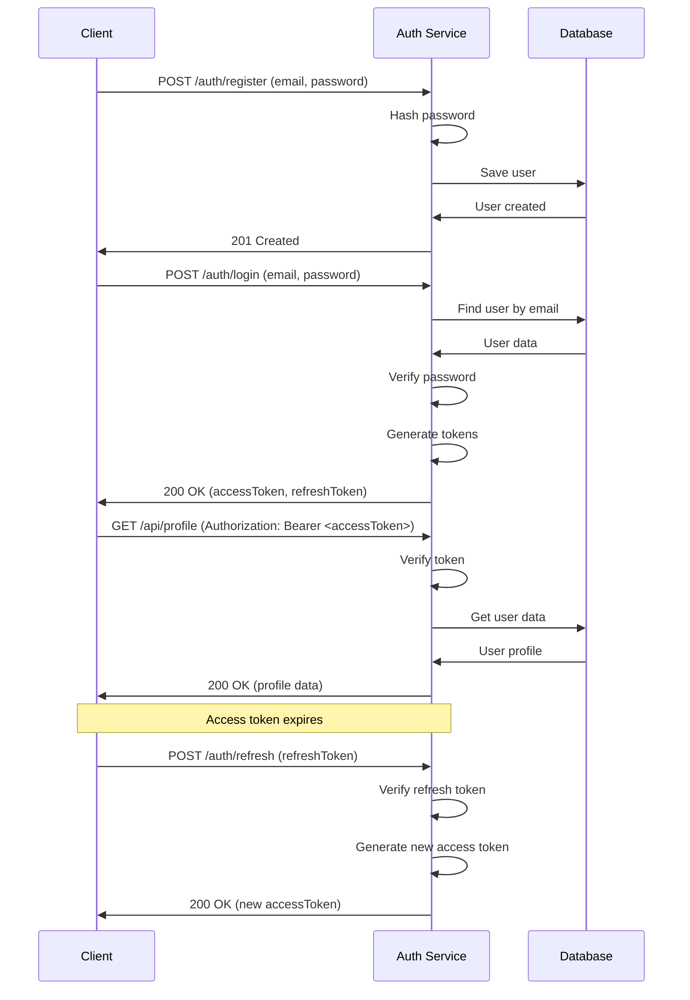

# Module 6: Authentication & Security

## Overview

Security is paramount in microservices. This module covers authentication, authorization, JWT tokens, password security, and best practices used in our auth-service. You'll learn to build secure APIs that protect user data and prevent common vulnerabilities.

## Learning Objectives

- ✅ Implement JWT-based authentication
- ✅ Secure passwords with hashing
- ✅ Build role-based access control (RBAC)
- ✅ Prevent common security vulnerabilities
- ✅ Implement refresh token rotation
- ✅ Apply security best practices

## Authentication vs Authorization

**Authentication**: "Who are you?"
- Verifying user identity
- Login with username/password
- JWT tokens, sessions, OAuth

**Authorization**: "What can you do?"
- Verifying user permissions
- Role-based access control
- Resource-level permissions

## Password Security

### Hashing with bcrypt

```typescript
import bcrypt from 'bcrypt';

// Hash password
async function hashPassword(password: string): Promise<string> {
  const saltRounds = 10;
  return await bcrypt.hash(password, saltRounds);
}

// Verify password
async function verifyPassword(password: string, hash: string): Promise<boolean> {
  return await bcrypt.compare(password, hash);
}

// Usage
const hashedPassword = await hashPassword('mypassword123');
// $2b$10$ZKxT8z2H9...

const isValid = await verifyPassword('mypassword123', hashedPassword);
// true
```

### Password Requirements

```typescript
function validatePassword(password: string): boolean {
  // Minimum 8 characters, at least one uppercase, lowercase, number, special char
  const passwordRegex = /^(?=.*[a-z])(?=.*[A-Z])(?=.*\d)(?=.*[@$!%*?&])[A-Za-z\d@$!%*?&]{8,}$/;
  return passwordRegex.test(password);
}
```

## JWT (JSON Web Tokens)

### JWT Structure

```
Header.Payload.Signature
```

```json
// Header
{
  "alg": "HS256",
  "typ": "JWT"
}

// Payload
{
  "sub": "1234567890",
  "name": "John Doe",
  "role": "admin",
  "iat": 1516239022,
  "exp": 1516242622
}

// Signature
HMACSHA256(
  base64UrlEncode(header) + "." + base64UrlEncode(payload),
  secret
)
```

### Implementing JWT

```typescript
import jwt from 'jsonwebtoken';

interface TokenPayload {
  userId: number;
  email: string;
  role: string;
}

// Generate access token (short-lived)
function generateAccessToken(payload: TokenPayload): string {
  return jwt.sign(payload, process.env.JWT_SECRET!, {
    expiresIn: '15m'
  });
}

// Generate refresh token (long-lived)
function generateRefreshToken(payload: TokenPayload): string {
  return jwt.sign(payload, process.env.JWT_REFRESH_SECRET!, {
    expiresIn: '7d'
  });
}

// Verify token
function verifyAccessToken(token: string): TokenPayload {
  try {
    return jwt.verify(token, process.env.JWT_SECRET!) as TokenPayload;
  } catch (error) {
    throw new Error('Invalid token');
  }
}

// Decode without verification (for debugging)
function decodeToken(token: string) {
  return jwt.decode(token);
}
```

## Authentication Flow



## Implementation Example

### Register User

```typescript
import express from 'express';
import bcrypt from 'bcrypt';

router.post('/auth/register', async (req, res) => {
  try {
    const { email, password, name } = req.body;

    // Validate input
    if (!email || !password || !name) {
      return res.status(400).json({ error: 'All fields required' });
    }

    // Check if user exists
    const existingUser = await userRepository.findOne({ where: { email } });
    if (existingUser) {
      return res.status(409).json({ error: 'User already exists' });
    }

    // Validate password strength
    if (!validatePassword(password)) {
      return res.status(400).json({ error: 'Password too weak' });
    }

    // Hash password
    const passwordHash = await bcrypt.hash(password, 10);

    // Create user
    const user = await userRepository.save({
      email,
      name,
      passwordHash
    });

    // Don't return password hash
    const { passwordHash: _, ...userWithoutPassword } = user;

    res.status(201).json({
      message: 'User created successfully',
      user: userWithoutPassword
    });
  } catch (error) {
    console.error('Registration error:', error);
    res.status(500).json({ error: 'Internal server error' });
  }
});
```

### Login User

```typescript
router.post('/auth/login', async (req, res) => {
  try {
    const { email, password } = req.body;

    // Find user
    const user = await userRepository.findOne({ where: { email } });
    if (!user) {
      return res.status(401).json({ error: 'Invalid credentials' });
    }

    // Verify password
    const isValid = await bcrypt.compare(password, user.passwordHash);
    if (!isValid) {
      return res.status(401).json({ error: 'Invalid credentials' });
    }

    // Generate tokens
    const accessToken = generateAccessToken({
      userId: user.id,
      email: user.email,
      role: user.role
    });

    const refreshToken = generateRefreshToken({
      userId: user.id,
      email: user.email,
      role: user.role
    });

    // Store refresh token in database (for revocation)
    await tokenRepository.save({
      userId: user.id,
      token: refreshToken,
      expiresAt: new Date(Date.now() + 7 * 24 * 60 * 60 * 1000)
    });

    res.json({
      accessToken,
      refreshToken,
      user: {
        id: user.id,
        email: user.email,
        name: user.name,
        role: user.role
      }
    });
  } catch (error) {
    console.error('Login error:', error);
    res.status(500).json({ error: 'Internal server error' });
  }
});
```

### Authentication Middleware

```typescript
import { Request, Response, NextFunction } from 'express';
import jwt from 'jsonwebtoken';

interface AuthRequest extends Request {
  user?: TokenPayload;
}

export function authenticate(
  req: AuthRequest,
  res: Response,
  next: NextFunction
) {
  try {
    // Get token from header
    const authHeader = req.headers.authorization;
    if (!authHeader || !authHeader.startsWith('Bearer ')) {
      return res.status(401).json({ error: 'No token provided' });
    }

    const token = authHeader.substring(7);

    // Verify token
    const payload = jwt.verify(token, process.env.JWT_SECRET!) as TokenPayload;

    // Attach user to request
    req.user = payload;

    next();
  } catch (error) {
    if (error instanceof jwt.TokenExpiredError) {
      return res.status(401).json({ error: 'Token expired' });
    }
    return res.status(401).json({ error: 'Invalid token' });
  }
}

// Usage
router.get('/api/profile', authenticate, async (req: AuthRequest, res) => {
  const user = await userRepository.findOne({ where: { id: req.user!.userId } });
  res.json(user);
});
```

## Role-Based Access Control (RBAC)

```typescript
enum Role {
  Admin = 'admin',
  User = 'user',
  Guest = 'guest'
}

function authorize(...roles: Role[]) {
  return (req: AuthRequest, res: Response, next: NextFunction) => {
    if (!req.user) {
      return res.status(401).json({ error: 'Not authenticated' });
    }

    if (!roles.includes(req.user.role as Role)) {
      return res.status(403).json({ error: 'Insufficient permissions' });
    }

    next();
  };
}

// Usage
router.delete(
  '/api/users/:id',
  authenticate,
  authorize(Role.Admin),
  async (req, res) => {
    // Only admins can delete users
    await userRepository.delete(req.params.id);
    res.status(204).send();
  }
);

router.get(
  '/api/profile',
  authenticate,
  authorize(Role.User, Role.Admin),
  async (req, res) => {
    // Both users and admins can access
    res.json(req.user);
  }
);
```

## Refresh Token Flow

```typescript
router.post('/auth/refresh', async (req, res) => {
  try {
    const { refreshToken } = req.body;

    if (!refreshToken) {
      return res.status(400).json({ error: 'Refresh token required' });
    }

    // Verify refresh token
    const payload = jwt.verify(
      refreshToken,
      process.env.JWT_REFRESH_SECRET!
    ) as TokenPayload;

    // Check if token exists in database (not revoked)
    const storedToken = await tokenRepository.findOne({
      where: { token: refreshToken, userId: payload.userId }
    });

    if (!storedToken) {
      return res.status(401).json({ error: 'Invalid refresh token' });
    }

    // Generate new access token
    const newAccessToken = generateAccessToken({
      userId: payload.userId,
      email: payload.email,
      role: payload.role
    });

    res.json({ accessToken: newAccessToken });
  } catch (error) {
    return res.status(401).json({ error: 'Invalid refresh token' });
  }
});
```

## Security Best Practices

### 1. HTTPS Only
```typescript
// Redirect HTTP to HTTPS
app.use((req, res, next) => {
  if (req.protocol === 'http') {
    res.redirect(301, `https://${req.headers.host}${req.url}`);
  } else {
    next();
  }
});
```

### 2. Security Headers
```typescript
import helmet from 'helmet';
app.use(helmet());

// Or manually:
app.use((req, res, next) => {
  res.setHeader('X-Content-Type-Options', 'nosniff');
  res.setHeader('X-Frame-Options', 'DENY');
  res.setHeader('X-XSS-Protection', '1; mode=block');
  res.setHeader('Strict-Transport-Security', 'max-age=31536000; includeSubDomains');
  next();
});
```

### 3. Rate Limiting
```typescript
import rateLimit from 'express-rate-limit';

const authLimiter = rateLimit({
  windowMs: 15 * 60 * 1000, // 15 minutes
  max: 5, // 5 attempts
  message: 'Too many login attempts, please try again later'
});

router.post('/auth/login', authLimiter, loginHandler);
```

### 4. Input Validation
```typescript
import Joi from 'joi';

const registerSchema = Joi.object({
  email: Joi.string().email().required(),
  password: Joi.string().min(8).required(),
  name: Joi.string().min(2).max(50).required()
});

const { error, value } = registerSchema.validate(req.body);
```

### 5. CORS Configuration
```typescript
import cors from 'cors';

app.use(cors({
  origin: process.env.ALLOWED_ORIGINS?.split(','),
  credentials: true,
  methods: ['GET', 'POST', 'PUT', 'DELETE'],
  allowedHeaders: ['Content-Type', 'Authorization']
}));
```

## Common Vulnerabilities

### SQL Injection (Prevented by ORMs)
```typescript
// ❌ Vulnerable
const users = await db.query(`SELECT * FROM users WHERE id = ${userId}`);

// ✅ Safe with prepared statements
const users = await userRepository.find({ where: { id: userId } });
```

### XSS (Cross-Site Scripting)
```typescript
// Sanitize user input
import DOMPurify from 'isomorphic-dompurify';

const cleanInput = DOMPurify.sanitize(userInput);
```

### CSRF (Cross-Site Request Forgery)
```typescript
import csrf from 'csurf';

const csrfProtection = csrf({ cookie: true });
app.use(csrfProtection);
```

## Summary

- ✅ JWT-based authentication
- ✅ Password hashing with bcrypt
- ✅ Authentication vs authorization
- ✅ Role-based access control
- ✅ Refresh token rotation
- ✅ Security best practices
- ✅ Common vulnerability prevention

## Next Steps

1. Complete exercises in [exercises/](./exercises/)
2. Review [security-checklist.md](./security-checklist.md)
3. Complete [assignment.md](./assignment.md)
4. Proceed to [Module 7: Microservices Introduction](../07-microservices-intro/README.md)
