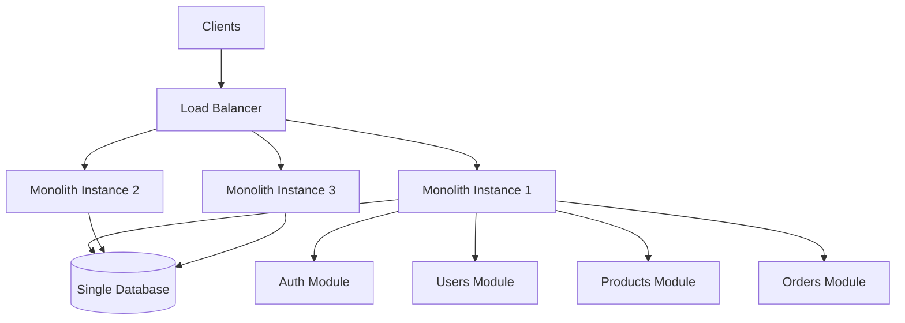
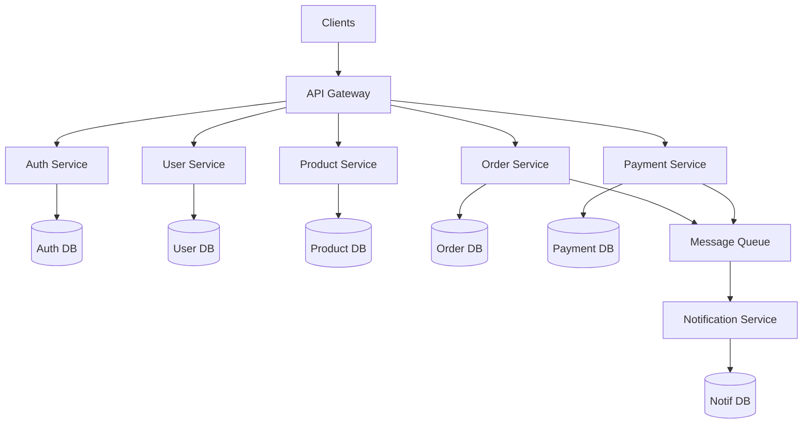
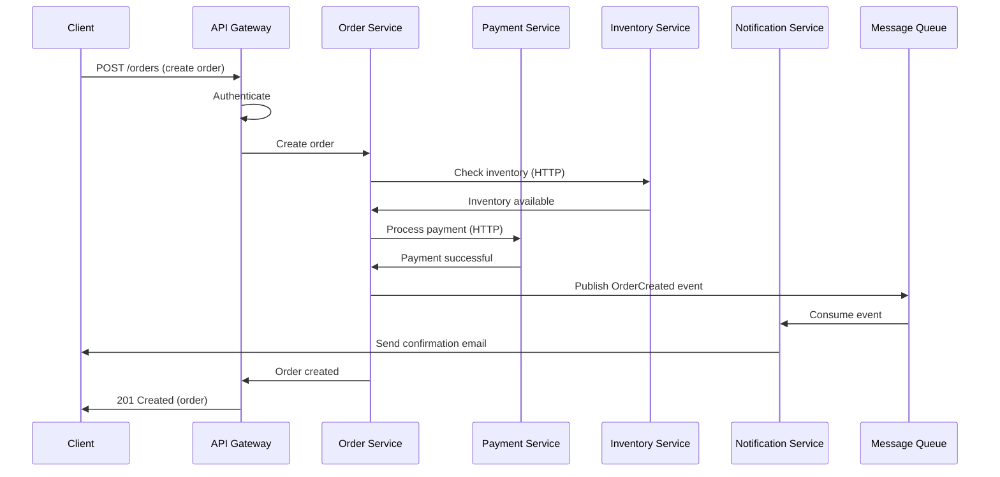
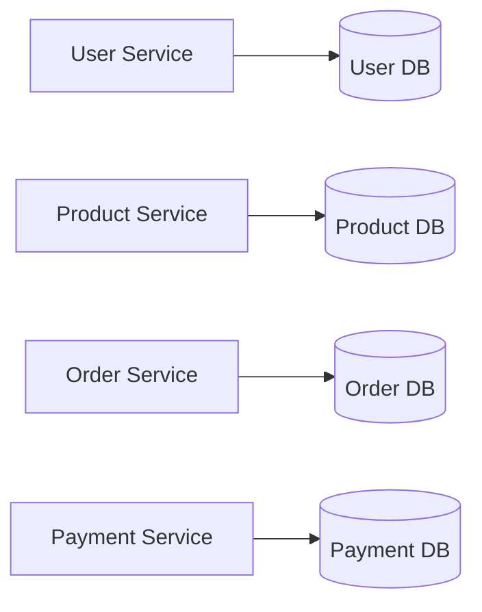
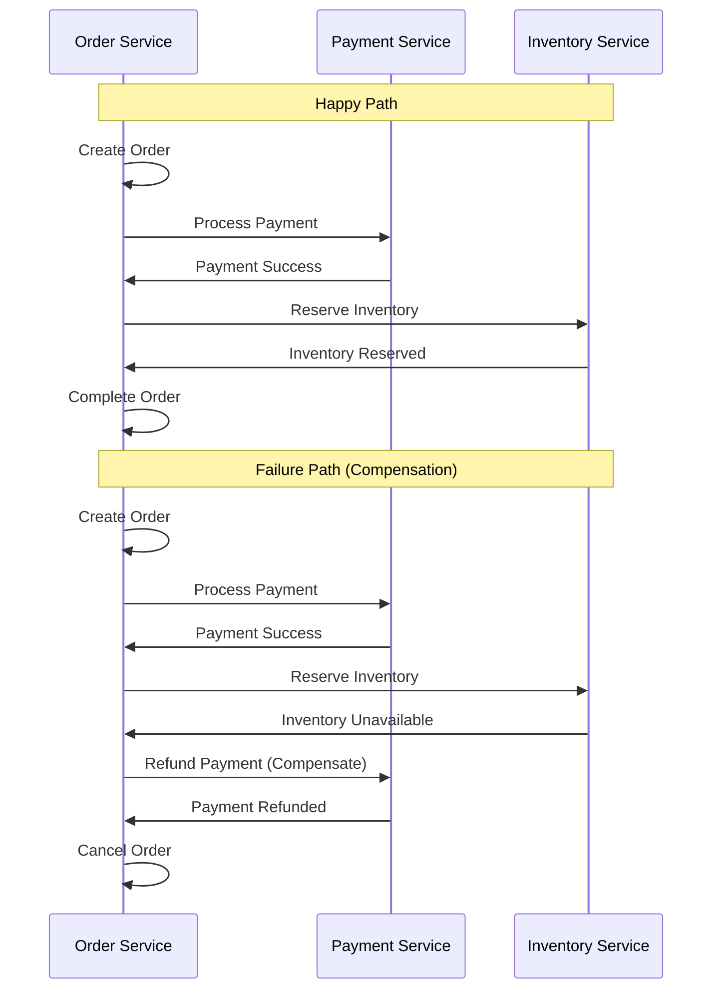

# Module 7: Introduction to Microservices Architecture

## Overview

Microservices architecture is a method of developing software systems that focuses on building single-function modules with well-defined interfaces. This module introduces microservices concepts, patterns, and the architectural decisions behind our e-commerce platform.

## Learning Objectives

- ✅ Understand microservices architecture principles
- ✅ Compare monolithic vs microservices approaches
- ✅ Learn service decomposition strategies
- ✅ Identify bounded contexts using Domain-Driven Design
- ✅ Understand data management in microservices
- ✅ Learn common microservices patterns

## What are Microservices?

Microservices are small, autonomous services that work together. Each service:

- **Focuses on one business capability**
- **Owns its own data**
- **Can be deployed independently**
- **Communicates via well-defined APIs**
- **Can use different technologies**

### Characteristics

1. **Componentization via Services**: Components are services, not libraries
2. **Organized Around Business Capabilities**: Teams own full services
3. **Products not Projects**: Teams own services long-term
4. **Smart Endpoints, Dumb Pipes**: Services handle logic, not middleware
5. **Decentralized Governance**: Teams choose technologies
6. **Decentralized Data Management**: Each service owns its data
7. **Infrastructure Automation**: CI/CD pipelines
8. **Design for Failure**: Services must handle failures gracefully

## Monolithic vs Microservices

### Monolithic Architecture



**Characteristics**:
- Single codebase
- Single deployment unit
- Shared database
- Single technology stack

**Advantages**:
- ✅ Simple to develop initially
- ✅ Easy to test
- ✅ Easy to deploy (single artifact)
- ✅ Simple scaling (duplicate entire app)

**Disadvantages**:
- ❌ Tight coupling
- ❌ Hard to scale specific features
- ❌ Technology lock-in
- ❌ Large, complex codebase
- ❌ Long deployment times
- ❌ If one part fails, entire app fails

### Microservices Architecture



**Characteristics**:
- Multiple services
- Independent deployments
- Database per service
- Polyglot persistence/programming

**Advantages**:
- ✅ Independent scaling
- ✅ Independent deployment
- ✅ Technology diversity
- ✅ Team autonomy
- ✅ Fault isolation
- ✅ Easier to understand (smaller codebases)

**Disadvantages**:
- ❌ Complex infrastructure
- ❌ Distributed system challenges
- ❌ Network latency
- ❌ Data consistency challenges
- ❌ Testing complexity
- ❌ Deployment complexity

## When to Use Microservices?

### Use Microservices When:
- ✅ Application is large and complex
- ✅ Different parts have different scaling needs
- ✅ Multiple teams working on the project
- ✅ Need for technology diversity
- ✅ Frequent deployments required
- ✅ High availability is critical

### Stick with Monolith When:
- ✅ Small application
- ✅ Small team
- ✅ Early-stage startup (unclear requirements)
- ✅ Simple domain
- ✅ Limited resources for DevOps

## Service Decomposition Strategies

### 1. By Business Capability

Organize services around business functions:

```
E-Commerce Platform
├── User Management
├── Product Catalog
├── Shopping Cart
├── Order Processing
├── Payment Processing
├── Inventory Management
└── Notifications
```

### 2. By Subdomain (Domain-Driven Design)

Identify bounded contexts:

```
Core Domains (competitive advantage):
- Product Recommendation Engine
- Pricing Engine

Supporting Domains:
- User Management
- Order Processing

Generic Domains:
- Authentication
- Notifications
```

### 3. By Technical Capability

Sometimes technical concerns dictate boundaries:

```
- API Gateway
- Backend for Frontend (BFF)
- Data Processing Service
- Reporting Service
```

## Our E-Commerce Platform Breakdown

### Service Overview

| Service | Responsibility | Database | Communication |
|---------|---------------|----------|---------------|
| **API Gateway** | Routing, rate limiting, auth | Redis | Sync (HTTP) |
| **Auth Service** | Authentication, JWT | PostgreSQL | Sync |
| **User Service** | User profiles, preferences | PostgreSQL | Sync |
| **Product Service** | Catalog, inventory, search | PostgreSQL | Sync |
| **Order Service** | Order processing, cart | PostgreSQL | Sync + Async |
| **Payment Service** | Payment processing | PostgreSQL | Sync + Async |
| **Notification Service** | Email, SMS, push | PostgreSQL | Async |

### Service Interactions



## Bounded Contexts

**Definition**: A bounded context is a logical boundary within which a particular model is defined and applicable.

### Example: "Order" means different things

**Order Service Context**:
```typescript
interface Order {
  id: string;
  userId: string;
  items: OrderItem[];
  totalAmount: number;
  status: OrderStatus;
  shippingAddress: Address;
}
```

**Payment Service Context**:
```typescript
interface PaymentOrder {
  orderId: string;
  amount: number;
  currency: string;
  paymentMethod: string;
}
```

**Notification Service Context**:
```typescript
interface OrderNotification {
  orderId: string;
  userEmail: string;
  orderSummary: string;
}
```

## Data Management Patterns

### Database per Service

**Principle**: Each service owns its data and is the only one that can access it directly.



**Benefits**:
- Services are loosely coupled
- Services can use different database types
- Each service can scale its database independently

**Challenges**:
- No foreign keys across services
- Distributed queries are complex
- Data consistency is harder

### Saga Pattern

Managing distributed transactions:



## API Gateway Pattern

The API Gateway is the single entry point for clients:

**Responsibilities**:
- **Routing**: Forward requests to appropriate services
- **Authentication**: Verify JWT tokens
- **Rate Limiting**: Prevent abuse
- **Request/Response Transformation**: Adapt protocols
- **Caching**: Cache responses
- **Load Balancing**: Distribute load across instances

**Example**:
```typescript
// API Gateway routing
app.get('/api/users/:id', authenticate, async (req, res) => {
  const response = await fetch(`${USER_SERVICE_URL}/users/${req.params.id}`);
  res.json(await response.json());
});

app.get('/api/products', authenticate, rateLimit, async (req, res) => {
  const response = await fetch(`${PRODUCT_SERVICE_URL}/products${req.query}`);
  res.json(await response.json());
});
```

## Service Discovery

Services need to find each other in a dynamic environment:

### Client-Side Discovery
```typescript
// Service registry
const serviceRegistry = {
  'user-service': ['http://user-1:3002', 'http://user-2:3002'],
  'product-service': ['http://product-1:3003', 'http://product-2:3003']
};

// Load balancing
function getServiceUrl(serviceName: string): string {
  const instances = serviceRegistry[serviceName];
  return instances[Math.floor(Math.random() * instances.length)];
}
```

### Server-Side Discovery (Kubernetes)
```yaml
# Service definition
apiVersion: v1
kind: Service
metadata:
  name: user-service
spec:
  selector:
    app: user-service
  ports:
    - port: 80
      targetPort: 3002

# Access service
http://user-service/users/123
```

## Benefits vs Challenges

### Benefits
1. **Scalability**: Scale services independently
2. **Flexibility**: Use different technologies
3. **Resilience**: Fault isolation
4. **Faster Development**: Teams work independently
5. **Easier Deployment**: Deploy services independently

### Challenges
1. **Complexity**: Distributed systems are complex
2. **Data Consistency**: Eventual consistency
3. **Network Latency**: Inter-service calls
4. **Testing**: Integration testing is harder
5. **Monitoring**: Need distributed tracing
6. **DevOps**: Requires automation

## Best Practices

### 1. Design Services Around Business Capabilities
Not technical layers.

### 2. Decentralize Everything
Data, governance, decision-making.

### 3. Automate Everything
CI/CD, testing, deployment, monitoring.

### 4. Design for Failure
Services will fail. Handle it gracefully.

### 5. Keep Services Small
If a service is too large, split it.

### 6. Use Async Communication When Possible
Reduces coupling and improves resilience.

### 7. Monitor Everything
Comprehensive observability is critical.

## Anti-Patterns to Avoid

### 1. Distributed Monolith
Services that are tightly coupled and must be deployed together.

### 2. Shared Database
Multiple services accessing the same database.

### 3. Chatty Services
Too many synchronous calls between services.

### 4. Too Many Services
Micro-microservices: too granular.

### 5. Ignoring DevOps
Microservices require automation.

## Summary

- ✅ Microservices vs monolithic architecture
- ✅ Service decomposition strategies
- ✅ Bounded contexts and Domain-Driven Design
- ✅ Database per service pattern
- ✅ API Gateway pattern
- ✅ Service discovery
- ✅ Benefits and challenges
- ✅ Best practices and anti-patterns

## Next Steps

1. Review [comparison.md](./comparison.md)
2. Study [case-study.md](./case-study.md) of our platform
3. Complete [exercises.md](./exercises.md)
4. Proceed to [Module 8: Service Communication](../08-service-communication/README.md)
