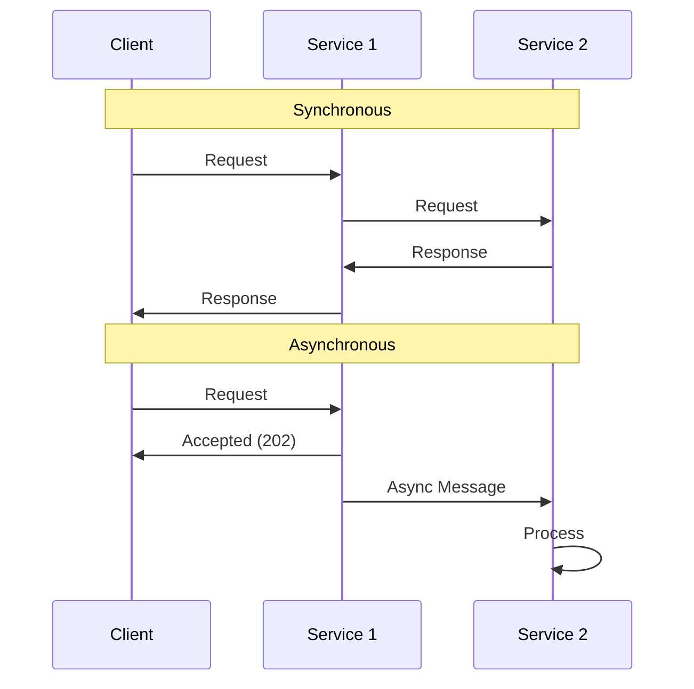
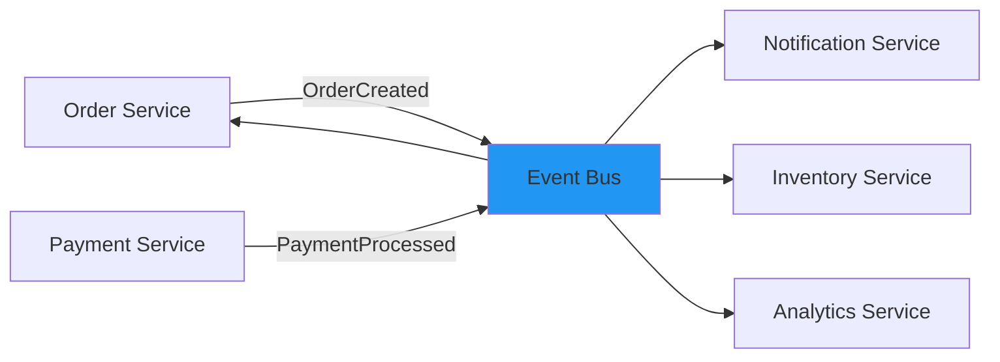
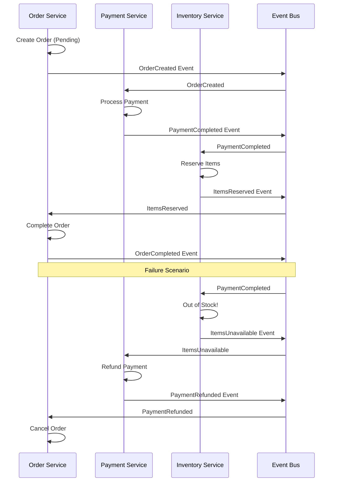

# Module 8: Service Communication Patterns

## Overview

In microservices, services need to communicate with each other. This module covers synchronous and asynchronous communication patterns, message queues, event-driven architecture, and resilience patterns like circuit breakers and sagas.

## Learning Objectives

- ✅ Implement synchronous communication with REST
- ✅ Build asynchronous messaging with queues
- ✅ Design event-driven architectures
- ✅ Apply Saga pattern for distributed transactions
- ✅ Implement circuit breaker pattern
- ✅ Handle service failures gracefully

## Communication Patterns

### Synchronous vs Asynchronous

**Synchronous (Request-Response)**:
- Client waits for response
- Tight coupling
- Immediate feedback
- Examples: REST, gRPC

**Asynchronous (Fire-and-Forget)**:
- Client doesn't wait
- Loose coupling
- Eventual consistency
- Examples: Message queues, events



## Synchronous Communication

### REST API Calls

```typescript
// Service A calling Service B
import axios from 'axios';

class OrderService {
  private paymentServiceUrl = process.env.PAYMENT_SERVICE_URL;

  async createOrder(orderData: CreateOrderDTO) {
    try {
      // 1. Create order locally
      const order = await this.orderRepository.save(orderData);

      // 2. Call payment service synchronously
      const paymentResponse = await axios.post(
        `${this.paymentServiceUrl}/payments`,
        {
          orderId: order.id,
          amount: order.totalAmount,
          currency: 'USD'
        },
        {
          headers: {
            'Authorization': `Bearer ${process.env.SERVICE_TOKEN}`,
            'Content-Type': 'application/json'
          },
          timeout: 5000 // 5 second timeout
        }
      );

      // 3. Update order with payment info
      order.paymentId = paymentResponse.data.id;
      order.status = 'paid';
      await this.orderRepository.save(order);

      return order;
    } catch (error) {
      // Handle failure
      console.error('Payment failed:', error);
      throw new Error('Order creation failed');
    }
  }
}
```

### Service-to-Service Authentication

```typescript
// Generate service token
function generateServiceToken(): string {
  return jwt.sign(
    { service: 'order-service', role: 'service' },
    process.env.SERVICE_SECRET!,
    { expiresIn: '1h' }
  );
}

// Verify service token middleware
function verifyServiceToken(req: Request, res: Response, next: NextFunction) {
  const token = req.headers.authorization?.substring(7);

  try {
    const payload = jwt.verify(token!, process.env.SERVICE_SECRET!);
    if (payload.role !== 'service') {
      return res.status(403).json({ error: 'Not a service token' });
    }
    next();
  } catch (error) {
    return res.status(401).json({ error: 'Invalid token' });
  }
}

// Protected endpoint
router.post('/payments', verifyServiceToken, createPaymentHandler);
```

## Asynchronous Communication

### Message Queues (RabbitMQ)

```typescript
import amqp from 'amqplib';

class MessageQueue {
  private connection: amqp.Connection;
  private channel: amqp.Channel;

  async connect() {
    this.connection = await amqp.connect(process.env.RABBITMQ_URL!);
    this.channel = await this.connection.createChannel();
  }

  async publishMessage(queue: string, message: any) {
    await this.channel.assertQueue(queue, { durable: true });
    this.channel.sendToQueue(
      queue,
      Buffer.from(JSON.stringify(message)),
      { persistent: true }
    );
    console.log(`Published to ${queue}:`, message);
  }

  async consumeMessages(queue: string, handler: (message: any) => Promise<void>) {
    await this.channel.assertQueue(queue, { durable: true });
    this.channel.prefetch(1); // Process one message at a time

    this.channel.consume(queue, async (msg) => {
      if (msg) {
        try {
          const content = JSON.parse(msg.content.toString());
          await handler(content);
          this.channel.ack(msg); // Acknowledge successful processing
        } catch (error) {
          console.error('Error processing message:', error);
          this.channel.nack(msg, false, false); // Don't requeue
        }
      }
    });
  }
}

// Usage in Order Service
const queue = new MessageQueue();
await queue.connect();

// Publish event when order is created
await queue.publishMessage('order-created', {
  orderId: order.id,
  userId: order.userId,
  totalAmount: order.totalAmount,
  items: order.items
});

// Consume in Notification Service
await queue.consumeMessages('order-created', async (message) => {
  console.log('Received order created event:', message);
  await sendOrderConfirmationEmail(message);
});
```

### Event-Driven Architecture



**Event Publisher**:
```typescript
interface OrderCreatedEvent {
  eventType: 'OrderCreated';
  eventId: string;
  timestamp: Date;
  data: {
    orderId: string;
    userId: string;
    items: Array<{productId: string; quantity: number}>;
    totalAmount: number;
  };
}

class EventPublisher {
  async publishEvent(event: OrderCreatedEvent) {
    await queue.publishMessage('events', event);

    // Also store in event store for event sourcing
    await eventStore.save({
      eventId: event.eventId,
      eventType: event.eventType,
      aggregateId: event.data.orderId,
      data: event.data,
      timestamp: event.timestamp
    });
  }
}

// When order is created
const event: OrderCreatedEvent = {
  eventType: 'OrderCreated',
  eventId: uuidv4(),
  timestamp: new Date(),
  data: {
    orderId: order.id,
    userId: order.userId,
    items: order.items,
    totalAmount: order.totalAmount
  }
};

await eventPublisher.publishEvent(event);
```

**Event Consumer**:
```typescript
// Notification Service
class OrderEventHandler {
  async handleOrderCreated(event: OrderCreatedEvent) {
    const user = await getUserById(event.data.userId);

    await sendEmail({
      to: user.email,
      subject: 'Order Confirmation',
      body: `Your order ${event.data.orderId} has been created.`
    });
  }

  async handlePaymentProcessed(event: PaymentProcessedEvent) {
    if (event.data.status === 'completed') {
      await sendEmail({
        to: user.email,
        subject: 'Payment Confirmed',
        body: `Payment for order ${event.data.orderId} was successful.`
      });
    }
  }
}

// Register handlers
await queue.consumeMessages('events', async (event) => {
  switch (event.eventType) {
    case 'OrderCreated':
      await orderEventHandler.handleOrderCreated(event);
      break;
    case 'PaymentProcessed':
      await orderEventHandler.handlePaymentProcessed(event);
      break;
  }
});
```

## Saga Pattern

Managing distributed transactions without 2-phase commit:

### Choreography-Based Saga



**Implementation**:
```typescript
// Order Service
class OrderSaga {
  async createOrder(orderData: CreateOrderDTO) {
    const order = await this.orderRepository.save({
      ...orderData,
      status: 'pending'
    });

    // Start saga
    await eventBus.publish({
      eventType: 'OrderCreated',
      data: order
    });

    return order;
  }

  async handlePaymentCompleted(event: PaymentCompletedEvent) {
    // Payment successful, wait for inventory
    await this.orderRepository.update(event.data.orderId, {
      paymentId: event.data.paymentId,
      status: 'payment_completed'
    });
  }

  async handleItemsReserved(event: ItemsReservedEvent) {
    // Inventory reserved, complete order
    await this.orderRepository.update(event.data.orderId, {
      status: 'completed'
    });

    await eventBus.publish({
      eventType: 'OrderCompleted',
      data: { orderId: event.data.orderId }
    });
  }

  async handleItemsUnavailable(event: ItemsUnavailableEvent) {
    // Inventory failed, trigger compensation
    await this.orderRepository.update(event.data.orderId, {
      status: 'cancelled',
      cancellationReason: 'items_unavailable'
    });

    // Compensation: refund payment
    await eventBus.publish({
      eventType: 'RefundRequested',
      data: { orderId: event.data.orderId }
    });
  }
}

// Payment Service
class PaymentSaga {
  async handleOrderCreated(event: OrderCreatedEvent) {
    try {
      const payment = await this.processPayment({
        orderId: event.data.orderId,
        amount: event.data.totalAmount
      });

      await eventBus.publish({
        eventType: 'PaymentCompleted',
        data: {
          orderId: event.data.orderId,
          paymentId: payment.id
        }
      });
    } catch (error) {
      await eventBus.publish({
        eventType: 'PaymentFailed',
        data: {
          orderId: event.data.orderId,
          error: error.message
        }
      });
    }
  }

  async handleRefundRequested(event: RefundRequestedEvent) {
    await this.refundPayment(event.data.orderId);

    await eventBus.publish({
      eventType: 'PaymentRefunded',
      data: { orderId: event.data.orderId }
    });
  }
}
```

### Orchestration-Based Saga

```typescript
// Saga Orchestrator
class OrderSagaOrchestrator {
  async execute(orderData: CreateOrderDTO) {
    const sagaId = uuidv4();
    let order: Order;

    try {
      // Step 1: Create order
      order = await orderService.createOrder(orderData);
      await this.saveSagaState(sagaId, 'order_created', { orderId: order.id });

      // Step 2: Process payment
      const payment = await paymentService.processPayment({
        orderId: order.id,
        amount: order.totalAmount
      });
      await this.saveSagaState(sagaId, 'payment_completed', { paymentId: payment.id });

      // Step 3: Reserve inventory
      await inventoryService.reserveItems(order.items);
      await this.saveSagaState(sagaId, 'inventory_reserved');

      // Step 4: Complete order
      await orderService.completeOrder(order.id);
      await this.saveSagaState(sagaId, 'completed');

      return order;
    } catch (error) {
      // Compensation flow
      await this.compensate(sagaId, order);
      throw error;
    }
  }

  private async compensate(sagaId: string, order: Order) {
    const sagaState = await this.getSagaState(sagaId);

    // Rollback in reverse order
    if (sagaState.includes('inventory_reserved')) {
      await inventoryService.releaseItems(order.items);
    }

    if (sagaState.includes('payment_completed')) {
      await paymentService.refundPayment(order.id);
    }

    if (sagaState.includes('order_created')) {
      await orderService.cancelOrder(order.id);
    }
  }
}
```

## Circuit Breaker Pattern

Prevent cascading failures:

```typescript
class CircuitBreaker {
  private failures = 0;
  private nextAttempt = Date.now();
  private state: 'CLOSED' | 'OPEN' | 'HALF_OPEN' = 'CLOSED';

  constructor(
    private threshold = 5,        // Failures before opening
    private timeout = 60000,      // Time to wait before retry (1 min)
    private monitoringPeriod = 10000  // Reset failures after 10s
  ) {}

  async execute<T>(fn: () => Promise<T>): Promise<T> {
    // OPEN: Don't attempt call
    if (this.state === 'OPEN') {
      if (Date.now() < this.nextAttempt) {
        throw new Error('Circuit breaker is OPEN');
      }
      // Try half-open
      this.state = 'HALF_OPEN';
    }

    try {
      const result = await fn();

      // Success: reset or close circuit
      if (this.state === 'HALF_OPEN') {
        this.state = 'CLOSED';
        this.failures = 0;
      }

      return result;
    } catch (error) {
      this.failures++;

      if (this.failures >= this.threshold) {
        this.state = 'OPEN';
        this.nextAttempt = Date.now() + this.timeout;
      }

      throw error;
    }
  }
}

// Usage
const paymentServiceBreaker = new CircuitBreaker(5, 60000);

async function callPaymentService(data: any) {
  try {
    return await paymentServiceBreaker.execute(async () => {
      return await axios.post(`${PAYMENT_SERVICE_URL}/payments`, data);
    });
  } catch (error) {
    // Circuit is open or request failed
    // Return fallback response
    return { status: 'pending', message: 'Payment will be processed later' };
  }
}
```

## Retry Pattern

```typescript
async function retryWithExponentialBackoff<T>(
  fn: () => Promise<T>,
  maxRetries = 3,
  baseDelay = 1000
): Promise<T> {
  for (let attempt = 0; attempt <= maxRetries; attempt++) {
    try {
      return await fn();
    } catch (error) {
      if (attempt === maxRetries) {
        throw error;
      }

      const delay = baseDelay * Math.pow(2, attempt);
      console.log(`Retry attempt ${attempt + 1} after ${delay}ms`);
      await new Promise(resolve => setTimeout(resolve, delay));
    }
  }

  throw new Error('Max retries exceeded');
}

// Usage
const result = await retryWithExponentialBackoff(
  () => axios.post(`${SERVICE_URL}/endpoint`, data),
  3,
  1000
);
```

## Best Practices

### 1. Use Async for Long Operations
```typescript
// ❌ Synchronous - client waits
app.post('/orders', async (req, res) => {
  await createOrder(req.body);
  await processPayment();
  await reserveInventory();
  await sendEmail();
  res.json({ success: true });
});

// ✅ Asynchronous - client gets immediate response
app.post('/orders', async (req, res) => {
  const order = await createOrder(req.body);

  // Process asynchronously
  await eventBus.publish({ eventType: 'OrderCreated', data: order });

  res.status(202).json({ orderId: order.id, status: 'processing' });
});
```

### 2. Implement Timeouts
```typescript
const response = await axios.post(url, data, {
  timeout: 5000 // 5 seconds
});
```

### 3. Handle Failures Gracefully
```typescript
try {
  const result = await callExternalService();
  return result;
} catch (error) {
  console.error('Service call failed:', error);
  // Return cached data or default response
  return getCachedData() || getDefaultResponse();
}
```

### 4. Use Idempotency
```typescript
// Include idempotency key
await paymentService.processPayment({
  idempotencyKey: `order-${orderId}`,
  amount: 100
});
```

## Summary

- ✅ Synchronous vs asynchronous communication
- ✅ REST API calls between services
- ✅ Message queues and event-driven architecture
- ✅ Saga pattern for distributed transactions
- ✅ Circuit breaker for resilience
- ✅ Retry patterns and error handling

## Next Steps

1. Complete exercises in [exercises/](./exercises/)
2. Review [patterns.md](./patterns.md)
3. Complete [assignment.md](./assignment.md)
4. Proceed to [Module 9: Docker](../09-docker/README.md)
