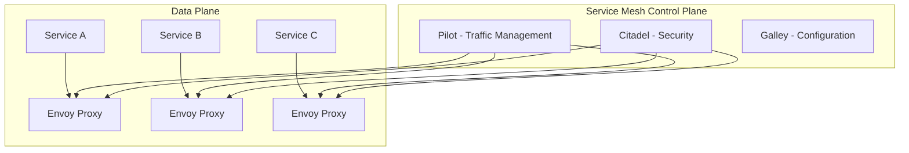

# Module 12: Service Mesh - Advanced Networking

## Overview

Service meshes provide infrastructure layer for service-to-service communication with features like mTLS, traffic management, observability. We use Istio/Linkerd in our platform for secure, reliable service communication.

## Learning Objectives

- ✅ Understand service mesh architecture
- ✅ Deploy Istio/Linkerd
- ✅ Implement mTLS for secure communication
- ✅ Configure traffic routing and splitting
- ✅ Apply advanced deployment patterns (canary, blue-green)
- ✅ Monitor with service mesh dashboards

## Service Mesh Architecture



## Installing Istio

```bash
# Download Istio
curl -L https://istio.io/downloadIstio | sh -
cd istio-*
export PATH=$PWD/bin:$PATH

# Install Istio
istioctl install --set profile=demo -y

# Enable sidecar injection
kubectl label namespace microservices istio-injection=enabled

# Verify
kubectl get pods -n istio-system
```

## Mutual TLS (mTLS)

### Enable mTLS

```yaml
apiVersion: security.istio.io/v1beta1
kind: PeerAuthentication
metadata:
  name: default
  namespace: microservices
spec:
  mtls:
    mode: STRICT
```

Benefits:
- Encrypted service-to-service communication
- Automatic certificate rotation
- Identity verification

## Traffic Management

### Virtual Service

```yaml
apiVersion: networking.istio.io/v1beta1
kind: VirtualService
metadata:
  name: user-service
  namespace: microservices
spec:
  hosts:
  - user-service
  http:
  - match:
    - headers:
        user-type:
          exact: premium
    route:
    - destination:
        host: user-service
        subset: v2
      weight: 100
  - route:
    - destination:
        host: user-service
        subset: v1
      weight: 90
    - destination:
        host: user-service
        subset: v2
      weight: 10
```

### Destination Rule

```yaml
apiVersion: networking.istio.io/v1beta1
kind: DestinationRule
metadata:
  name: user-service
  namespace: microservices
spec:
  host: user-service
  trafficPolicy:
    connectionPool:
      tcp:
        maxConnections: 100
      http:
        http1MaxPendingRequests: 50
        http2MaxRequests: 100
    loadBalancer:
      simple: LEAST_REQUEST
    outlierDetection:
      consecutiveErrors: 5
      interval: 30s
      baseEjectionTime: 30s
      maxEjectionPercent: 50
  subsets:
  - name: v1
    labels:
      version: v1
  - name: v2
    labels:
      version: v2
```

## Canary Deployment

```yaml
apiVersion: networking.istio.io/v1beta1
kind: VirtualService
metadata:
  name: user-service-canary
spec:
  hosts:
  - user-service
  http:
  - route:
    - destination:
        host: user-service
        subset: stable
      weight: 90
    - destination:
        host: user-service
        subset: canary
      weight: 10
    timeout: 10s
    retries:
      attempts: 3
      perTryTimeout: 3s
```

## Circuit Breaking

```yaml
apiVersion: networking.istio.io/v1beta1
kind: DestinationRule
metadata:
  name: payment-service
spec:
  host: payment-service
  trafficPolicy:
    connectionPool:
      tcp:
        maxConnections: 10
      http:
        http1MaxPendingRequests: 1
        maxRequestsPerConnection: 2
    outlierDetection:
      consecutiveErrors: 3
      interval: 30s
      baseEjectionTime: 30s
```

## Fault Injection

```yaml
apiVersion: networking.istio.io/v1beta1
kind: VirtualService
metadata:
  name: payment-service-fault
spec:
  hosts:
  - payment-service
  http:
  - fault:
      delay:
        percentage:
          value: 10
        fixedDelay: 5s
      abort:
        percentage:
          value: 5
        httpStatus: 500
    route:
    - destination:
        host: payment-service
```

## Summary

- ✅ Service mesh architecture
- ✅ mTLS for secure communication
- ✅ Traffic routing and splitting
- ✅ Canary deployments
- ✅ Circuit breaking and fault injection

## Next Steps

1. Complete exercises in [exercises/](./exercises/)
2. Review [patterns.md](./patterns.md)
3. Complete [assignment.md](./assignment.md)
4. Proceed to [Module 13: CI/CD](../13-cicd/README.md)
