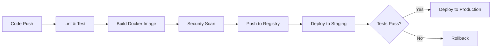

# Module 13: CI/CD Pipelines

## Overview

Continuous Integration and Continuous Deployment automate testing, building, and deployment. This module covers GitHub Actions workflows, automated testing, container building, and deployment strategies used in production.

## Learning Objectives

- ✅ Design automated CI/CD pipelines
- ✅ Implement automated testing in pipelines
- ✅ Build and scan container images
- ✅ Deploy to Kubernetes automatically
- ✅ Implement deployment strategies
- ✅ Apply GitOps principles

## CI/CD Pipeline Stages



## GitHub Actions Workflow

### Complete CI Pipeline

```yaml
# .github/workflows/ci.yml
name: CI Pipeline

on:
  push:
    branches: [ main, develop ]
  pull_request:
    branches: [ main ]

jobs:
  test:
    runs-on: ubuntu-latest
    strategy:
      matrix:
        node-version: [20.x]

    steps:
    - name: Checkout code
      uses: actions/checkout@v3

    - name: Setup Node.js
      uses: actions/setup-node@v3
      with:
        node-version: ${{ matrix.node-version }}
        cache: 'npm'

    - name: Install dependencies
      run: npm ci

    - name: Run linter
      run: npm run lint

    - name: Run tests
      run: npm test

    - name: Run test coverage
      run: npm run test:coverage

    - name: Upload coverage
      uses: codecov/codecov-action@v3
      with:
        files: ./coverage/lcov.info

  build:
    needs: test
    runs-on: ubuntu-latest

    steps:
    - name: Checkout code
      uses: actions/checkout@v3

    - name: Set up Docker Buildx
      uses: docker/setup-buildx-action@v2

    - name: Login to Docker Hub
      uses: docker/login-action@v2
      with:
        username: ${{ secrets.DOCKER_USERNAME }}
        password: ${{ secrets.DOCKER_PASSWORD }}

    - name: Build and push
      uses: docker/build-push-action@v4
      with:
        context: .
        push: true
        tags: |
          ${{ secrets.DOCKER_USERNAME }}/user-service:${{ github.sha }}
          ${{ secrets.DOCKER_USERNAME }}/user-service:latest
        cache-from: type=gha
        cache-to: type=gha,mode=max

  security-scan:
    needs: build
    runs-on: ubuntu-latest

    steps:
    - name: Run Trivy vulnerability scanner
      uses: aquasecurity/trivy-action@master
      with:
        image-ref: ${{ secrets.DOCKER_USERNAME }}/user-service:${{ github.sha }}
        format: 'sarif'
        output: 'trivy-results.sarif'

    - name: Upload Trivy results
      uses: github/codeql-action/upload-sarif@v2
      with:
        sarif_file: 'trivy-results.sarif'
```

### CD Pipeline

```yaml
# .github/workflows/cd.yml
name: CD Pipeline

on:
  workflow_run:
    workflows: ["CI Pipeline"]
    types:
      - completed
    branches: [main]

jobs:
  deploy-staging:
    if: ${{ github.event.workflow_run.conclusion == 'success' }}
    runs-on: ubuntu-latest

    steps:
    - name: Checkout code
      uses: actions/checkout@v3

    - name: Configure kubectl
      uses: azure/k8s-set-context@v3
      with:
        method: kubeconfig
        kubeconfig: ${{ secrets.KUBE_CONFIG }}

    - name: Deploy to staging
      run: |
        kubectl set image deployment/user-service \
          user-service=${{ secrets.DOCKER_USERNAME }}/user-service:${{ github.sha }} \
          -n staging

    - name: Wait for rollout
      run: |
        kubectl rollout status deployment/user-service -n staging --timeout=5m

    - name: Run smoke tests
      run: |
        kubectl run smoke-test \
          --image=curlimages/curl:latest \
          --restart=Never \
          --rm -i \
          -- curl -f http://user-service.staging/health

  deploy-production:
    needs: deploy-staging
    runs-on: ubuntu-latest
    environment:
      name: production
      url: https://api.example.com

    steps:
    - name: Checkout code
      uses: actions/checkout@v3

    - name: Configure kubectl
      uses: azure/k8s-set-context@v3
      with:
        method: kubeconfig
        kubeconfig: ${{ secrets.KUBE_CONFIG_PROD }}

    - name: Deploy to production
      run: |
        kubectl set image deployment/user-service \
          user-service=${{ secrets.DOCKER_USERNAME }}/user-service:${{ github.sha }} \
          -n production

    - name: Wait for rollout
      run: |
        kubectl rollout status deployment/user-service -n production --timeout=10m

    - name: Monitor deployment
      run: |
        sleep 60
        kubectl get pods -n production

    - name: Rollback on failure
      if: failure()
      run: |
        kubectl rollout undo deployment/user-service -n production
```

## Deployment Strategies

### Blue-Green Deployment

```yaml
# Deploy green (new version)
apiVersion: apps/v1
kind: Deployment
metadata:
  name: user-service-green
spec:
  replicas: 3
  template:
    metadata:
      labels:
        app: user-service
        version: green
    spec:
      containers:
      - name: user-service
        image: user-service:2.0.0

---
# Switch traffic
apiVersion: v1
kind: Service
metadata:
  name: user-service
spec:
  selector:
    app: user-service
    version: green  # Switch from blue to green
```

### Canary Deployment

```bash
# Deploy canary (10% traffic)
kubectl apply -f user-service-canary.yaml

# Monitor metrics
# If healthy, increase traffic
kubectl patch virtualservice user-service --type merge \
  -p '{"spec":{"http":[{"route":[{"destination":{"host":"user-service","subset":"stable"},"weight":50},{"destination":{"host":"user-service","subset":"canary"},"weight":50}]}]}}'

# Gradually increase to 100%
# Then promote canary to stable
```

## GitOps with ArgoCD

```yaml
# argocd-app.yaml
apiVersion: argoproj.io/v1alpha1
kind: Application
metadata:
  name: user-service
  namespace: argocd
spec:
  project: default
  source:
    repoURL: https://github.com/org/microservices
    targetRevision: HEAD
    path: k8s/user-service
  destination:
    server: https://kubernetes.default.svc
    namespace: production
  syncPolicy:
    automated:
      prune: true
      selfHeal: true
```

## Best Practices

1. **Test Before Deploy**: Run all tests in CI
2. **Security Scanning**: Scan images for vulnerabilities
3. **Secrets Management**: Use secrets, never commit
4. **Rollback Strategy**: Automated rollback on failure
5. **Environment Parity**: Staging mirrors production
6. **Monitoring**: Monitor deployments
7. **Approval Gates**: Manual approval for production

## Summary

- ✅ CI/CD pipeline design
- ✅ Automated testing and building
- ✅ Container security scanning
- ✅ Deployment automation
- ✅ Deployment strategies
- ✅ GitOps principles

## Next Steps

1. Complete exercises in [exercises/](./exercises/)
2. Review [best-practices.md](./best-practices.md)
3. Complete [assignment.md](./assignment.md)
4. Proceed to [Module 14: Production Ready](../14-production-ready/README.md)
