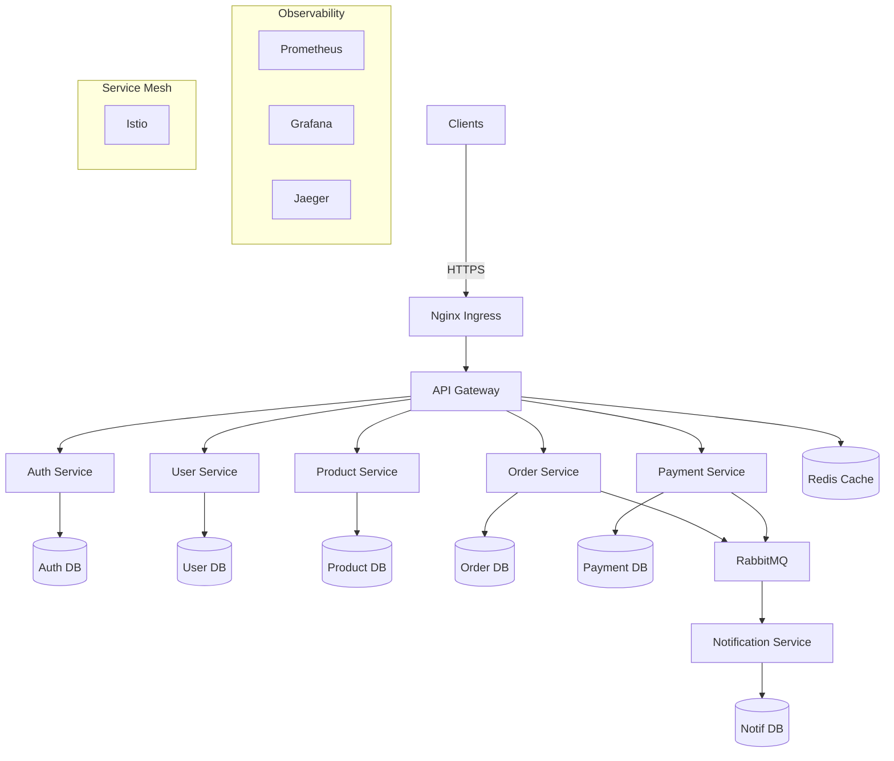

# Progressive Hands-On Projects

## Overview

This course includes three progressive projects that build upon each other, taking you from a simple microservice to a complete production-ready platform.

## Project 1: Simple Microservice API

**Duration**: 15-20 hours
**Modules**: 1-5

### Objective
Build a task management API with full CRUD operations, database integration, and authentication.

### Features
- RESTful API with Express and TypeScript
- PostgreSQL database with TypeORM
- JWT authentication
- Input validation
- Error handling
- API documentation with Swagger
- Unit and integration tests

### Technical Requirements
- Node.js 20.x
- TypeScript 5.x
- Express 4.x
- PostgreSQL 15.x
- Jest for testing

### Deliverables
- [ ] Fully functional API
- [ ] 80%+ test coverage
- [ ] API documentation
- [ ] README with setup instructions

### Grading Criteria
- Functionality: 40%
- Code quality: 25%
- Tests: 20%
- Documentation: 15%

---

## Project 2: Multi-Service Application

**Duration**: 25-30 hours
**Modules**: 6-10

### Objective
Build a blog platform with multiple microservices communicating with each other.

### Services
1. **User Service**: User authentication and profiles
2. **Post Service**: Blog posts management
3. **Comment Service**: Comments on posts
4. **API Gateway**: Single entry point

### Features
- Service-to-service communication (REST and events)
- Event-driven architecture with RabbitMQ
- JWT authentication across services
- Docker containerization
- Kubernetes deployment
- Service discovery
- Ingress configuration

### Architecture

```
Client --> API Gateway --> User Service
                       --> Post Service
                       --> Comment Service

Post Service --> Message Queue --> Comment Service
```

### Technical Requirements
- 3+ microservices
- Docker Compose for local dev
- Kubernetes manifests
- RabbitMQ for async communication
- PostgreSQL database per service

### Deliverables
- [ ] All services functional
- [ ] Dockerfiles for all services
- [ ] docker-compose.yml
- [ ] Kubernetes manifests
- [ ] Architecture diagram
- [ ] Deployment guide

### Grading Criteria
- Architecture: 30%
- Implementation: 35%
- Containerization: 20%
- Documentation: 15%

---

## Project 3: Production-Ready E-Commerce Platform

**Duration**: 35-40 hours
**Modules**: 11-14

### Objective
Build a complete, production-ready e-commerce platform with all best practices applied.

### Services (minimum 5)
1. **API Gateway**: Routing, auth, rate limiting
2. **User Service**: User management
3. **Product Service**: Catalog and inventory
4. **Order Service**: Order processing
5. **Payment Service**: Payment processing
6. **Notification Service**: Email/SMS notifications

### Features

#### Core Functionality
- Complete e-commerce workflow
- User registration and authentication
- Product browsing and search
- Shopping cart
- Order placement
- Payment processing
- Order notifications

#### Microservices Patterns
- Database per service
- Event-driven architecture
- Saga pattern for distributed transactions
- Circuit breaker for resilience
- API Gateway pattern

#### Observability
- Prometheus metrics
- Grafana dashboards
- Jaeger distributed tracing
- Structured logging
- Alerting rules

#### Service Mesh
- Istio/Linkerd configuration
- mTLS between services
- Traffic management
- Canary deployments

#### CI/CD
- GitHub Actions workflows
- Automated testing
- Container building and scanning
- Deployment automation
- Environment promotion

#### Production Hardening
- High availability (multi-zone)
- Auto-scaling (HPA)
- Security hardening
- Performance optimization
- Load testing

### Architecture



### Technical Requirements

#### Services
- Minimum 5 microservices
- TypeScript with strict mode
- Express.js framework
- PostgreSQL databases
- Redis caching
- RabbitMQ message queue

#### Containerization
- Production-ready Dockerfiles
- Multi-stage builds
- Non-root user
- Health checks
- Optimized image sizes

#### Kubernetes
- Deployments with 3+ replicas
- Services (ClusterIP)
- ConfigMaps and Secrets
- Horizontal Pod Autoscalers
- Persistent Volumes for databases
- Ingress with TLS
- Network Policies

#### Observability
- Prometheus metrics in all services
- 3+ Grafana dashboards
- Distributed tracing configured
- Centralized logging
- Alert rules for critical issues

#### Service Mesh
- Istio/Linkerd deployed
- mTLS enabled
- Traffic splitting configured
- Circuit breaker rules
- Retry policies

#### CI/CD
- GitHub Actions workflows
- Automated testing (unit, integration)
- Container building and pushing
- Security scanning
- Deployment to staging
- Production deployment with approval

#### Testing
- Unit tests: 80%+ coverage
- Integration tests
- E2E tests for critical flows
- Load tests (k6 or similar)
- Handles 1000+ RPS

#### Security
- HTTPS everywhere
- JWT authentication
- RBAC authorization
- Input validation
- Security headers
- Container scanning
- No secrets in code

#### Documentation
- Architecture diagrams
- API documentation (OpenAPI)
- Deployment guide
- Runbooks
- README files for all services

### Performance Targets
- **Availability**: 99.9% uptime
- **Latency**: p95 < 500ms, p99 < 1s
- **Throughput**: 1000+ requests/second
- **Scalability**: Auto-scale to 10,000 RPS

### Deliverables

- [ ] All services implemented and functional
- [ ] Complete Kubernetes manifests
- [ ] CI/CD pipelines working
- [ ] Monitoring dashboards
- [ ] Service mesh configured
- [ ] Load test results
- [ ] Security scan passing
- [ ] Complete documentation
- [ ] Architecture diagrams
- [ ] Deployment guide
- [ ] Demo video (5-10 minutes)

### Grading Criteria (Total: 100 points)

1. **Architecture & Design (20 points)**
   - Service boundaries well-defined
   - Appropriate patterns used
   - Scalable design

2. **Implementation (25 points)**
   - All features working
   - Code quality
   - Best practices followed

3. **Containerization & Kubernetes (15 points)**
   - Production-ready Dockerfiles
   - Proper K8s manifests
   - Resource management

4. **Observability (10 points)**
   - Comprehensive metrics
   - Useful dashboards
   - Tracing implemented

5. **CI/CD (10 points)**
   - Automated pipelines
   - Testing automation
   - Deployment automation

6. **Testing (10 points)**
   - Test coverage
   - Load test results
   - E2E tests

7. **Security (5 points)**
   - Security best practices
   - No vulnerabilities
   - Proper secret management

8. **Documentation (5 points)**
   - Clear README files
   - Architecture diagrams
   - API documentation

**Passing Score**: 70/100

---

## Submission Guidelines

### GitHub Repository Structure

```
my-project/
├── services/
│   ├── api-gateway/
│   ├── user-service/
│   ├── product-service/
│   └── ...
├── k8s/
│   ├── base/
│   └── overlays/
├── .github/
│   └── workflows/
├── docs/
│   ├── architecture.md
│   ├── api.md
│   └── deployment.md
├── tests/
│   └── e2e/
├── docker-compose.yml
├── README.md
└── LICENSE
```

### README Template

```markdown
# Project Name

Brief description

## Architecture

[Diagram]

## Features

- Feature 1
- Feature 2
- ...

## Prerequisites

- Node.js 20.x
- Docker
- Kubernetes cluster
- ...

## Quick Start

### Local Development
\`\`\`bash
docker-compose up
\`\`\`

### Kubernetes Deployment
\`\`\`bash
kubectl apply -k k8s/base/
\`\`\`

## Testing

\`\`\`bash
npm test
npm run test:e2e
npm run test:load
\`\`\`

## Monitoring

- Grafana: http://localhost:3000
- Prometheus: http://localhost:9090
- Jaeger: http://localhost:16686

## API Documentation

http://localhost:3000/api-docs

## License

MIT
```

---

## Getting Started

1. **Choose Your Project**: Start with Project 1
2. **Set Up Repository**: Create Git repository
3. **Plan Architecture**: Design before coding
4. **Build Iteratively**: Start simple, add features
5. **Test Continuously**: Write tests as you go
6. **Document Everything**: README, comments, diagrams
7. **Seek Feedback**: Code reviews, discussions
8. **Iterate**: Improve based on feedback

## Resources

- **Code Examples**: Check `../solutions/` for reference
- **Templates**: Use provided templates
- **Community**: Join discussions
- **Office Hours**: Ask questions

## Tips for Success

1. **Start Small**: Get basics working first
2. **Test Early**: Write tests as you develop
3. **Commit Often**: Small, logical commits
4. **Document As You Go**: Don't wait until the end
5. **Ask for Help**: Use community resources
6. **Review Others**: Learn from peer projects
7. **Iterate**: Continuous improvement

Good luck with your projects! 🚀
